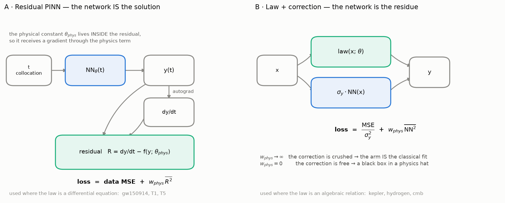

# physprior — what does a physics prior buy you?

[](https://github.com/drorjac/physics-prior/actions/workflows/ci.yml)
[](pyproject.toml)
[](LICENSE)
[](https://docs.astral.sh/ruff/)

A controlled comparison of **physics-informed machine learning** (PINNs and
symbolic regression) against a **purely data-driven** neural network — on
**real measured data** from LIGO, NASA, NIST and JPL, *and* on **simulations
you can watch**, where the governing law is known exactly.

> **The goal, in one sentence.** Measure what a physics prior is actually
> worth — in accuracy, data efficiency, noise tolerance, extrapolation, and
> the ability to hand back a physical constant and a closed-form law — **and
> measure what it costs when the prior is wrong.**

> **The answer so far.** A physics-informed network (law + learned
> correction) pays off **when the law is incomplete in a way the law itself
> cannot imitate**. Then the correction has something real to learn. When the
> law is already right, the correction only adds error out of range. When
> what is missing has the law's own shape, the fit absorbs it into the law's
> constant, and the constant comes out wrong while the curve looks fine. This
> holds in controlled simulations and on GW150914. Helium, the test named in
> advance, refutes it as stated: the missing quantum defect was
> distinguishable, yet the correction did not help, because it had to
> extrapolate in n. The correction must also be one a network can carry out
> of range. The questions, their evidence and what would refute them are in
> [`docs/HYPOTHESES.md`](docs/HYPOTHESES.md).

**Start with the results.** [`SUMMARY.md`](SUMMARY.md) is the project on one
page, generated from `results/`. [`docs/MISSIONS.md`](docs/MISSIONS.md) lists every
task with its goal and conclusion, the clear results first and the open ones
after them; [`notebooks/summary.ipynb`](notebooks/summary.ipynb) shows the
data and results of each in plots (`physprior summary --execute`); [`docs/CONTRIBUTIONS.md`](docs/CONTRIBUTIONS.md)
says what is new.

The package is organised along the two axes that question needs:

```text
physprior.data       the data layer     — one loader per source; downloads once,
                                          records provenance, asserts its units
physprior.problems   the physics        — gravity · relativity · quantum, each
                                          with its simulations, its real-data
                                          benchmark tracks and its discovery
                                          experiments side by side
```

---

## Install

```bash
pip install -e '.[all]'      # or '.[dev]' for the test and lint toolchain
physprior --version
```

`torch` (the `nn`/`pinn` arms) and `pysr` (the `sr` arm) are **optional
extras** — the data layer, the simulations and the classical fits run without
either.

## Use

```bash
physprior run gravity        # simulations + real data + discovery -> results/, figures/
physprior run all            # every problem
physprior run all --quick    # short sweeps, smoke test

physprior report             # results/ -> headline.json, docs/RESULTS.md, README section
physprior figures            # figures/ from results/
physprior notebooks --execute

physprior data list          # the registered datasets
physprior neglected          # the neglected-terms study: where a prior actually wins
physprior neglected tune     # the design sweeps behind it, on the tuning seeds
physprior info               # resolved paths, and which device torch will use

physprior run fields         # spatial fields: station temperatures, a radio field
physprior reconstruct        # field reconstruction from sparse sensors, 1-D to 3-D
physprior dynamics           # learning the update rule of ODEs and PDEs
physprior optim              # optimizers, loss functions, curvature, loss balancing
physprior theory             # how symbolic regression searches; the fitting packages
physprior lorenz             # Lorenz-63: PINN vs black box vs shooting, noise, the butterfly
physprior summary-md         # SUMMARY.md, the project on one page, from results/
```

`make reproduce` regenerates everything into `build/reproduce/` and checks
every number against `results/`; the last run is recorded in
[`docs/REPRODUCTION.md`](docs/REPRODUCTION.md).

Every writable path is overridable — `PHYSPRIOR_RESULTS_DIR`,
`PHYSPRIOR_DATA_DIR`, `PHYSPRIOR_CACHE_DIR`, `PHYSPRIOR_OFFLINE=1` — so the
package behaves the same from a checkout, a wheel, or CI.

---

## A chaotic inverse problem: the butterfly and the PINN


Forty noisy observations of one Lorenz-63 trajectory. The PINN fits the
trajectory and the constants (sigma, rho, beta) of the law together, from a
start that is wrong by a factor of two in each. Against a tuned black-box
network it reconstructs the trajectory and its derivative about an order of
magnitude more accurately on every reporting seed, and it returns the
constants, which the black box cannot. Against classical fitting of the same
law, single shooting lands in a wrong minimum on most seeds; multiple shooting,
the standard remedy, matches the PINN; with only ten observations, the PINN is
the one method that still recovers the constants. A vanilla PINN fails on
most seeds; the study builds the training recipe up one piece at a time and
measures each piece.


The numbers, the noise and budget sweeps, the loss term by term and the
measured Lyapunov exponent are on [`docs/lorenz`](docs/lorenz/README.md); the
tutorial is [T14](notebooks/tutorials/T14_butterfly_and_the_pinn.ipynb).
`tests/test_lorenz.py` checks every statement in this paragraph against
`results/lorenz`.

## The two shapes a PINN comes in



They are not variants of one architecture. **A** is used where the law is a
differential equation — the network *is* the solution, and the physical
constant sits inside the residual so it receives a gradient through the
physics term. **B** is used where the law is an algebraic relation — the
network is a *correction* to it, and `w_phys` is a continuous dial between
the classical fit and a black box. The tutorials build both.

## Start here: a step-by-step PINN course

Generated, executable notebooks in
[`notebooks/tutorials/`](notebooks/tutorials), built from
[`tutorials.py`](src/physprior/reporting/tutorials.py) and its topic modules,
so they cannot drift from the code they teach. T1–T7 are the PINN course;
T8–T14 cover optimisation, spatial fields, symbolic regression, learned
dynamics and a chaotic inverse problem.

```bash
physprior tutorials --execute
```

| | Notebook | What it teaches |
|---|---|---|
| **T1** | [what a PINN is](notebooks/tutorials/T1_what_is_a_pinn.ipynb) | a network trained on an **equation**, not data: collocation points, autograd derivatives, why `tanh` and never `ReLU`, conditions as **hard** constraints |
| **T2** | [forward and inverse](notebooks/tutorials/T2_forward_and_inverse.ipynb) | recovering an unknown constant from sparse noisy data, and the `w_phys` dial that decides whether it means anything |
| **T3** | [gravity](notebooks/tutorials/T3_gravity.ipynb) | the law is **exact** — Kepler on real JPL data, five arms at matched capacity |
| **T4** | [relativity](notebooks/tutorials/T4_relativity.ipynb) | the law is a **truncated expansion** — a 9 M☉ bias the RMSE cannot see |
| **T5** | [quantum](notebooks/tutorials/T5_quantum_wavefunction.ipynb) | **no data at all** — learning ψ and E together, and the four ways it breaks |
| **T6** | [when PINNs fail](notebooks/tutorials/T6_when_pinns_fail.ipynb) | the failure catalogue, measured: which of seven standard improvements help, and which cost 98× |
| **T7** | [when the prior wins](notebooks/tutorials/T7_when_the_prior_wins.ipynb) | a law with a **term left out**, where the correction has something real to learn |
| **T8** | [a network from scratch](notebooks/tutorials/T8_network_from_scratch.ipynb) | an MLP in NumPy with hand-written backprop, a gradient check, and SGD through Adam written by hand |
| **T9** | [optimizers and loss functions](notebooks/tutorials/T9_optimizers_and_losses.ipynb) | which optimizer reaches a physics fit, a PINN and a black box; curvature; robust losses; what loss balancing does |
| **T10** | [spatial fields](notebooks/tutorials/T10_spatial_fields.ipynb) | station temperatures and the lapse rate over the Alps; kriging; a radio field where the fit also finds the transmitter |
| **T11** | [how symbolic regression works](notebooks/tutorials/T11_how_symbolic_regression_works.ipynb) | expression trees, the search space, a genetic search and its Pareto front, SINDy, the operator set as a prior |
| **T12** | [field reconstruction in 1-D, 2-D, 3-D](notebooks/tutorials/T12_field_reconstruction.ipynb) | a rod, a plate and a 3-D potential from sparse sensors, and how the sensor count each method needs grows with dimension |
| **T13** | [learning the update rule](notebooks/tutorials/T13_learning_the_update.ipynb) | learned time-steppers for a pendulum, Lorenz and Burgers: energy drift, valid horizons, stability |
| **T14** | [the butterfly and the PINN](notebooks/tutorials/T14_butterfly_and_the_pinn.ipynb) | a chaotic inverse problem: the butterfly effect, a PINN drawn as a block diagram, why the vanilla PINN collapses and the recipe that fixes it, the loss term by term, and the PINN against a tuned black box and classical shooting |

The difficulty rises with the physics, and each domain breaks the previous
one's assumption — by T5 the prior *is* the problem statement.

---

## The problems

| Problem | Simulations | Real data |
|---|---|---|
| [**gravity**](docs/gravity) | two-body orbits · the three-body problem (figure-eight + chaos) · the solar system from JPL initial conditions · symplectic vs RK4 | Kepler's third law, DE441; ATNF pulsar braking indices |
| [**relativity**](docs/relativity) | Schwarzschild orbits and perihelion precession · post-Newtonian inspiral waveforms · light bending | GW150914 strain (LIGO); Mercury's ephemeris |
| [**quantum**](docs/quantum) | the Schrödinger equation: bound states, convergence, tunnelling | NIST hydrogen levels; NIST helium terms; COBE/FIRAS |
| [**fields**](docs/fields) | a 2-D radio field from the Helmholtz equation, in free space and with walls; a temperature field with a known lapse rate | NOAA ISD station temperatures over the Alps |

**Why both halves.** The simulations are the *control*: when the law is
exactly what was put in, whatever a method fails to recover is the **method's
own error**. Every real-data number is read against that floor — and three
results here exist only because both halves are present.

## Studies across problems

Each of these reports on the reporting seeds only and generates its page from
`results/`; all but the Lorenz study stated their hypotheses before the runs.

- **[Lorenz-63, a chaotic inverse problem](docs/lorenz/).** A PINN against a
  tuned black box and against single and multiple shooting, under noise from
  0 to 20 % and with 10 to 160 observations; the PINN's training recipe as a
  ladder of measured steps; three ways of computing du/dt and what each costs;
  the butterfly effect and the forecast horizon it sets.

- **[Field reconstruction, 1-D to 3-D](docs/reconstruction/).** How many
  sensors a physics-constrained reconstruction needs, against a GP, RBF
  interpolation and a network, as the field's dimension grows. The
  pre-registered hypothesis, that the physics prior's advantage widens with
  dimension, is supported on both field families; in 1-D there is no
  advantage at all.
- **[Learning the update rule](docs/dynamics/).** Learned time-steppers for
  ODEs and PDEs over long rollouts: black-box, residual, neural-ODE,
  Hamiltonian with a symplectic step, and known physics plus a learned
  closure. Several of the expectations written in advance are refuted.
- **[Optimization](docs/optimization/).** Optimizers, learning rates and loss
  functions for a physics fit, a PINN and a black box, with the curvature
  each one lands in. It also measures what loss balancing, the `pinn` arm's
  setting until 2026-09-27, did to the arm.
- **[Symbolic regression, in theory and practice](docs/theory/symbolic_regression.md).**
  The size of the search space, a genetic search, PySR's selection rule,
  SINDy, and the operator set as a prior; with a companion page on what
  [the fitting packages](docs/theory/packages.md) do underneath.

## The five arms

| Arm | What it is | Knows the law? | Returns a constant? | Returns a formula? |
|---|---|---|---|---|
| `oracle` | the published law with published constants; **the ceiling, not a competitor** | yes | — | yes |
| `physics` | the published law with its constants fitted | yes | yes, with an error bar | yes |
| `pinn` | `y = law(x; θ) + σ_y·NN(x)`, loss `= MSE/σ_y² + w_phys·mean(NN²)`, θ trainable — or an ODE residual where the law is a differential equation | yes | yes | yes + a correction |
| `sr` | symbolic regression (PySR) over a chosen operator set | **no** | sometimes | yes, whatever it finds |
| `nn` | a plain MLP, grid-tuned on held-out data | no | no | no |

`w_phys` is the **dial**: at `w_phys → ∞` the neural correction is crushed and
`pinn` becomes `physics`; at `w_phys = 0` it is a black box wearing a physics
hat. The black box is **not** handicapped — its width, depth and weight decay
are searched on held-out data on the tuning seeds, then frozen.

## The protocol

Every benchmark track goes through the same six questions
(`physprior.benchmark.protocol`): interpolation · data efficiency · noise ·
extrapolation · parameter recovery · law recovery.

**Seed discipline:** tune on 3 / 7 / 19, report on 11 / 23 / 42. Never select
on a reported seed — or on the real data. Signal-processing choices are
calibrated on *injected* signals with known answers.

---

## Results

<!-- RESULTS:START -->
| track | quantity | published | recovered | sigma | deviation |
| --- | --- | --- | --- | --- | --- |
| relativity | chirp mass Mc [0PN (Newtonian)] | 31.174 | 40.075 | 4.06 | +8.90 Msun (+2.19 sigma) |
| relativity | chirp mass Mc [1PN] | 31.174 |  |  | fit pinned to bound (did not converge) |
| relativity | chirp mass Mc [1.5PN (+tail)] | 31.174 | 31.9656 | 2.78 | +0.79 Msun (+0.28 sigma) |
| relativity | chirp mass Mc [2PN] | 31.174 | 30.7547 | 2.63 | -0.42 Msun (-0.16 sigma) |
| quantum | CMB temperature T [K] | 2.72548 | 2.72502 | 7.58e-06 | -170 ppm (partly by construction - see caveat) |
| quantum | Rydberg R vs NIST ionisation limit [cm^-1] | 109678.7717 | 109678.7774 | 1.53e-04 | +51 ppb |
| quantum | Rydberg R vs Bohr prediction [cm^-1] | 109677.5834 | 109678.7774 | 1.53e-04 | +10.89 ppm = QED + relativistic |
| quantum | R_He from the hydrogenic law, He I [cm^-1] | 109722.2755 | 123242.8128 | 771 | +12.3% = absorbed quantum defect |
| quantum | He I limit from Rydberg-Ritz, n <= 10 [cm^-1] | 198310.6664 | 198310.5617 |  | -0.105 cm^-1 |
| gravity | pulsar braking index n, younger half [dimensionless] | 3 | 2.40297 | 0.146 | -0.60 (-4.1 sigma) |
| gravity | GM_sun from Kepler [m^3/s^2] | 1.327124e+20 | 1.327203e+20 | 3.38e+15 | +59.3 ppm |
| relativity | GR coefficient alpha (Mercury) | 1 | 1.00012 | 1.65e-05 | +1.21e-04 |
| relativity | perihelion advance [arcsec/century] | 42.98 | 42.9852 |  | +0.005 |

Extrapolation — error outside the training range relative to inside:

| track | arm | n_seeds | nrmse_in | nrmse_out | out/in | out/in range |
| --- | --- | --- | --- | --- | --- | --- |
| gravity/kepler | oracle | 3 | 1.54e-08 | 7.62e-05 | 4,950 | 4,950 – 4,950 |
| gravity/kepler | physics | 3 | 1.14e-08 | 7.56e-05 | 6,600 | 6,600 – 6,600 |
| gravity/kepler | pinn | 3 | 1.13e-08 | 2.46e-04 | 21,700 | 2,220 – 41,600 |
| gravity/kepler | sr | 3 | 8.93e-09 | 7.78e-05 | 8,720 | 8,400 – 10,000 |
| gravity/kepler | nn | 3 | 2.12e-05 | 1.66 | 78,200 | 78,100 – 78,500 |
| gravity/pulsar_spindown | oracle | 3 | 0.0206 | 1.37 | 66.7 | 66.7 – 66.7 |
| gravity/pulsar_spindown | physics | 3 | 0.00987 | 1.38 | 139 | 139 – 139 |
| gravity/pulsar_spindown | pinn | 3 | 0.00987 | 1.38 | 139 | 139 – 139 |
| gravity/pulsar_spindown | sr | 3 | 0.00753 | 1.37 | 182 | 182 – 182 |
| gravity/pulsar_spindown | nn | 3 | 3.76e-07 | 1.38 | 3.66e+06 | 3.57e+06 – 3.79e+06 |
| relativity/gw150914 | oracle | 3 | 0.315 | 0.0858 | 0.272 | 0.272 – 0.272 |
| relativity/gw150914 | physics | 3 | 0.268 | 13.4 | 50.2 | 50.2 – 50.2 |
| relativity/gw150914 | pinn | 3 | 0.193 | 0.457 | 2.36 | 2.24 – 3.09 |
| relativity/gw150914 | sr | 3 | 0.129 | 6.36 | 49.4 | 48.1 – 72.8 |
| relativity/gw150914 | nn | 3 | 0.00131 | 0.682 | 520 | 474 – 521 |
| quantum/hydrogen | oracle | 3 | 6.26e-05 | 6.79e-05 | 1.09 | 1.09 – 1.09 |
| quantum/hydrogen | physics | 3 | 1.71e-06 | 8.12e-07 | 0.475 | 0.475 – 0.475 |
| quantum/hydrogen | pinn | 3 | 3.28e-05 | 0.0142 | 432 | 282 – 1,480 |
| quantum/hydrogen | sr | 3 | 2.25e-07 | 5.03e-07 | 2.24 | 2.16 – 5.48 |
| quantum/hydrogen | nn | 3 | 0.00758 | 0.336 | 44.4 | 42.4 – 56.9 |
| quantum/helium | oracle | 3 | 0.361 | 0.00146 | 0.00405 | 0.00405 – 0.00405 |
| quantum/helium | physics | 3 | 0.269 | 0.0858 | 0.319 | 0.319 – 0.319 |
| quantum/helium | pinn | 3 | 0.00300 | 0.408 | 136 | 96.0 – 194 |
| quantum/helium | sr | 3 | 0.0456 | 0.0482 | 1.06 | 0.887 – 1.06 |
| quantum/helium | nn | 3 | 0.00536 | 0.121 | 22.6 | 12.0 – 74.9 |
| quantum/cmb | oracle | 3 | 0.00100 | 0.00115 | 1.14 | 1.14 – 1.14 |
| quantum/cmb | physics | 3 | 1.34e-04 | 5.72e-04 | 4.26 | 4.26 – 4.26 |
| quantum/cmb | pinn | 3 | 1.33e-04 | 0.00562 | 42.2 | 5.95 – 102 |
| quantum/cmb | sr | 3 | 4.85e-04 | 16.2 | 33,400 | 32,500 – 80,300 |
| quantum/cmb | nn | 3 | 0.00146 | 2.08 | 1,420 | 1,410 – 1,430 |

<!-- RESULTS:END -->

Full tables: [`docs/RESULTS.md`](docs/RESULTS.md) · raw CSVs: [`results/`](results)

### The five findings

**1 · Inside the training range, with enough clean data, the black box is
competitive.** Physics buys little there. Any claim to the contrary is usually
a comparison against an untuned baseline.

**2 · Outside it the gap is orders of magnitude — but the mechanism is
identifiability, not the mere presence of a law.** On `quantum/cmb`,
out-of-band error falls ~56× as the fitted band reaches into the
Rayleigh-Jeans regime while the **in-band error gets worse**. On
`relativity/gw150914` — the counter-control — extrapolation from four faint
early cycles defeats *every* fitted arm, physics included. A physics prior
buys extrapolation when the data can identify its parameter, and not
otherwise.

**3 · Only the physics arms return something a physicist can argue with.**
And three times the argument was worth having:

- **hydrogen** — fitting Bohr's law to the NIST levels returns the measured
  ionisation limit to a few parts in 10⁹. That limit sits **10.8 ppm above**
  Bohr's prediction: relativistic and QED corrections to the 1s level. The
  same shift is reached independently by solving Schrödinger's equation and
  differencing against NIST. A black box fits the same levels and can say
  nothing about QED.
- **GW150914** — the Newtonian inspiral law recovers a chirp mass biased by
  **+9 M☉** with a formal error of 4.1: a confident wrong answer. Adding the
  1.5PN tail and 2PN terms removes the bias while the RMSE barely moves.
  *Goodness of fit does not diagnose a wrong law.*
- **Mercury** — the acceleration differentiated out of the ephemeris at a
  plausible step size gives a GR coefficient of **α = 1.1343 ± 0.0024**: a
  13.4% violation of general relativity at **56 formal sigma**. It is entirely
  finite-difference truncation error. With a 6th-order stencil α agrees with
  Einstein to one part in **10⁴**. *The result is not α; it is α once it has
  stopped moving.* What is left, **α − 1 = +1.2×10⁻⁴**, is not numerical:
  halving the step again moves α by only 2×10⁻⁵. It is **two omitted pieces
  of physics that nearly cancel**. Putting back the Sun's oblateness and spin
  moves α to +4.7×10⁻⁴. Replacing the one-body GR term with the n-body
  equations DE441 integrates moves it the other way, to −3.5×10⁻⁴. With both,
  α − 1 = **+1.8×10⁻⁶ ± 1.4×10⁻⁵**. That is a consistency check, not a new
  test of GR, because DE441 itself assumes GR: it shows the model is now
  complete ([relativity](docs/relativity/)).

**4 · The network eats the physics if you let it.** `w_phys` is the weight on
the physics term in the PINN's loss, and it decides whether the recovered
constant means anything:

| problem | constant | error at `w_phys = 0` | error at `w_phys ≥ 0.01` |
|---|---|---|---|
| gravity | `GM_sun` | **19.5 %** | 0.005 % |
| quantum | `T_CMB` | **1.33 %** | 0.017 % |

At `w_phys = 0` the neural correction is free, absorbs the signal, and the
physical parameter drifts to whatever is left over — while the held-out error
barely changes. A PINN that fits well is not thereby measuring anything. The
physics term is not a regulariser you tune for accuracy; it is what makes the
parameter identifiable.

**5 · A pipeline you have not injected into has no error budget.** The
GW150914 chirp mass is extracted through a chain of signal-processing choices.
One — the envelope SNR a cycle must clear — was set to 2.0 a priori and looked
perfectly reasonable. Injecting a **known** chirp mass into the **real
detector noise** and running the identical code says otherwise:

| SNR cut | median `Mc` recovered (true 31.17) | bias | trials within 20% |
|---|---|---|---|
| 2.0 | 9.3 | **−70 %** | 0 / 10 |
| 2.5 | 29.4 | −5.7 % | 6 / 10 |
| **3.0** | **30.9** | **−0.9 %** | **9 / 10** |

The cut was re-chosen **on injections, never on the real event**. The same
injections then settle finding 3: at Newtonian order the injection is biased
**+25 %** and the real event **+29 %**; at 2PN, **−1.2 %** and **−1.3 %**. The
Newtonian bias is post-Newtonian truncation, not an artefact of the pipeline.

---

### The PINN arm's configuration

Each track's `pinn` arm now carries its own physics weight, chosen on the
**tuning** seeds (3/7/19) from a validation block cut from the top of that
track's training range, so the choice rewards a correction that carries past
the range it was fitted on without touching the reported test points. The
rule and every candidate's score are in `results/<track>/tune/w_phys_selection.csv`
([`benchmark/pinn_tuning.py`](src/physprior/benchmark/pinn_tuning.py)).

Until 2026-09-27 the arm used gradient-norm loss balancing (Wang et al.
2021) instead. In this arm the physics term is a penalty on the correction,
whose gradient vanishes as the correction shrinks, so balancing raised the
weight without bound and switched the correction off: the arm was the
`physics` fit under another name ([`docs/optimization/`](docs/optimization/)
§5). The ablation that had shipped it measured that collapse as an
improvement over an unbalanced arm whose correction overfits.

With the correction switched back on, the results tables show what it does:
out of range it is worse than the fitted law on hydrogen, CMB and helium on
every reporting seed, and on Kepler in the median but not on every seed; and
where the validation block prefers no correction at all, the weight is
pinned at the top of its grid and the arm is the law by choice. The
validation block sits just above the fitted range while the test runs much
further, so the rule cannot see how far out a correction fails; that is a
limit of any choice made without the test data.

Rejected, with their measurements: early stopping hurt four cells and helped
none; Fourier features made hydrogen interpolation **98× worse**; L-BFGS ran
on every track and its proposal never lowered the loss, so the revert guard
discarded it every time. A five-member ensemble does help, and stacked with
balancing helps most, but only by a further 1.3–1.4× for five times the
compute on all 210 PINN fits of a reporting run.

`relativity/gw150914` does not move, and this is expected rather
than a gap: its arm is the ODE-residual PINN, a different model, and it
reports the option as **not engaged** instead of returning a baseline number
under the option's name.


## Notebooks

| Notebook | What it shows |
|---|---|
| [`00_overview`](notebooks/00_overview.ipynb) | the whole project, cross-problem tables |
| [`01_gravity`](notebooks/01_gravity.ipynb) | orbits and the three-body problem running; chaos measured; the force law and Kepler's 3/2 recovered from simulation; a PINN learning an orbit |
| [`02_relativity`](notebooks/02_relativity.ipynb) | Schwarzschild precession; 43″/century twice over; GW150914's strain; the PN ablation; the injection test |
| [`03_quantum`](notebooks/03_quantum.ipynb) | bound states and tunnelling; SR on the solved spectra; QED from two directions; why SR misses Planck's law |
| [`04_fields`](notebooks/04_fields.ipynb) | station temperatures and the lapse rate; the radio field and the transmitter's position |

Animations live in `figures/<problem>/` and are referenced, not embedded, so
the notebooks stay small.

## Documentation

| | |
|---|---|
| [`docs/CONTRIBUTIONS.md`](docs/CONTRIBUTIONS.md) | what the project adds, separated into likely new, known in kind, and reproduced as checks |
| [`docs/HYPOTHESES.md`](docs/HYPOTHESES.md) | the physical questions, the evidence for each, and what would refute it |
| [`docs/neglected/`](docs/neglected) | **when** a physics prior helps — the controlled study, on an algebraic law, an ODE and a PDE. Start here |
| [`docs/DECISIONS.md`](docs/DECISIONS.md) | what was decided, against what, and why — and what is still open |
| [`docs/RELATED_WORK.md`](docs/RELATED_WORK.md) | the prior work — PINNs, APHYNITY, PySR, the benchmark suites — and what this project adds ([`references.bib`](docs/references.bib)) |
| [`docs/gravity/`](docs/gravity) · [`docs/relativity/`](docs/relativity) · [`docs/quantum/`](docs/quantum) · [`docs/fields/`](docs/fields) | one folder per physics topic: its simulations, its tracks, its figures and its caveats |
| [`docs/reconstruction/`](docs/reconstruction) · [`docs/dynamics/`](docs/dynamics) · [`docs/optimization/`](docs/optimization) · [`docs/theory/`](docs/theory) | the studies across problems |
| [`docs/plans/`](docs/plans) | the audit, the Phase 2 outcome, and the phases waiting at their approval gates |
| [`docs/TOOLING.md`](docs/TOOLING.md) | which package does what, and **exactly how a formula comes out of symbolic regression** |
| [`docs/DATA.md`](docs/DATA.md) | provenance, units, and the caveats stated up front |
| [`docs/METHOD.md`](docs/METHOD.md) | design decisions — including the ones made after something went wrong |
| [`docs/RESULTS.md`](docs/RESULTS.md) | generated from `results/` |
| [`benchmarks/`](benchmarks) | what a GPU is worth here, measured — and why `mps.is_available()` is False on a machine that has one |
| [`CONTRIBUTING.md`](CONTRIBUTING.md) | the rules this project holds itself to, and why |

## Layout

```text
src/physprior/
  config.py          resolved paths and switches, all env-overridable
  exceptions.py      PhysPriorError · DataError · UnitError · ConvergenceError
  units.py           require() — guards that do not vanish under python -O
  constants.py       physical constants, each with its source
  data/              the data layer
    cache.py           download once, checksum, record provenance
    sources/           gwosc · firas · nist (H I, He I) · horizons · isd
    registry.py        name -> loader
  problems/          the physics
    gravity/           orbits · kepler · discovery · run
    relativity/        spacetime · gw150914 · mercury · discovery · run
    quantum/           schrodinger · hydrogen · helium · cmb · discovery · run
    fields/            weather (ISD, lapse rate) · kriging · rf (Helmholtz) · run
  methods/           neural · pinn (oracle/physics/pinn) · symbolic
  numerics/          integrators (Verlet, RK4) · stencils (+ Richardson)
  benchmark/         protocol (splits, sweeps, scoring) · metrics
                     neglected.py — the controlled study: three rungs of one ladder
  viz/               plots · animate · palette (validated, not eyeballed)
  methods/device.py  which device and dtype, and why they are not independent
  reconstruction/    sparse-sensor field reconstruction in 1-D, 2-D, 3-D
  dynamics/          learned time-steppers for ODEs and PDEs
  optim/             a network from scratch; optimizer, loss and curvature studies
  symbolic/          expression trees, exhaustive and genetic search, SINDy
  reporting/         report · figures · notebooks · tutorials · verify
  cli.py             the console script
```

## Data provenance

GWOSC (Abbott et al. 2019, GWTC-1) · COBE/FIRAS (Fixsen et al. 1996,
ApJ 473, 576) · NIST ASD v5.12 (Kramida et al.) · JPL Horizons / DE441.
Each loader records the URL, byte count and SHA-256 of the file it read, in
that problem's `meta.json`. Raw downloads are ~20 MB and are **not**
committed — `physprior data fetch` re-obtains them.

## Sibling project

[`qphys`](https://github.com/drorjac/qphys) asks a different question under
the same rules: whether quantum formalism is an efficient modelling language
for a real time series, and whether a law can be read out of a network
trained on slow motion. Both touch Mercury; they are kept separate on purpose
([`docs/DECISIONS.md`](docs/DECISIONS.md)).

## Citation

See [`CITATION.cff`](CITATION.cff). Licensed under the [MIT License](LICENSE).
