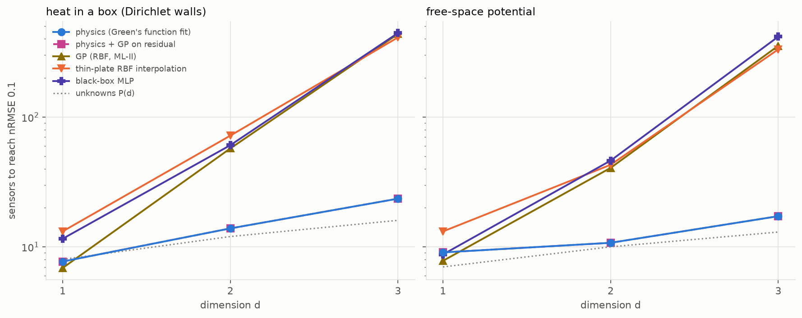
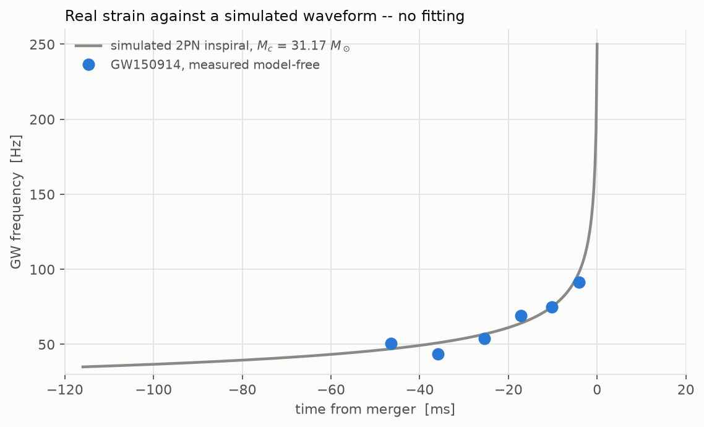

# physprior: what does a physics prior buy you?

[](https://github.com/drorjac/physics-prior/actions/workflows/ci.yml)
[](pyproject.toml)
[](LICENSE)
[](https://docs.astral.sh/ruff/)

*Written 2024–2025, released 2026.*

Physics-informed neural networks (PINNs) build a known law into a network.
This project measures what that is worth. It compares models that know the
law (the fitted law, a PINN, symbolic regression) with a tuned black-box
network, on the same data, splits and seeds, and scores each on accuracy,
data efficiency, noise, extrapolation, and whether it returns a physical
constant or a formula.

Half of the data is real measurement: LIGO's GW150914, COBE/FIRAS, NIST
atomic levels, JPL ephemerides, ATNF pulsars and NOAA weather stations. The
other half is simulation, where the law is known exactly, so a method's error
can be told apart from a flaw in the law.

<p align="center">
  
</p>

## Method


Where the law is a differential equation, the network is the solution and
the law enters the loss as a residual, with the physical constants trained
alongside the weights (A). Where the law is algebraic, the network is a
correction added to the law, and a weight `w_phys` sets how strongly the
correction is held to zero (B).

| Arm | Knows the law | Returns a constant |
|---|---|---|
| `physics`: the law with its constants fitted | yes | yes, with an error bar |
| `pinn`: the law plus a network | yes | yes |
| `sr`: symbolic regression | no | sometimes |
| `nn`: a multilayer perceptron, tuned on held-out data | no | no |

Every choice is tuned on seeds 3, 7, 19 and every number is reported on
seeds 11, 23, 42. Numbers in the docs are generated from `results/` and
checked by tests.

## Results

| | |
|---|---|
|  |  |
| **A chaotic inverse problem.** From 40 noisy points of a Lorenz trajectory, the PINN reconstructs the trajectory about an order of magnitude better than a tuned network and recovers the three constants; single shooting fails, multiple shooting matches it. | **When the law is incomplete.** A learned correction beats both the fitted law and the black box once a term is missing that the law cannot imitate. |
|  |  |
| **Fields from sparse sensors.** The physics-constrained fit needs far fewer sensors, and its advantage grows from none in 1-D to over an order of magnitude in 3-D. | **GW150914.** A Newtonian law fits the chirp but returns a biased chirp mass; goodness of fit does not diagnose a wrong law. |

- Inside the training range, with enough clean data, a tuned black box is
  competitive. The prior matters out of range, and only where the data can
  identify its constants.
- With the physics weight at zero, a PINN fits as well and its constants
  drift: the physics term is what makes them identifiable.
- Recovered from real data by the fitted law: hydrogen's QED shift, Mercury's
  relativistic precession, the Sun's GM and the CMB temperature.

One page with every result: [docs/SUMMARY.md](docs/SUMMARY.md). The findings with their
numbers: [docs/FINDINGS.md](docs/FINDINGS.md). All tables:
[docs/RESULTS.md](docs/RESULTS.md).

## Tutorials

Fourteen executable notebooks in [`notebooks/tutorials/`](notebooks/tutorials),
from a first PINN to a chaotic inverse problem:
[what a PINN is](notebooks/tutorials/T1_what_is_a_pinn.ipynb) ·
[forward and inverse](notebooks/tutorials/T2_forward_and_inverse.ipynb) ·
[gravity](notebooks/tutorials/T3_gravity.ipynb) ·
[relativity](notebooks/tutorials/T4_relativity.ipynb) ·
[quantum](notebooks/tutorials/T5_quantum_wavefunction.ipynb) ·
[when PINNs fail](notebooks/tutorials/T6_when_pinns_fail.ipynb) ·
[when the prior wins](notebooks/tutorials/T7_when_the_prior_wins.ipynb) ·
[a network from scratch](notebooks/tutorials/T8_network_from_scratch.ipynb) ·
[optimizers and losses](notebooks/tutorials/T9_optimizers_and_losses.ipynb) ·
[spatial fields](notebooks/tutorials/T10_spatial_fields.ipynb) ·
[symbolic regression](notebooks/tutorials/T11_how_symbolic_regression_works.ipynb) ·
[field reconstruction](notebooks/tutorials/T12_field_reconstruction.ipynb) ·
[learned dynamics](notebooks/tutorials/T13_learning_the_update.ipynb) ·
[the butterfly and the PINN](notebooks/tutorials/T14_butterfly_and_the_pinn.ipynb).
A tour of every result in plots: [`notebooks/summary.ipynb`](notebooks/summary.ipynb).

## Install and run

```bash
pip install -e '.[all]'          # torch and pysr are optional extras
physprior run all                # the benchmark tracks -> results/, figures/
physprior lorenz                 # the Lorenz study
physprior tutorials --execute    # build and run the tutorials
make reproduce                   # re-run everything and compare every number
```

`physprior --help` lists the other studies. Raw data (~20 MB) is downloaded
on first use and its checksum recorded; see [docs/DATA.md](docs/DATA.md).

## Documentation

| | |
|---|---|
| [docs/MISSIONS.md](docs/MISSIONS.md) | every task, its goal and its conclusion |
| [docs/gravity](docs/gravity) · [relativity](docs/relativity) · [quantum](docs/quantum) · [fields](docs/fields) | the physics topics: simulations, real-data tracks, caveats |
| [docs/lorenz](docs/lorenz) · [neglected](docs/neglected) · [reconstruction](docs/reconstruction) · [dynamics](docs/dynamics) · [optimization](docs/optimization) · [cml](docs/cml) · [hybrid_tracks](docs/hybrid_tracks) | the studies across problems |
| [docs/METHOD.md](docs/METHOD.md) · [DECISIONS.md](docs/DECISIONS.md) · [HYPOTHESES.md](docs/HYPOTHESES.md) | how it was done and why |
| [docs/RELATED_WORK.md](docs/RELATED_WORK.md) · [CONTRIBUTIONS.md](docs/CONTRIBUTIONS.md) | prior work, and what is new here |

A related project, [qphys](https://github.com/drorjac/qphys), applies the same
protocol to quantum-formalism models of time series.

## Citation

See [CITATION.cff](CITATION.cff). MIT License.
