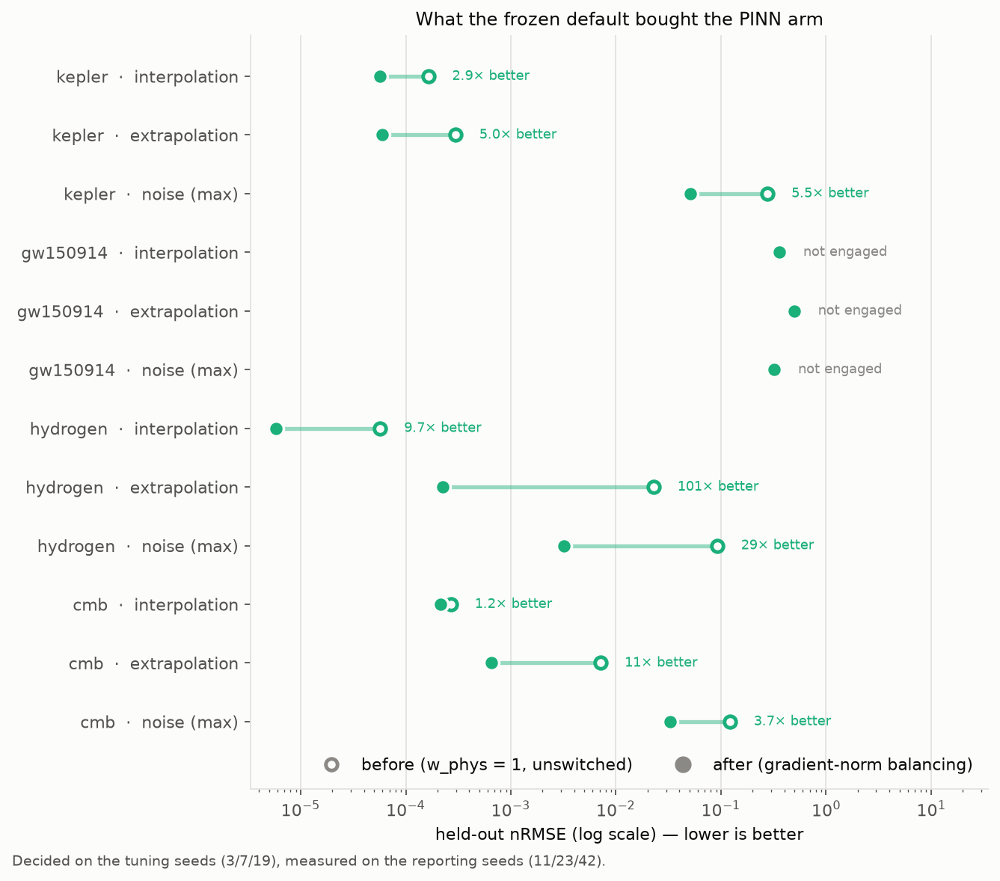

# physprior — what does a physics prior buy you?

[](https://github.com/drorjacoby/physics-prior/actions/workflows/ci.yml)
[](pyproject.toml)
[](LICENSE)
[](https://docs.astral.sh/ruff/)

A controlled comparison of **physics-informed machine learning** (PINNs and
symbolic regression) against a **purely data-driven** neural network — on
**real measured data** from LIGO, NASA, NIST and JPL, *and* on **simulations
you can watch**, where the governing law is known exactly.

> **The goal, in one sentence.** Measure what a physics prior is actually
> worth — in accuracy, data efficiency, noise tolerance, extrapolation, and
> the ability to hand back a physical constant and a closed-form law — **and
> measure what it costs when the prior is wrong.**

The package is organised along the two axes that question needs:

```text
physprior.data       the data layer     — one loader per source; downloads once,
                                          records provenance, asserts its units
physprior.problems   the physics        — gravity · relativity · quantum, each
                                          with its simulations, its real-data
                                          benchmark tracks and its discovery
                                          experiments side by side
```

---

## Install

```bash
pip install -e '.[all]'      # or '.[dev]' for the test and lint toolchain
physprior --version
```

`torch` (the `nn`/`pinn` arms) and `pysr` (the `sr` arm) are **optional
extras** — the data layer, the simulations and the classical fits run without
either.

## Use

```bash
physprior run gravity        # simulations + real data + discovery -> results/, figures/
physprior run all            # every problem
physprior run all --quick    # short sweeps, smoke test

physprior report             # results/ -> headline.json, docs/RESULTS.md, README section
physprior figures            # figures/ from results/
physprior notebooks --execute

physprior data list          # the registered datasets
physprior neglected          # the neglected-terms study: where a prior actually wins
physprior neglected tune     # the design sweeps behind it, on the tuning seeds
physprior info               # resolved paths, and which device torch will use
```

Every writable path is overridable — `PHYSPRIOR_RESULTS_DIR`,
`PHYSPRIOR_DATA_DIR`, `PHYSPRIOR_CACHE_DIR`, `PHYSPRIOR_OFFLINE=1` — so the
package behaves the same from a checkout, a wheel, or CI.

---

## The two shapes a PINN comes in


They are not variants of one architecture. **A** is used where the law is a
differential equation — the network *is* the solution, and the physical
constant sits inside the residual so it receives a gradient through the
physics term. **B** is used where the law is an algebraic relation — the
network is a *correction* to it, and `w_phys` is a continuous dial between
the classical fit and a black box. The tutorials build both.

## Start here: a step-by-step PINN course

Six generated, executable notebooks in
[`notebooks/tutorials/`](notebooks/tutorials) — built from
[`tutorials.py`](src/physprior/reporting/tutorials.py) and run in CI, so they
cannot drift from the code they teach.

```bash
physprior tutorials --execute
```

| | Notebook | What it teaches |
|---|---|---|
| **T1** | [what a PINN is](notebooks/tutorials/T1_what_is_a_pinn.ipynb) | a network trained on an **equation**, not data: collocation points, autograd derivatives, why `tanh` and never `ReLU`, conditions as **hard** constraints |
| **T2** | [forward and inverse](notebooks/tutorials/T2_forward_and_inverse.ipynb) | recovering an unknown constant from sparse noisy data, and the `w_phys` dial that decides whether it means anything |
| **T3** | [gravity](notebooks/tutorials/T3_gravity.ipynb) | the law is **exact** — Kepler on real JPL data, five arms at matched capacity |
| **T4** | [relativity](notebooks/tutorials/T4_relativity.ipynb) | the law is a **truncated expansion** — a 9 M☉ bias the RMSE cannot see |
| **T5** | [quantum](notebooks/tutorials/T5_quantum_wavefunction.ipynb) | **no data at all** — learning ψ and E together, and the four ways it breaks |
| **T6** | [when PINNs fail](notebooks/tutorials/T6_when_pinns_fail.ipynb) | the failure catalogue, measured: which of seven standard improvements help, and which cost 98× |

The difficulty rises with the physics, and each domain breaks the previous
one's assumption — by T5 the prior *is* the problem statement.

---

## The three problems

| Problem | Simulations | Real data |
|---|---|---|
| [**gravity**](docs/gravity) | two-body orbits · the three-body problem (figure-eight + chaos) · the solar system from JPL initial conditions · symplectic vs RK4 | Kepler's third law, DE441 |
| [**relativity**](docs/relativity) | Schwarzschild orbits and perihelion precession · post-Newtonian inspiral waveforms · light bending | GW150914 strain (LIGO); Mercury's ephemeris |
| [**quantum**](docs/quantum) | the Schrödinger equation: bound states, convergence, tunnelling | NIST hydrogen levels; COBE/FIRAS |

**Why both halves.** The simulations are the *control*: when the law is
exactly what was put in, whatever a method fails to recover is the **method's
own error**. Every real-data number is read against that floor — and three
results here exist only because both halves are present.

## The five arms

| Arm | What it is | Knows the law? | Returns a constant? | Returns a formula? |
|---|---|---|---|---|
| `oracle` | the published law with published constants; **the ceiling, not a competitor** | yes | — | yes |
| `physics` | the published law with its constants fitted | yes | yes, with an error bar | yes |
| `pinn` | `y = law(x; θ) + σ_y·NN(x)`, loss `= MSE/σ_y² + w_phys·mean(NN²)`, θ trainable — or an ODE residual where the law is a differential equation | yes | yes | yes + a correction |
| `sr` | symbolic regression (PySR) over a chosen operator set | **no** | sometimes | yes, whatever it finds |
| `nn` | a plain MLP, grid-tuned on held-out data | no | no | no |

`w_phys` is the **dial**: at `w_phys → ∞` the neural correction is crushed and
`pinn` becomes `physics`; at `w_phys = 0` it is a black box wearing a physics
hat. The black box is **not** handicapped — its width, depth and weight decay
are searched on held-out data on the tuning seeds, then frozen.

## The protocol

Every benchmark track goes through the same six questions
(`physprior.benchmark.protocol`): interpolation · data efficiency · noise ·
extrapolation · parameter recovery · law recovery.

**Seed discipline:** tune on 3 / 7 / 19, report on 11 / 23 / 42. Never select
on a reported seed — or on the real data. Signal-processing choices are
calibrated on *injected* signals with known answers.

---

## Results

<!-- RESULTS:START -->
| track | quantity | published | recovered | sigma | deviation |
| --- | --- | --- | --- | --- | --- |
| relativity | chirp mass Mc [0PN (Newtonian)] | 31.174 | 40.075 | 4.05724 | +8.90 Msun (+2.19 sigma) |
| relativity | chirp mass Mc [1PN] | 31.174 |  |  | fit pinned to bound (did not converge) |
| relativity | chirp mass Mc [1.5PN (+tail)] | 31.174 | 31.9656 | 2.77995 | +0.79 Msun (+0.28 sigma) |
| relativity | chirp mass Mc [2PN] | 31.174 | 30.7547 | 2.63462 | -0.42 Msun (-0.16 sigma) |
| quantum | CMB temperature T [K] | 2.72548 | 2.72502 | 7.577835e-06 | -170 ppm (partly by construction - see caveat) |
| quantum | Rydberg R vs NIST ionisation limit [cm^-1] | 109678.7717 | 109678.7774 | 0.000153377 | +51 ppb |
| quantum | Rydberg R vs Bohr prediction [cm^-1] | 109677.5834 | 109678.7774 | 0.000153377 | +10.89 ppm = QED + relativistic |
| gravity | GM_sun from Kepler [m^3/s^2] | 1.327124e+20 | 1.327203e+20 | 3.377371e+15 | +59.3 ppm |
| relativity | GR coefficient alpha (Mercury) | 1 | 1.00012 | 1.654817e-05 | +1.21e-04 |
| relativity | perihelion advance [arcsec/century] | 42.98 | 42.9852 |  | +0.005 |

Extrapolation — error outside the training range relative to inside:

| track | arm | nrmse_in | nrmse_out | out/in |
| --- | --- | --- | --- | --- |
| gravity/kepler | oracle | 1.537401e-08 | 7.615129e-05 | 4953.250058 |
| gravity/kepler | physics | 1.144904e-08 | 7.558060e-05 | 6601.477587 |
| gravity/kepler | pinn | 1.163204e-08 | 6.208668e-05 | 5337.558048 |
| gravity/kepler | sr | 8.926247e-09 | 7.781677e-05 | 8717.748162 |
| gravity/kepler | nn | 2.123769e-05 | 1.66047 | 78185.25462 |
| relativity/gw150914 | oracle | 0.31518 | 0.0858235 | 0.2723 |
| relativity/gw150914 | physics | 0.267932 | 13.447 | 50.1881 |
| relativity/gw150914 | pinn | 0.193351 | 0.456796 | 2.36252 |
| relativity/gw150914 | sr | 0.128819 | 6.36421 | 49.4044 |
| relativity/gw150914 | nn | 0.0013106 | 0.682004 | 520.376 |
| quantum/hydrogen | oracle | 6.258366e-05 | 6.794815e-05 | 1.08572 |
| quantum/hydrogen | physics | 1.711022e-06 | 8.122348e-07 | 0.474707 |
| quantum/hydrogen | pinn | 1.823908e-06 | 0.0001624 | 89.0396 |
| quantum/hydrogen | sr | 2.247598e-07 | 5.033930e-07 | 2.23969 |
| quantum/hydrogen | nn | 0.00757562 | 0.336 | 44.3528 |
| quantum/cmb | oracle | 0.00100435 | 0.00114864 | 1.14367 |
| quantum/cmb | physics | 0.000134423 | 0.000572361 | 4.2579 |
| quantum/cmb | pinn | 0.000133712 | 0.000635673 | 4.75405 |
| quantum/cmb | sr | 0.000484725 | 16.1954 | 33411.52162 |
| quantum/cmb | nn | 0.00146101 | 2.08173 | 1424.85661 |

<!-- RESULTS:END -->

Full tables: [`docs/RESULTS.md`](docs/RESULTS.md) · raw CSVs: [`results/`](results)

### The five findings

**1 · Inside the training range, with enough clean data, the black box is
competitive.** Physics buys little there. Any claim to the contrary is usually
a comparison against an untuned baseline.

**2 · Outside it the gap is orders of magnitude — but the mechanism is
identifiability, not the mere presence of a law.** On `quantum/cmb`,
out-of-band error falls ~56× as the fitted band reaches into the
Rayleigh-Jeans regime while the **in-band error gets worse**. On
`relativity/gw150914` — the counter-control — extrapolation from four faint
early cycles defeats *every* fitted arm, physics included. A physics prior
buys extrapolation when the data can identify its parameter, and not
otherwise.

**3 · Only the physics arms return something a physicist can argue with.**
And three times the argument was worth having:

- **hydrogen** — fitting Bohr's law to the NIST levels returns the measured
  ionisation limit to a few parts in 10⁹. That limit sits **10.8 ppm above**
  Bohr's prediction: relativistic and QED corrections to the 1s level. The
  same shift is reached independently by solving Schrödinger's equation and
  differencing against NIST. A black box fits the same levels and can say
  nothing about QED.
- **GW150914** — the Newtonian inspiral law recovers a chirp mass biased by
  **+9 M☉** with a formal error of 4.1: a confident wrong answer. Adding the
  1.5PN tail and 2PN terms removes the bias while the RMSE barely moves.
  *Goodness of fit does not diagnose a wrong law.*
- **Mercury** — the acceleration differentiated out of the ephemeris at a
  plausible step size gives a GR coefficient of **α = 1.1343 ± 0.0024**: a
  13.4% violation of general relativity at **56 formal sigma**. It is entirely
  finite-difference truncation error. With a 6th-order stencil α agrees with
  Einstein to one part in **10⁴**. *The result is not α; it is α once it has
  stopped moving.*

**4 · The network eats the physics if you let it.** `w_phys` is the weight on
the physics term in the PINN's loss, and it decides whether the recovered
constant means anything:

| problem | constant | error at `w_phys = 0` | error at `w_phys ≥ 0.01` |
|---|---|---|---|
| gravity | `GM_sun` | **19.5 %** | 0.005 % |
| quantum | `T_CMB` | **1.33 %** | 0.017 % |

At `w_phys = 0` the neural correction is free, absorbs the signal, and the
physical parameter drifts to whatever is left over — while the held-out error
barely changes. A PINN that fits well is not thereby measuring anything. The
physics term is not a regulariser you tune for accuracy; it is what makes the
parameter identifiable.

**5 · A pipeline you have not injected into has no error budget.** The
GW150914 chirp mass is extracted through a chain of signal-processing choices.
One — the envelope SNR a cycle must clear — was set to 2.0 a priori and looked
perfectly reasonable. Injecting a **known** chirp mass into the **real
detector noise** and running the identical code says otherwise:

| SNR cut | median `Mc` recovered (true 31.17) | bias | trials within 20% |
|---|---|---|---|
| 2.0 | 9.3 | **−70 %** | 0 / 10 |
| 2.5 | 29.4 | −5.7 % | 6 / 10 |
| **3.0** | **30.9** | **−0.9 %** | **9 / 10** |

The cut was re-chosen **on injections, never on the real event**. The same
injections then settle finding 3: at Newtonian order the injection is biased
**+25 %** and the real event **+29 %**; at 2PN, **−1.2 %** and **−1.3 %**. The
Newtonian bias is post-Newtonian truncation, not an artefact of the pipeline.

---

### What the PINN arm's default is worth



The `pinn` arm's configuration was frozen by ablating one switch at a time on
the **tuning** seeds (3/7/19) and then re-measuring on the reporting seeds
(11/23/42). Gradient-norm loss balancing (Wang et al. 2021) was the only
option that shipped: it helps on five of the eight cells that can move, hurts
none, and shifts the recovered constants by under 2% — so the accuracy is not
bought out of the physics.

Rejected, with their measurements: early stopping hurt four cells and helped
none; Fourier features made hydrogen interpolation **98× worse**; L-BFGS ran
on every track and its proposal never lowered the loss, so the revert guard
discarded it every time. A five-member ensemble does help, and stacked with
balancing helps most, but only by a further 1.3–1.4× for five times the
compute on all 210 PINN fits of a reporting run.

`relativity/gw150914` does not move, and that is the honest result rather
than a gap: its arm is the ODE-residual PINN, a different model, and it
reports the option as **not engaged** instead of returning a baseline number
under the option's name.


## Notebooks

| Notebook | What it shows |
|---|---|
| [`00_overview`](notebooks/00_overview.ipynb) | the whole project, cross-problem tables |
| [`01_gravity`](notebooks/01_gravity.ipynb) | orbits and the three-body problem running; chaos measured; the force law and Kepler's 3/2 recovered from simulation; a PINN learning an orbit |
| [`02_relativity`](notebooks/02_relativity.ipynb) | Schwarzschild precession; 43″/century twice over; GW150914's strain; the PN ablation; the injection test |
| [`03_quantum`](notebooks/03_quantum.ipynb) | bound states and tunnelling; SR on the solved spectra; QED from two directions; why SR misses Planck's law |

Animations live in `figures/<problem>/` and are referenced, not embedded, so
the notebooks stay small.

## Documentation

| | |
|---|---|
| [`docs/neglected/`](docs/neglected) | **when** a physics prior helps — the controlled study, on an algebraic law, an ODE and a PDE. Start here |
| [`docs/gravity/`](docs/gravity) · [`docs/relativity/`](docs/relativity) · [`docs/quantum/`](docs/quantum) | one folder per physics topic: its simulations, its tracks, its figures and its caveats |
| [`docs/plans/`](docs/plans) | the audit, the Phase 2 outcome, and the phases waiting at their approval gates |
| [`docs/TOOLING.md`](docs/TOOLING.md) | which package does what, and **exactly how a formula comes out of symbolic regression** |
| [`docs/DATA.md`](docs/DATA.md) | provenance, units, and the caveats stated up front |
| [`docs/METHOD.md`](docs/METHOD.md) | design decisions — including the ones made after something went wrong |
| [`docs/RESULTS.md`](docs/RESULTS.md) | generated from `results/` |
| [`benchmarks/`](benchmarks) | what a GPU is worth here, measured — and why `mps.is_available()` is False on a machine that has one |
| [`CONTRIBUTING.md`](CONTRIBUTING.md) | the rules this project holds itself to, and why |

## Layout

```text
src/physprior/
  config.py          resolved paths and switches, all env-overridable
  exceptions.py      PhysPriorError · DataError · UnitError · ConvergenceError
  units.py           require() — guards that do not vanish under python -O
  constants.py       physical constants, each with its source
  data/              the data layer
    cache.py           download once, checksum, record provenance
    sources/           gwosc · firas · nist · horizons
    registry.py        name -> loader
  problems/          the physics
    gravity/           orbits · kepler · discovery · run
    relativity/        spacetime · gw150914 · mercury · discovery · run
    quantum/           schrodinger · hydrogen · cmb · discovery · run
  methods/           neural · pinn (oracle/physics/pinn) · symbolic
  numerics/          integrators (Verlet, RK4) · stencils (+ Richardson)
  benchmark/         protocol (splits, sweeps, scoring) · metrics
                     neglected.py — the controlled study: three rungs of one ladder
  viz/               plots · animate · palette (validated, not eyeballed)
  methods/device.py  which device and dtype, and why they are not independent
  reporting/         report · figures · notebooks · neglected_study
  cli.py             the console script
```

## Data provenance

GWOSC (Abbott et al. 2019, GWTC-1) · COBE/FIRAS (Fixsen et al. 1996,
ApJ 473, 576) · NIST ASD v5.12 (Kramida et al.) · JPL Horizons / DE441.
Each loader records the URL, byte count and SHA-256 of the file it read, in
that problem's `meta.json`. Raw downloads are ~20 MB and are **not**
committed — `physprior data fetch` re-obtains them.

## Citation

See [`CITATION.cff`](CITATION.cff). Licensed under the [MIT License](LICENSE).
