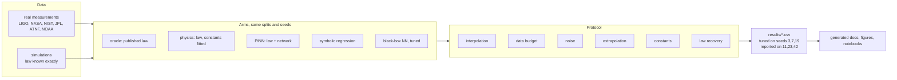
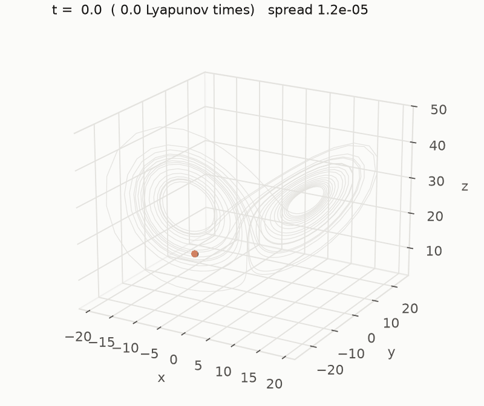
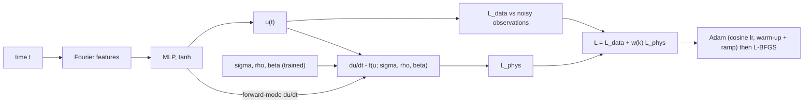
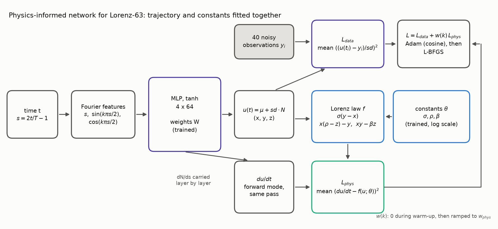
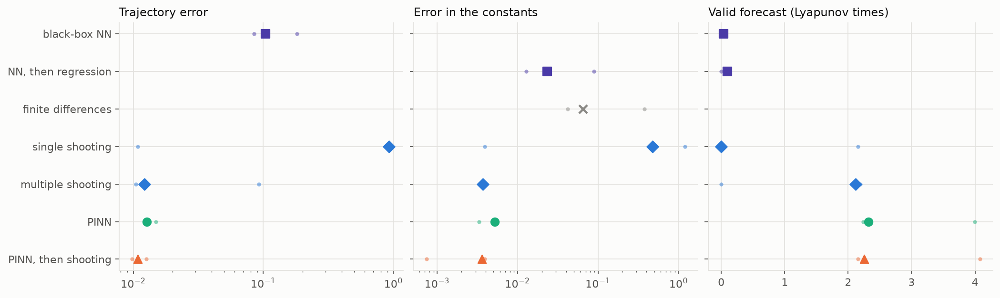
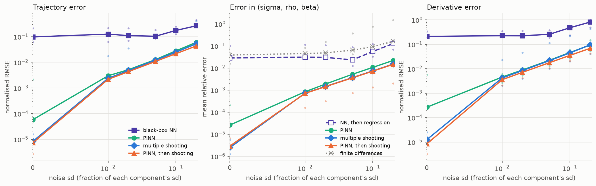
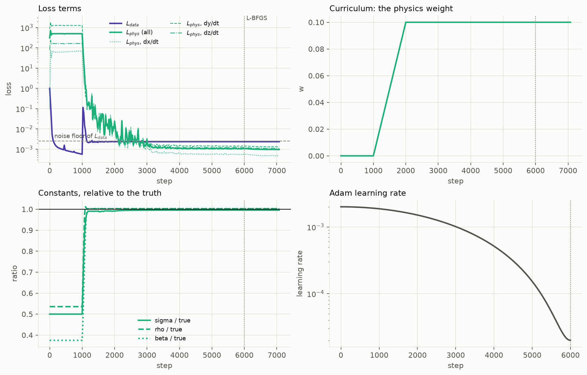
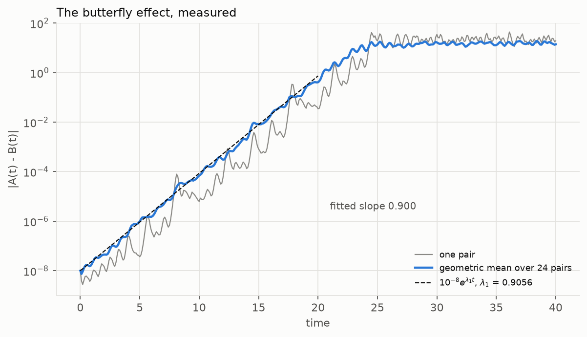

# Summary

*Generated by `physprior summary-md` from `results/`; do not edit by hand.*

## The question

What is a physics prior worth to a machine-learning model, and what does it cost when the law is wrong? Every study here compares models that know a law (the fitted law, a physics-informed network, symbolic regression) with a tuned black-box network, on the same data, splits and seeds. Half of the data is real measurement; the other half is simulation, where the law is known exactly and every error is the method's own.



## Where the physics-informed network pays: a chaotic inverse problem



40 noisy observations of one Lorenz-63 trajectory, 2.7 Lyapunov times long. The PINN fits the trajectory and the three constants of the law together:





Against a black-box network of the same kind, tuned on separate seeds:

| | black-box NN | PINN |
|---|---|---|
| trajectory error (normalised RMSE) | 0.104 | 0.0127 |
| improvement | | 8.1x, on 3 of 3 seeds |
| du/dt error, improvement | | 11.6x |
| constants (sigma, rho, beta) | 2.3 % (differentiate, then regress) | 0.52 % |
| valid forecast, Lyapunov times | 0.036 (extrapolated) | 2.3 (law with fitted constants) |

Against classical fitting of the same law, from the same wrong start: single shooting misses the constants by 47.9 %; multiple shooting recovers them to 0.37 %; single shooting started from the PINN's answer reaches 0.36 %. A well-built classical fit is as good as the PINN on the constants. The PINN needs no segmentation, returns a smooth trajectory and derivative, and gives shooting a start in the right basin.



### Noise

| noise | black-box NN | PINN | factor |
|---|---|---|---|
| 0 % | 0.0977 | 5.85e-05 | 1.7e+03 |
| 1 % | 0.126 | 0.00299 | 42 |
| 2 % | 0.11 | 0.00517 | 21 |
| 5 % | 0.104 | 0.0127 | 8.1 |
| 10 % | 0.174 | 0.0279 | 6.2 |
| 20 % | 0.264 | 0.0597 | 4.4 |

The black box cannot interpolate a chaotic trajectory between 40 points even without noise, while the PINN's error scales with the noise, so the factor is largest on clean data. With fewer observations it is 4.5 at 160 points and 28 at 20. At 10 points only the PINN still recovers the constants: 1.5 %, against 36 % for multiple shooting.



### Making the PINN train

| recipe | trajectory error | worst seed | constants error |
|---|---|---|---|
| vanilla | 0.119 | 0.626 | 3.3 % |
| + warm-up and ramp | 0.0116 | 0.0239 | 0.31 % |
| + cosine lr, resampling | 0.0198 | 0.021 | 0.42 % |
| + L-BFGS finish | 0.0129 | 0.0151 | 0.53 % |
| + Fourier features | 0.0127 | 0.0149 | 0.52 % |
| vanilla + gradnorm | 0.021 | 0.0754 | 0.39 % |
| final + causal | 0.013 | 0.0149 | 0.53 % |

A vanilla PINN fails on 2 of 3 seeds: it stalls in a minimum that fits neither the data nor the law. Fitting the data first and ramping the physics weight in is the change that matters most; a cosine learning rate, fresh collocation points each step, an L-BFGS finish and Fourier features of time tighten the worst seed. Gradient-norm balancing rescues most of the vanilla recipe; causal weighting adds nothing to the final one. The time derivative is propagated in forward mode by hand, 1.4x cheaper per step than reverse-mode autograd, and `torch.compile` gives a further 1.21x.



### The butterfly effect

Trajectories that start 1e-8 apart separate at the rate 0.900 per unit time (reference lambda_1 = 0.9056), and every forecast inherits that: an error e in the state reaches the validity threshold in about ln(0.4/e)/lambda_1, whatever produced it.



Full page: [docs/lorenz](lorenz/README.md). Tutorial: [T14](../notebooks/tutorials/T14_butterfly_and_the_pinn.ipynb).

## What the other studies found

Each line is a conclusion from the page it links to, where the numbers are generated from `results/`.

- **In range, with enough clean data, a tuned black box is competitive.** The prior buys little there ([RESULTS](RESULTS.md)).
- **A learned correction pays when the law is incomplete in a way the law cannot imitate** ([neglected terms](neglected/README.md)). When the missing term has the law's own shape, the fitted constant absorbs it and comes out wrong while the curve looks right.
- **Goodness of fit does not diagnose a wrong law.** GW150914 at Newtonian order gives a biased chirp mass with barely a change in RMSE ([relativity](relativity/README.md)).
- **The network eats the physics if the physics weight is zero.** The constants drift while held-out error hardly moves ([optimization](optimization/README.md)).
- **The prior's advantage grows with dimension** in field reconstruction from sparse sensors ([reconstruction](reconstruction/README.md)).
- **Structure in a learned time-stepper keeps energy bounded** where black boxes drift ([dynamics](dynamics/README.md)).
- **The operator set is a prior for symbolic regression**: a law outside it is not found ([theory](theory/symbolic_regression.md)).

Every mission with its goal and conclusion: [MISSIONS](MISSIONS.md). What is new: [CONTRIBUTIONS](CONTRIBUTIONS.md). A tour in plots: [summary notebook](../notebooks/summary.ipynb).

## Constants recovered from real data

| track | quantity | published | recovered | deviation |
|---|---|---|---|---|
| relativity | chirp mass Mc [0PN (Newtonian)] | 31.174 | 40.07495 | +8.90 Msun (+2.19 sigma) |
| relativity | chirp mass Mc [1PN] | 31.174 | – | fit pinned to bound (did not converge) |
| relativity | chirp mass Mc [1.5PN (+tail)] | 31.174 | 31.965578 | +0.79 Msun (+0.28 sigma) |
| relativity | chirp mass Mc [2PN] | 31.174 | 30.754713 | -0.42 Msun (-0.16 sigma) |
| quantum | CMB temperature T [K] | 2.72548 | 2.7250153 | -170 ppm (partly by construction - see caveat) |
| quantum | Rydberg R vs NIST ionisation limit [cm^-1] | 109678.77 | 109678.78 | +51 ppb |
| quantum | Rydberg R vs Bohr prediction [cm^-1] | 109677.58 | 109678.78 | +10.89 ppm = QED + relativistic |
| quantum | R_He from the hydrogenic law, He I [cm^-1] | 109722.28 | 123242.81 | +12.3% = absorbed quantum defect |
| quantum | He I limit from Rydberg-Ritz, n <= 10 [cm^-1] | 198310.67 | 198310.56 | -0.105 cm^-1 |
| gravity | pulsar braking index n, younger half [dimensionless] | 3 | 2.4029734 | -0.60 (-4.1 sigma) |
| gravity | GM_sun from Kepler [m^3/s^2] | 1.3271244e+20 | 1.3272031e+20 | +59.3 ppm |
| relativity | GR coefficient alpha (Mercury) | 1 | 1.0001206 | +1.21e-04 |
| relativity | perihelion advance [arcsec/century] | 42.98 | 42.985184 | +0.005 |

## Limits

- The Lorenz study is a simulation with the law known exactly; it measures the method, not a discovery.
- On algebraic laws that are already right, the PINN's correction extrapolates worse than the fitted law; helium refutes the prediction stated for it ([HYPOTHESES](HYPOTHESES.md)).
- Every number is on CPU in float64; the GPU paths are written but not used for results ([tools](../tools/README.md)).

## Reproduce

```bash
pip install -e '.[all]'
physprior run all && physprior report     # the benchmark tracks
physprior lorenz                          # the Lorenz study
physprior tutorials --execute             # T1-T14
physprior summary --execute               # the summary notebook
make reproduce                            # re-run and compare every number
```
