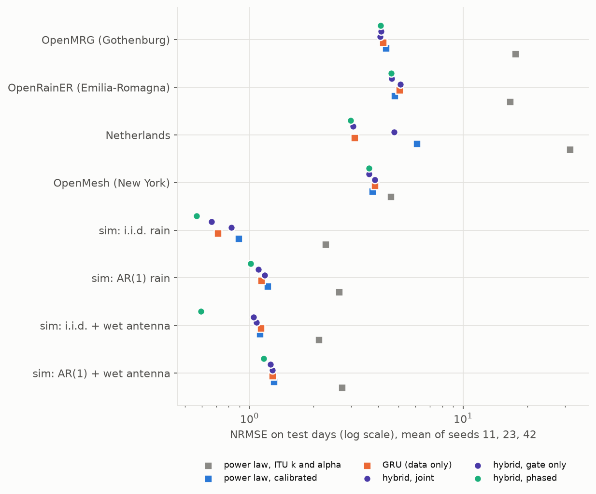
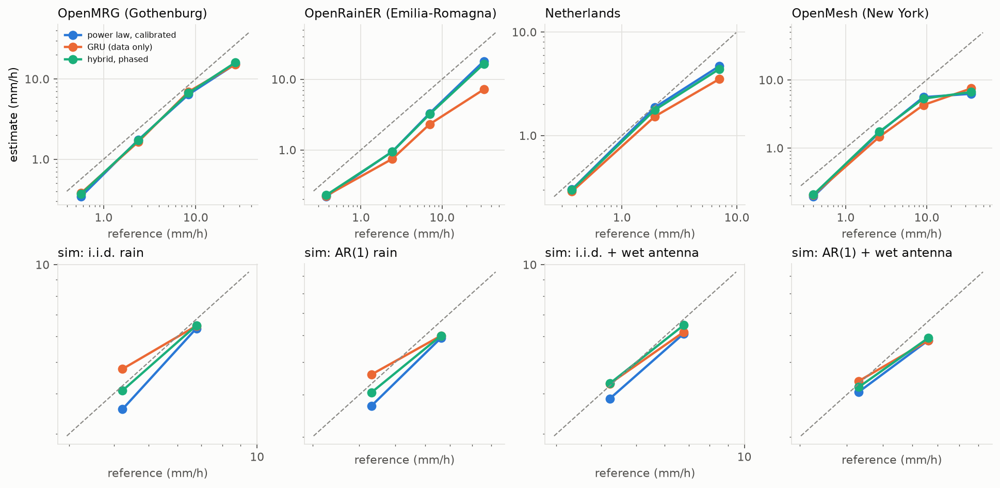
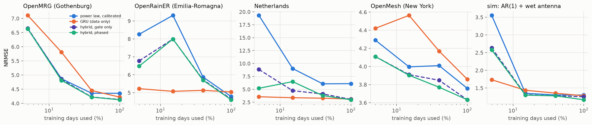
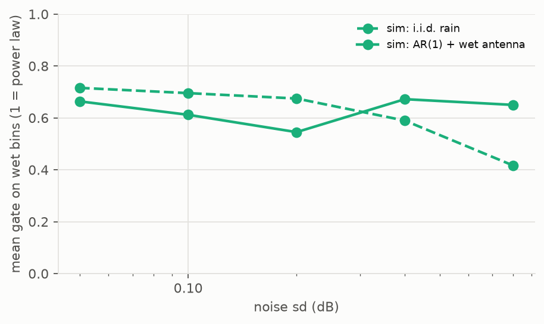

# Rain from microwave links: power law, network and hybrid

<!-- Generated by physprior.cml.doc.render_doc() from results/cml. Do not edit by hand. -->

A commercial microwave link loses signal in rain, A = k R^alpha L (ITU-R P.838-3). Three ways to turn that loss into a rain rate are compared on four link archives and four simulations: the power law (with ITU coefficients, or calibrated per link), a GRU trained on gauge or radar labels, and the gated hybrid of Jacoby et al. (ICASSP 2026), where a learned gate blends the two. Setup, splits and results are built here from scratch; the plan is `docs/plans/CML_PLAN.md`, the code `src/physprior/cml/`, and `physprior cml` reruns it.

## Data

| dataset | n_links | n_samples | wet_fraction | mean_rain_mmh | freq_min | freq_max | len_min | len_max |
|---|---|---|---|---|---|---|---|---|
| Netherlands | 37 | 80987 | 0.0938 | 0.135 | 25.1 | 39.4 | 0.67 | 7.9 |
| OpenMesh (New York) | 10 | 119060 | 0.107 | 0.179 | 24.1 | 68 | 1.05 | 4.33 |
| OpenMRG (Gothenburg) | 37 | 489750 | 0.0535 | 0.117 | 28.2 | 38.7 | 0.321 | 4.01 |
| OpenRainER (Emilia-Romagna) | 40 | 675897 | 0.0864 | 0.131 | 24.6 | 25.6 | 0.886 | 17.7 |
| sim: AR(1) rain | 20 | 172640 | 0.0718 | 0.437 | 28.2 | 38.6 | 0.382 | 4.01 |
| sim: AR(1) + wet antenna | 20 | 172640 | 0.0718 | 0.437 | 28.2 | 38.6 | 0.382 | 4.01 |
| sim: i.i.d. rain | 20 | 172640 | 0.0718 | 0.441 | 28.2 | 38.6 | 0.382 | 4.01 |
| sim: i.i.d. + wet antenna | 20 | 172640 | 0.0718 | 0.441 | 28.2 | 38.6 | 0.382 | 4.01 |

A sample is one bin of max(10 min, reference step): 10 min on OpenMRG and the simulations, 15 min on OpenRainER and OpenMesh, 60 min in the Netherlands. The input is the excess attenuation over a causal 24-h rolling median, over the 30 min that end with the bin. Days are split 70/15/15 into train, validation and test, the same split for every arm. Links whose label-free noise sd exceeds max(0.6 dB, 1.5 quantisation steps) are dropped (`results/cml/dropped_links.csv`).

## Main comparison

NRMSE = RMSE / mean(r) and NBIAS = mean(r_hat - r) / mean(r) on every test bin; `nrmse_link_median` is the median over links of the per-link NRMSE, which a single bad link cannot dominate; `wet` columns use bins above 0.1 mm/h. Mean of seeds 11, 23, 42. `gate` is the mean weight on the power-law branch.

### OpenMRG (Gothenburg)

| arm | nrmse | nrmse_link_median | nbias | corr | nrmse_wet | gate_mean | gate_wet |
|---|---|---|---|---|---|---|---|
| power law, ITU k and alpha | 17.6 | 7.62 | 2.05 | 0.702 | 3.37 | – | – |
| power law, calibrated | 4.35 | 4.06 | -0.178 | 0.856 | 0.874 | – | – |
| GRU (data only) | 4.22 | 3.86 | -0.068 | 0.866 | 0.844 | – | – |
| hybrid, joint | 4.09 | 3.84 | -0.138 | 0.874 | 0.822 | 0.959 | 0.877 |
| hybrid, gate only | 4.14 | 3.84 | -0.126 | 0.873 | 0.829 | 0.631 | 0.63 |
| hybrid, phased | 4.13 | 3.82 | -0.117 | 0.873 | 0.827 | 0.602 | 0.631 |

### OpenRainER (Emilia-Romagna)

| arm | nrmse | nrmse_link_median | nbias | corr | nrmse_wet | gate_mean | gate_wet |
|---|---|---|---|---|---|---|---|
| power law, ITU k and alpha | 16.6 | 5.52 | 0.461 | 0.34 | 2.6 | – | – |
| power law, calibrated | 4.78 | 4.06 | -0.334 | 0.626 | 1.15 | – | – |
| GRU (data only) | 5.04 | 4.35 | -0.0759 | 0.554 | 1.3 | – | – |
| hybrid, joint | 5.09 | 4.05 | -0.118 | 0.587 | 1.21 | 0.956 | 0.947 |
| hybrid, gate only | 4.64 | 4.1 | -0.214 | 0.643 | 1.16 | 0.686 | 0.684 |
| hybrid, phased | 4.6 | 4.05 | -0.224 | 0.65 | 1.15 | 0.691 | 0.706 |

### Netherlands

| arm | nrmse | nrmse_link_median | nbias | corr | nrmse_wet | gate_mean | gate_wet |
|---|---|---|---|---|---|---|---|
| power law, ITU k and alpha | 31.7 | 4.83 | 1.69 | 0.235 | 2.64 | – | – |
| power law, calibrated | 6.09 | 2.86 | 0.0495 | 0.524 | 0.918 | – | – |
| GRU (data only) | 3.11 | 2.81 | 0.152 | 0.737 | 0.893 | – | – |
| hybrid, joint | 4.76 | 2.74 | 0.337 | 0.649 | 0.872 | 0.924 | 0.888 |
| hybrid, gate only | 3.06 | 2.85 | 0.00897 | 0.768 | 0.883 | 0.79 | 0.791 |
| hybrid, phased | 2.98 | 2.81 | -0.00737 | 0.777 | 0.877 | 0.789 | 0.796 |

### OpenMesh (New York)

| arm | nrmse | nrmse_link_median | nbias | corr | nrmse_wet | gate_mean | gate_wet |
|---|---|---|---|---|---|---|---|
| power law, ITU k and alpha | 4.59 | 4.44 | -0.364 | 0.607 | 1.4 | – | – |
| power law, calibrated | 3.76 | 3.58 | -0.274 | 0.747 | 1.14 | – | – |
| GRU (data only) | 3.86 | 3.72 | -0.284 | 0.769 | 1.19 | – | – |
| hybrid, joint | 3.86 | 3.72 | -0.109 | 0.737 | 1.17 | 0.917 | 0.845 |
| hybrid, gate only | 3.63 | 3.29 | -0.264 | 0.776 | 1.11 | 0.653 | 0.65 |
| hybrid, phased | 3.63 | 3.29 | -0.264 | 0.776 | 1.11 | 0.653 | 0.65 |

### sim: i.i.d. rain

| arm | nrmse | nrmse_link_median | nbias | corr | nrmse_wet | gate_mean | gate_wet |
|---|---|---|---|---|---|---|---|
| power law, ITU k and alpha | 2.27 | 2.13 | -0.559 | 0.888 | 0.607 | – | – |
| power law, calibrated | 0.891 | 0.423 | -0.0143 | 0.971 | 0.228 | – | – |
| GRU (data only) | 0.712 | 0.65 | 0.0174 | 0.982 | 0.187 | – | – |
| hybrid, joint | 0.824 | 0.396 | -0.00677 | 0.976 | 0.21 | 0.982 | 0.946 |
| hybrid, gate only | 0.665 | 0.392 | -0.0186 | 0.984 | 0.175 | 0.6 | 0.713 |
| hybrid, phased | 0.566 | 0.342 | -0.0163 | 0.989 | 0.149 | 0.563 | 0.687 |

### sim: AR(1) rain

| arm | nrmse | nrmse_link_median | nbias | corr | nrmse_wet | gate_mean | gate_wet |
|---|---|---|---|---|---|---|---|
| power law, ITU k and alpha | 2.63 | 2.55 | -0.652 | 0.81 | 0.703 | – | – |
| power law, calibrated | 1.22 | 0.494 | -0.0205 | 0.945 | 0.313 | – | – |
| GRU (data only) | 1.14 | 0.662 | -0.0073 | 0.952 | 0.296 | – | – |
| hybrid, joint | 1.18 | 0.498 | -0.00623 | 0.949 | 0.303 | 0.973 | 0.94 |
| hybrid, gate only | 1.1 | 0.514 | -0.0439 | 0.955 | 0.29 | 0.616 | 0.725 |
| hybrid, phased | 1.02 | 0.495 | -0.0501 | 0.962 | 0.268 | 0.602 | 0.661 |

### sim: i.i.d. + wet antenna

| arm | nrmse | nrmse_link_median | nbias | corr | nrmse_wet | gate_mean | gate_wet |
|---|---|---|---|---|---|---|---|
| power law, ITU k and alpha | 2.11 | 1.64 | 0.296 | 0.93 | 0.557 | – | – |
| power law, calibrated | 1.12 | 0.616 | -0.0857 | 0.954 | 0.296 | – | – |
| GRU (data only) | 1.13 | 0.664 | -0.0499 | 0.953 | 0.3 | – | – |
| hybrid, joint | 1.08 | 0.526 | -0.053 | 0.958 | 0.284 | 0.973 | 0.933 |
| hybrid, gate only | 1.05 | 0.535 | -0.0638 | 0.96 | 0.278 | 0.535 | 0.671 |
| hybrid, phased | 0.594 | 0.425 | -0.0254 | 0.987 | 0.157 | 0.477 | 0.622 |

### sim: AR(1) + wet antenna

| arm | nrmse | nrmse_link_median | nbias | corr | nrmse_wet | gate_mean | gate_wet |
|---|---|---|---|---|---|---|---|
| power law, ITU k and alpha | 2.71 | 2.11 | 0.394 | 0.904 | 0.714 | – | – |
| power law, calibrated | 1.3 | 0.761 | -0.0966 | 0.937 | 0.343 | – | – |
| GRU (data only) | 1.28 | 0.626 | -0.071 | 0.939 | 0.341 | – | – |
| hybrid, joint | 1.28 | 0.728 | -0.0732 | 0.939 | 0.338 | 0.969 | 0.925 |
| hybrid, gate only | 1.25 | 0.584 | -0.0782 | 0.942 | 0.333 | 0.426 | 0.646 |
| hybrid, phased | 1.17 | 0.57 | -0.0798 | 0.949 | 0.311 | 0.473 | 0.657 |

## The phased hybrid against its branches

Gain in NRMSE, in percent, of the phased hybrid over the GRU and over the better of the calibrated power law and the GRU, per seed then averaged; the last column counts seeds where the hybrid beats both.

| dataset | pl_itu | pl_cal | gru | hybrid_phased | gain_vs_gru_pct | gain_vs_best_branch_pct | seeds_beating_best_branch | n_seeds |
|---|---|---|---|---|---|---|---|---|
| OpenMRG (Gothenburg) | 17.6 | 4.35 | 4.22 | 4.13 | 2.15 | 2.15 | 3 | 3 |
| OpenRainER (Emilia-Romagna) | 16.6 | 4.78 | 5.04 | 4.6 | 8.66 | 3.67 | 3 | 3 |
| Netherlands | 31.7 | 6.09 | 3.11 | 2.98 | 4.36 | 4.36 | 3 | 3 |
| OpenMesh (New York) | 4.59 | 3.76 | 3.86 | 3.63 | 5.79 | 3.28 | 3 | 3 |
| sim: i.i.d. rain | 2.27 | 0.891 | 0.712 | 0.566 | 20.6 | 20.6 | 3 | 3 |
| sim: AR(1) rain | 2.63 | 1.22 | 1.14 | 1.02 | 10.6 | 10.6 | 3 | 3 |
| sim: i.i.d. + wet antenna | 2.11 | 1.12 | 1.13 | 0.594 | 47.3 | 46.9 | 3 | 3 |
| sim: AR(1) + wet antenna | 2.71 | 1.3 | 1.28 | 1.17 | 8.72 | 8.72 | 3 | 3 |

Over all 24 (dataset, seed) pairs the phased hybrid has lower NRMSE than `gru` in 24 (Wilcoxon p = 1.2e-07).
Over all 24 (dataset, seed) pairs the phased hybrid has lower NRMSE than `pl_cal` in 24 (Wilcoxon p = 1.2e-07).

## By rain intensity

Test bins of the three seeds pooled, split by the reference rate (mm/h): dry < 0.1, light 0.1-1, moderate 1-5, heavy 5-20, very heavy > 20. `rel_bias` is mean(estimate - reference) / mean(reference) in the class; in the dry class it is the mean estimate itself, in mm/h, since the reference mean is near zero.

### OpenMRG (Gothenburg)

| class | bins | power law, calibrated | GRU (data only) | hybrid, phased |
|---|---|---|---|---|
| light | 4116 | -0.399 | -0.336 | -0.351 |
| moderate | 5361 | -0.268 | -0.307 | -0.282 |
| heavy | 912 | -0.235 | -0.171 | -0.202 |
| very heavy | 102 | -0.433 | -0.437 | -0.406 |

### OpenRainER (Emilia-Romagna)

| class | bins | power law, calibrated | GRU (data only) | hybrid, phased |
|---|---|---|---|---|
| dry | 269922 | 0.031 | 0.0777 | 0.0461 |
| light | 12483 | -0.416 | -0.4 | -0.388 |
| moderate | 8202 | -0.611 | -0.694 | -0.614 |
| heavy | 1437 | -0.531 | -0.672 | -0.545 |
| very heavy | 27 | -0.449 | -0.78 | -0.495 |

### Netherlands

| class | bins | power law, calibrated | GRU (data only) | hybrid, phased |
|---|---|---|---|---|
| light | 3330 | -0.181 | -0.217 | -0.188 |
| moderate | 1578 | -0.034 | -0.21 | -0.0871 |
| heavy | 102 | -0.335 | -0.502 | -0.377 |

### OpenMesh (New York)

| class | bins | power law, calibrated | GRU (data only) | hybrid, phased |
|---|---|---|---|---|
| dry | 50205 | 0.0347 | 0.0591 | 0.0388 |
| light | 2580 | -0.515 | -0.488 | -0.482 |
| moderate | 2043 | -0.35 | -0.439 | -0.333 |
| heavy | 714 | -0.386 | -0.529 | -0.416 |
| very heavy | 18 | -0.823 | -0.788 | -0.812 |

### sim: i.i.d. rain

| class | bins | power law, calibrated | GRU (data only) | hybrid, phased |
|---|---|---|---|---|
| moderate | 1485 | -0.154 | 0.127 | -0.0335 |
| heavy | 4035 | -0.0628 | -0.0455 | -0.0432 |

### sim: AR(1) rain

| class | bins | power law, calibrated | GRU (data only) | hybrid, phased |
|---|---|---|---|---|
| moderate | 1392 | -0.14 | 0.0655 | -0.0575 |
| heavy | 4128 | -0.108 | -0.0945 | -0.0945 |

### sim: i.i.d. + wet antenna

| class | bins | power law, calibrated | GRU (data only) | hybrid, phased |
|---|---|---|---|---|
| moderate | 1485 | -0.0876 | 0.0152 | 0.0165 |
| heavy | 4035 | -0.0976 | -0.087 | -0.0414 |

### sim: AR(1) + wet antenna

| class | bins | power law, calibrated | GRU (data only) | hybrid, phased |
|---|---|---|---|---|
| moderate | 1392 | -0.0539 | 0.0188 | -0.0222 |
| heavy | 4128 | -0.123 | -0.123 | -0.108 |

### Detection at 0.1 mm/h

POD: fraction of wet bins estimated wet. FAR: fraction of bins estimated wet that were dry. `dry called wet`: fraction of dry bins estimated wet.

| dataset | arm | pod | far | dry called wet |
|---|---|---|---|---|
| OpenMRG (Gothenburg) | power law, calibrated | 0.616 | 0.351 | 0.0153 |
| OpenMRG (Gothenburg) | GRU (data only) | 0.699 | 0.466 | 0.0281 |
| OpenMRG (Gothenburg) | hybrid, phased | 0.671 | 0.422 | 0.0225 |
| OpenRainER (Emilia-Romagna) | power law, calibrated | 0.434 | 0.514 | 0.0377 |
| OpenRainER (Emilia-Romagna) | GRU (data only) | 0.572 | 0.714 | 0.117 |
| OpenRainER (Emilia-Romagna) | hybrid, phased | 0.485 | 0.602 | 0.0601 |
| Netherlands | power law, calibrated | 0.685 | 0.176 | 0.0171 |
| Netherlands | GRU (data only) | 0.816 | 0.36 | 0.0536 |
| Netherlands | hybrid, phased | 0.718 | 0.226 | 0.0245 |
| OpenMesh (New York) | power law, calibrated | 0.525 | 0.544 | 0.0668 |
| OpenMesh (New York) | GRU (data only) | 0.627 | 0.663 | 0.132 |
| OpenMesh (New York) | hybrid, phased | 0.591 | 0.539 | 0.0738 |
| sim: i.i.d. rain | power law, calibrated | 0.998 | 0.521 | 0.0835 |
| sim: i.i.d. rain | GRU (data only) | 0.998 | 0.103 | 0.00877 |
| sim: i.i.d. rain | hybrid, phased | 1 | 0.272 | 0.0287 |
| sim: AR(1) rain | power law, calibrated | 0.988 | 0.597 | 0.113 |
| sim: AR(1) rain | GRU (data only) | 0.956 | 0.23 | 0.0219 |
| sim: AR(1) rain | hybrid, phased | 0.984 | 0.363 | 0.0431 |
| sim: i.i.d. + wet antenna | power law, calibrated | 0.986 | 0.0771 | 0.00634 |
| sim: i.i.d. + wet antenna | GRU (data only) | 0.961 | 0.0902 | 0.00733 |
| sim: i.i.d. + wet antenna | hybrid, phased | 0.997 | 0.0514 | 0.00415 |
| sim: AR(1) + wet antenna | power law, calibrated | 0.935 | 0.1 | 0.00803 |
| sim: AR(1) + wet antenna | GRU (data only) | 0.919 | 0.133 | 0.0108 |
| sim: AR(1) + wet antenna | hybrid, phased | 0.935 | 0.103 | 0.00828 |

### Rain events

An event is a run of wet reference bins on one link with gaps of at most 60 min. Median relative error of the event total (and its median absolute value) and of the event peak, by event total.

| dataset | event_class | arm | events | total_err_median | total_abs_err_median | peak_err_median |
|---|---|---|---|---|---|---|
| OpenMRG (Gothenburg) | < 1 mm | power law, calibrated | 1224 | -1 | 1 | -1 |
| OpenMRG (Gothenburg) | < 1 mm | GRU (data only) | 1224 | -0.926 | 0.963 | -0.929 |
| OpenMRG (Gothenburg) | < 1 mm | hybrid, phased | 1224 | -0.96 | 0.984 | -0.964 |
| OpenMRG (Gothenburg) | 1-5 mm | power law, calibrated | 276 | -0.633 | 0.643 | -0.593 |
| OpenMRG (Gothenburg) | 1-5 mm | GRU (data only) | 276 | -0.575 | 0.577 | -0.536 |
| OpenMRG (Gothenburg) | 1-5 mm | hybrid, phased | 276 | -0.598 | 0.626 | -0.581 |
| OpenMRG (Gothenburg) | 5-20 mm | power law, calibrated | 231 | -0.287 | 0.306 | -0.347 |
| OpenMRG (Gothenburg) | 5-20 mm | GRU (data only) | 231 | -0.19 | 0.222 | -0.311 |
| OpenMRG (Gothenburg) | 5-20 mm | hybrid, phased | 231 | -0.195 | 0.217 | -0.307 |
| OpenMRG (Gothenburg) | > 20 mm | power law, calibrated | 30 | -0.184 | 0.184 | -0.399 |
| OpenMRG (Gothenburg) | > 20 mm | GRU (data only) | 30 | -0.196 | 0.196 | -0.521 |
| OpenMRG (Gothenburg) | > 20 mm | hybrid, phased | 30 | -0.188 | 0.188 | -0.41 |
| OpenRainER (Emilia-Romagna) | < 1 mm | power law, calibrated | 2070 | -1 | 1 | -1 |
| OpenRainER (Emilia-Romagna) | < 1 mm | GRU (data only) | 2070 | -0.724 | 0.764 | -0.758 |
| OpenRainER (Emilia-Romagna) | < 1 mm | hybrid, phased | 2070 | -0.919 | 0.944 | -0.925 |
| OpenRainER (Emilia-Romagna) | 1-5 mm | power law, calibrated | 735 | -0.673 | 0.715 | -0.609 |
| OpenRainER (Emilia-Romagna) | 1-5 mm | GRU (data only) | 735 | -0.687 | 0.699 | -0.687 |
| OpenRainER (Emilia-Romagna) | 1-5 mm | hybrid, phased | 735 | -0.613 | 0.673 | -0.588 |
| OpenRainER (Emilia-Romagna) | 5-20 mm | power law, calibrated | 378 | -0.579 | 0.599 | -0.516 |
| OpenRainER (Emilia-Romagna) | 5-20 mm | GRU (data only) | 378 | -0.644 | 0.651 | -0.592 |
| OpenRainER (Emilia-Romagna) | 5-20 mm | hybrid, phased | 378 | -0.596 | 0.618 | -0.524 |
| OpenRainER (Emilia-Romagna) | > 20 mm | power law, calibrated | 81 | -0.694 | 0.694 | -0.509 |
| OpenRainER (Emilia-Romagna) | > 20 mm | GRU (data only) | 81 | -0.815 | 0.815 | -0.725 |
| OpenRainER (Emilia-Romagna) | > 20 mm | hybrid, phased | 81 | -0.694 | 0.694 | -0.537 |
| Netherlands | < 1 mm | power law, calibrated | 552 | -0.904 | 1 | -0.878 |
| Netherlands | < 1 mm | GRU (data only) | 552 | -0.59 | 0.662 | -0.587 |
| Netherlands | < 1 mm | hybrid, phased | 552 | -0.754 | 0.887 | -0.75 |
| Netherlands | 1-5 mm | power law, calibrated | 759 | -0.317 | 0.523 | -0.267 |
| Netherlands | 1-5 mm | GRU (data only) | 759 | -0.501 | 0.553 | -0.454 |
| Netherlands | 1-5 mm | hybrid, phased | 759 | -0.327 | 0.517 | -0.304 |
| Netherlands | 5-20 mm | power law, calibrated | 192 | -0.161 | 0.29 | -0.167 |
| Netherlands | 5-20 mm | GRU (data only) | 192 | -0.33 | 0.367 | -0.323 |
| Netherlands | 5-20 mm | hybrid, phased | 192 | -0.211 | 0.293 | -0.19 |
| Netherlands | > 20 mm | power law, calibrated | 45 | 0.0677 | 0.31 | 0.0257 |
| Netherlands | > 20 mm | GRU (data only) | 45 | -0.109 | 0.206 | -0.32 |
| Netherlands | > 20 mm | hybrid, phased | 45 | 0.0672 | 0.26 | -0.137 |
| OpenMesh (New York) | < 1 mm | power law, calibrated | 294 | -1 | 1 | -1 |
| OpenMesh (New York) | < 1 mm | GRU (data only) | 294 | -0.825 | 0.831 | -0.839 |
| OpenMesh (New York) | < 1 mm | hybrid, phased | 294 | -0.925 | 0.935 | -0.925 |
| OpenMesh (New York) | 1-5 mm | power law, calibrated | 144 | -0.695 | 0.737 | -0.415 |
| OpenMesh (New York) | 1-5 mm | GRU (data only) | 144 | -0.602 | 0.635 | -0.659 |
| OpenMesh (New York) | 1-5 mm | hybrid, phased | 144 | -0.693 | 0.746 | -0.536 |
| OpenMesh (New York) | 5-20 mm | power law, calibrated | 96 | -0.601 | 0.641 | -0.574 |
| OpenMesh (New York) | 5-20 mm | GRU (data only) | 96 | -0.7 | 0.712 | -0.653 |
| OpenMesh (New York) | 5-20 mm | hybrid, phased | 96 | -0.624 | 0.634 | -0.603 |
| OpenMesh (New York) | > 20 mm | power law, calibrated | 30 | -0.255 | 0.255 | -0.304 |
| OpenMesh (New York) | > 20 mm | GRU (data only) | 30 | -0.551 | 0.551 | -0.543 |
| OpenMesh (New York) | > 20 mm | hybrid, phased | 30 | -0.301 | 0.301 | -0.363 |
| sim: i.i.d. rain | 1-5 mm | power law, calibrated | 6 | -0.0667 | 0.0801 | 0.00855 |
| sim: i.i.d. rain | 1-5 mm | GRU (data only) | 6 | 0.21 | 0.21 | 0.103 |
| sim: i.i.d. rain | 1-5 mm | hybrid, phased | 6 | 0.0154 | 0.0626 | 0.063 |
| sim: i.i.d. rain | 5-20 mm | power law, calibrated | 249 | 0.0114 | 0.0806 | 0.0188 |
| sim: i.i.d. rain | 5-20 mm | GRU (data only) | 249 | -0.0055 | 0.0649 | -0.106 |
| sim: i.i.d. rain | 5-20 mm | hybrid, phased | 249 | 0.0153 | 0.0501 | 0.00256 |
| sim: i.i.d. rain | > 20 mm | power law, calibrated | 84 | -0.0543 | 0.0769 | -0.0289 |
| sim: i.i.d. rain | > 20 mm | GRU (data only) | 84 | 0.0119 | 0.0447 | -0.155 |
| sim: i.i.d. rain | > 20 mm | hybrid, phased | 84 | -0.0341 | 0.0494 | -0.0465 |
| sim: AR(1) rain | 1-5 mm | power law, calibrated | 6 | -0.0521 | 0.0701 | 0.0223 |
| sim: AR(1) rain | 1-5 mm | GRU (data only) | 6 | 0.258 | 0.258 | 0.111 |
| sim: AR(1) rain | 1-5 mm | hybrid, phased | 6 | 0.0907 | 0.0907 | 0.0366 |
| sim: AR(1) rain | 5-20 mm | power law, calibrated | 252 | 0.0164 | 0.0836 | 0.00271 |
| sim: AR(1) rain | 5-20 mm | GRU (data only) | 252 | 0.0152 | 0.0568 | -0.0739 |
| sim: AR(1) rain | 5-20 mm | hybrid, phased | 252 | 0.0222 | 0.0582 | -0.00507 |
| sim: AR(1) rain | > 20 mm | power law, calibrated | 81 | -0.0694 | 0.0812 | -0.0488 |
| sim: AR(1) rain | > 20 mm | GRU (data only) | 81 | -0.0167 | 0.0572 | -0.124 |
| sim: AR(1) rain | > 20 mm | hybrid, phased | 81 | -0.033 | 0.0739 | -0.0542 |
| sim: i.i.d. + wet antenna | 1-5 mm | power law, calibrated | 6 | -0.185 | 0.194 | -0.061 |
| sim: i.i.d. + wet antenna | 1-5 mm | GRU (data only) | 6 | 0.0484 | 0.053 | 0.0641 |
| sim: i.i.d. + wet antenna | 1-5 mm | hybrid, phased | 6 | -0.00262 | 0.0489 | -0.00305 |
| sim: i.i.d. + wet antenna | 5-20 mm | power law, calibrated | 249 | -0.00144 | 0.0761 | -0.0163 |
| sim: i.i.d. + wet antenna | 5-20 mm | GRU (data only) | 249 | -0.00617 | 0.0574 | -0.0991 |
| sim: i.i.d. + wet antenna | 5-20 mm | hybrid, phased | 249 | 0.0193 | 0.0457 | -0.018 |
| sim: i.i.d. + wet antenna | > 20 mm | power law, calibrated | 84 | -0.0497 | 0.0824 | -0.0503 |
| sim: i.i.d. + wet antenna | > 20 mm | GRU (data only) | 84 | -0.00886 | 0.0624 | -0.151 |
| sim: i.i.d. + wet antenna | > 20 mm | hybrid, phased | 84 | -0.0222 | 0.055 | -0.06 |
| sim: AR(1) + wet antenna | 1-5 mm | power law, calibrated | 6 | -0.162 | 0.257 | -0.0941 |
| sim: AR(1) + wet antenna | 1-5 mm | GRU (data only) | 6 | 0.0339 | 0.0339 | 0.0539 |
| sim: AR(1) + wet antenna | 1-5 mm | hybrid, phased | 6 | -0.0244 | 0.146 | -0.0451 |
| sim: AR(1) + wet antenna | 5-20 mm | power law, calibrated | 252 | 0.000493 | 0.0719 | -0.0359 |
| sim: AR(1) + wet antenna | 5-20 mm | GRU (data only) | 252 | -0.00699 | 0.0528 | -0.088 |
| sim: AR(1) + wet antenna | 5-20 mm | hybrid, phased | 252 | 0.00948 | 0.05 | -0.0313 |
| sim: AR(1) + wet antenna | > 20 mm | power law, calibrated | 81 | -0.0346 | 0.0822 | -0.0856 |
| sim: AR(1) + wet antenna | > 20 mm | GRU (data only) | 81 | -0.0173 | 0.0591 | -0.143 |
| sim: AR(1) + wet antenna | > 20 mm | hybrid, phased | 81 | -0.0248 | 0.061 | -0.0692 |

## Data efficiency

The same test days, training on 5, 15, 40 and 100 % of the training days (every k-th day in rain order, so wet and dry days are kept in proportion).

## What the gate does with noise

Simulated links, noise sd from 0.05 to 0.8 dB: the mean gate of the phased hybrid on wet bins (1 = all power law).

