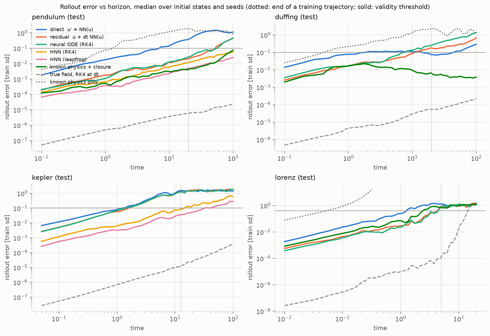
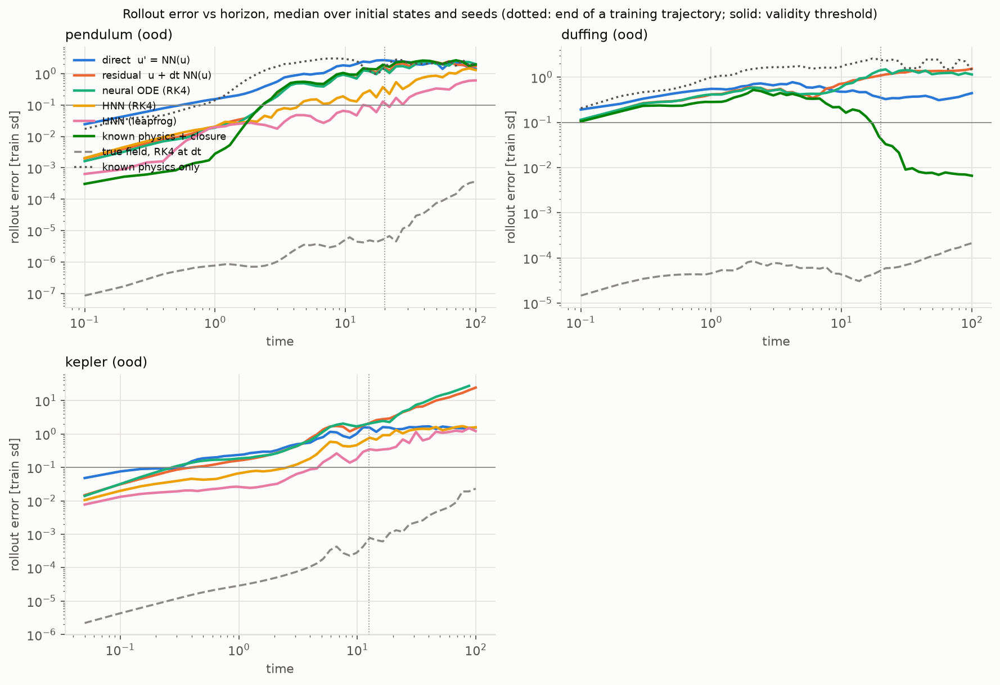
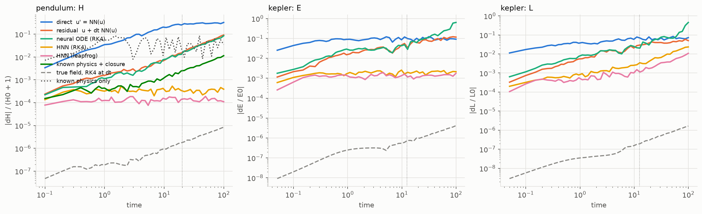
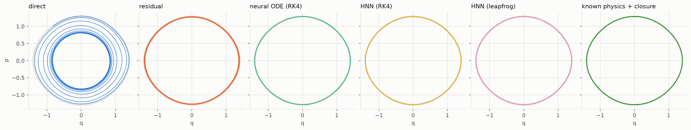
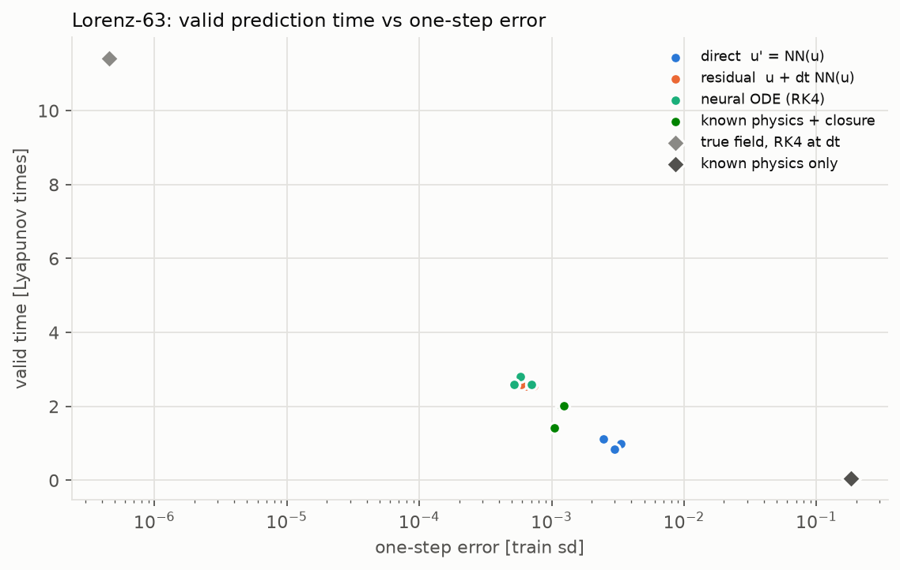
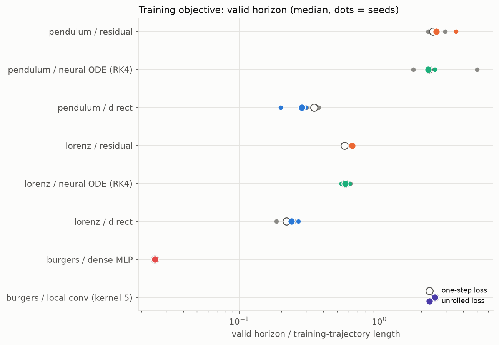
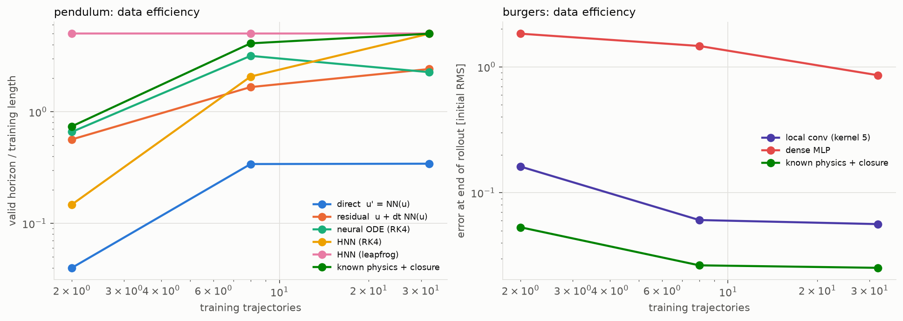
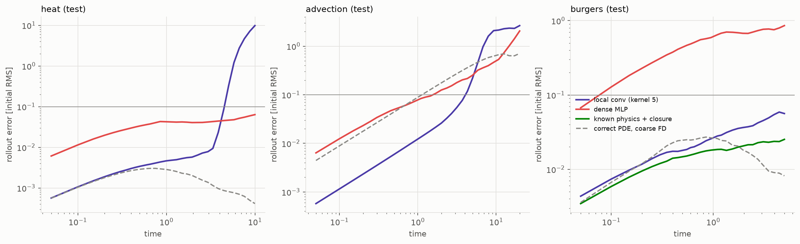
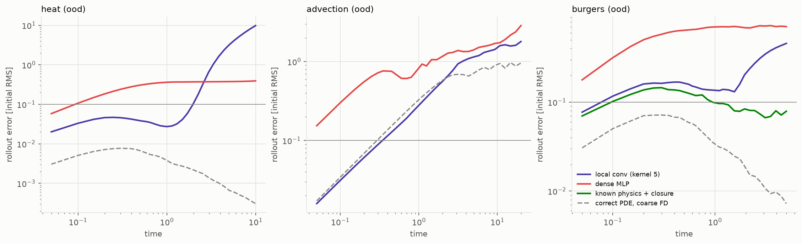
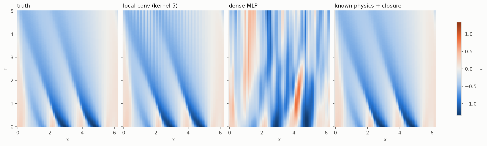

# Learning the update rule of a dynamical system

Generated by `physprior.dynamics.doc.render_doc()` from `results/dynamics/`. Do not edit by hand.

A model sees pairs of states one observation interval apart, u(t) and u(t + dt), and learns the map F with u(t + dt) = F(u(t)). It is then iterated on its own output from true initial states, for five to ten times longer than any training trajectory. The question is what physical structure in the stepper buys over a black box on those long rollouts. The expectations and the outcomes that would refute them were written before the reported runs: [expectations.md](expectations.md).

## Verdicts

| id | expectation | verdict |
|---|---|---|
| E1 | Leapfrog HNN keeps energy error bounded; black boxes drift | supported |
| E2 | A Hamiltonian field under RK4 still drifts more than under leapfrog | supported |
| E3 | Residual u + dt NN(u) beats direct u' = NN(u) | supported |
| E4 | Neural ODE (trained through RK4) beats the residual stepper | refuted |
| E5 | Known physics + closure beats the black boxes | refuted |
| E6 | An unrolled loss lengthens the valid horizon | refuted |
| E7 | Local conv beats dense MLP on PDEs, most with little data | refuted |
| E8 | On Lorenz, one-step error orders the valid times | supported |
| E9 | Structure helps most with little data (pendulum) | supported |

The numbers behind each verdict, medians over the reporting seeds:

- **E1**: kepler.black_box_late.direct = 0.115; kepler.black_box_late.node = 0.603; kepler.black_box_late.residual = 0.112; kepler.leapfrog_growth = 1.02; kepler.leapfrog_late = 0.00135; pendulum.black_box_late.direct = 0.307; pendulum.black_box_late.node = 0.0772; pendulum.black_box_late.residual = 0.0878; pendulum.leapfrog_growth = 0.994; pendulum.leapfrog_late = 0.000148
- **E2**: kepler.hnn_rk4_growth = 1.12; kepler.hnn_rk4_late = 0.00209; kepler.leapfrog_growth = 1.02; pendulum.hnn_rk4_growth = 0.995; pendulum.hnn_rk4_late = 0.000376; pendulum.leapfrog_growth = 0.994
  - pendulum: H growth RK4-HNN 0.995, leapfrog 0.994; late error RK4-HNN 0.000376, leapfrog 0.000148
  - kepler: E growth RK4-HNN 1.12, leapfrog 1.02; late error RK4-HNN 0.00209, leapfrog 0.00135
- **E3**: duffing.direct = 17; duffing.direct_ood = 0; duffing.residual = 103; duffing.residual_ood = 0.5; kepler.direct = 24; kepler.direct_ood = 6; kepler.residual = 31.5; kepler.residual_ood = 7.5; lorenz.direct = 109; lorenz.residual = 282; pendulum.direct = 68.5; pendulum.direct_ood = 5; pendulum.residual = 482; pendulum.residual_ood = 22.5
- **E4**: duffing.node = 73.5; duffing.residual = 103; kepler.node = 27.5; kepler.residual = 31.5; lorenz.node = 286; lorenz.residual = 282; pendulum.node = 452; pendulum.residual = 482
- **E5**: burgers.black_box.conv = 0.212; burgers.black_box.dense = 0.681; burgers.closure = 0.0818; burgers.closure_best = yes; duffing.black_box.direct = 0.373; duffing.black_box.node = 1.41; duffing.black_box.residual = 1.12; duffing.closure = 0.0381; duffing.closure_best = yes; lorenz.black_box.direct = 109; lorenz.black_box.node = 286; lorenz.black_box.residual = 282; lorenz.closure = 220; lorenz.closure_best = no; pendulum.black_box.direct = 2.67; pendulum.black_box.node = 1.49; pendulum.black_box.residual = 1.63; pendulum.closure = 1.86; pendulum.closure_best = no
  - pendulum: in-distribution valid steps closure 1e+03, best black box residual 482
  - duffing: in-distribution valid steps closure 1e+03, best black box residual 103
  - lorenz: in-distribution valid steps closure 220, best black box node 286
  - burgers: in-distribution valid steps closure 100, best black box conv 100
- **E6**: burgers/conv.onestep_loss = 100; burgers/conv.rollout_loss = 100; burgers/dense.onestep_loss = 1; burgers/dense.rollout_loss = 1; lorenz/direct.onestep_loss = 109; lorenz/direct.rollout_loss = 118; lorenz/node.onestep_loss = 286; lorenz/node.rollout_loss = 287; lorenz/residual.onestep_loss = 282; lorenz/residual.rollout_loss = 320; pendulum/direct.onestep_loss = 68.5; pendulum/direct.rollout_loss = 56; pendulum/node.onestep_loss = 452; pendulum/node.rollout_loss = 449; pendulum/residual.onestep_loss = 482; pendulum/residual.rollout_loss = 512
  - longer with unrolled loss: lorenz/direct, lorenz/node, lorenz/residual, pendulum/residual
  - not longer: burgers/conv, burgers/dense, pendulum/direct, pendulum/node
- **E7**: advection.conv = 2.65; advection.conv_ood = 1.79; advection.dense = 2.05; advection.dense_ood = 2.86; burgers.conv = 0.0563; burgers.conv_ood = 0.458; burgers.dense = 0.858; burgers.dense_ood = 0.707; burgers_conv_over_dense_by_n_traj.2 = 0.0879; burgers_conv_over_dense_by_n_traj.8 = 0.0413; burgers_conv_over_dense_by_n_traj.32 = 0.0656; heat.conv = 9.83; heat.conv_ood = 9.82; heat.dense = 0.0636; heat.dense_ood = 0.392
  - heat (test): err at end conv 9.83, dense 0.0636; fraction of conv rollouts ending with error > 1: 1
  - heat (ood): err at end conv 9.82, dense 0.392; fraction of conv rollouts ending with error > 1: 1
  - advection (test): err at end conv 2.65, dense 2.05; fraction of conv rollouts ending with error > 1: 1
  - advection (ood): err at end conv 1.79, dense 2.86; fraction of conv rollouts ending with error > 1: 1
  - burgers (test): err at end conv 0.0563, dense 0.858; fraction of conv rollouts ending with error > 1: 0
  - burgers (ood): err at end conv 0.458, dense 0.707; fraction of conv rollouts ending with error > 1: 0.375
- **E8**: max_vpt_lyap = 2.81; spearman = -0.904; vpt_lyap_by_arm.closure = 1.99; vpt_lyap_by_arm.direct = 0.987; vpt_lyap_by_arm.node = 2.59; vpt_lyap_by_arm.residual = 2.56
- **E9**: 2.closure = 148; 2.hnn_leapfrog = 1e+03; 2.leapfrog_over_residual = 8.85; 2.residual = 113; 8.closure = 820; 8.hnn_leapfrog = 1e+03; 8.leapfrog_over_residual = 3.01; 8.residual = 332; 32.closure = 1e+03; 32.hnn_leapfrog = 1e+03; 32.leapfrog_over_residual = 2.07; 32.residual = 482

Indented lines are measurements the pre-registered criterion does not look at; they were added to the evaluation after the criteria were fixed and do not change a verdict.

## Systems

| system | law | dt | train steps | test steps | structure |
|---|---|---|---|---|---|
| pendulum | q'' = -sin q; H = p^2/2 - cos q | 0.1 | 200 | 1000 | Hamiltonian, closure |
| duffing | x'' + 0.3x' + x + x^3 = 0.5 cos(1.2 t), state (x, v, cos, sin) | 0.1 | 200 | 1000 | closure |
| kepler | q'' = -q/|q|^3 (GM = 1); E and L conserved | 0.05 | 250 | 2000 | Hamiltonian |
| lorenz | Lorenz-63, sigma=10, rho=28, beta=8/3 | 0.01 | 500 | 2000 | closure, chaotic |
| heat | u_t = 0.05 u_xx | 0.05 | 40 | 200 | PDE, 64-point periodic grid |
| advection | u_t + u_x = 0 | 0.05 | 40 | 400 | PDE, 64-point periodic grid |
| burgers | u_t + u u_x = 0.03 u_xx | 0.05 | 40 | 100 | PDE, 64-point periodic grid, closure |

Units are dimensionless (g/l = 1 for the pendulum, GM = 1 for Kepler). Training trajectories start from initial states drawn per seed; the test set and the out-of-distribution (OOD) set are fixed across arms and seeds. OOD means energies closer to the separatrix (pendulum), larger amplitudes (Duffing), eccentricities 0.5 to 0.6 against a training range 0 to 0.5 (Kepler), and rougher, larger initial fields (PDEs: modes up to k = 10 against 6). Lorenz-63 has no OOD set; its initial states are on the attractor.

### Reference solutions and their convergence

ODE references use RK4 at the listed substeps per observation interval (the pendulum and Kepler use the project's second-order `numerics.integrators.rk4`). The error is the maximum over one training trajectory against a run with four times the substeps, in training standard deviations. Burgers uses an integrating-factor pseudo-spectral solver on 1024 points, compared with 2048 points and half the time step at the coarse grid points over a full test rollout. Heat and advection are solved exactly in Fourier space.

| system | substeps used | max error (used vs 4x finer) | observed order |
|---|---|---|---|
| pendulum | 10 | 1.57e-09 | 4.07 |
| duffing | 10 | 1.12e-08 | 4.1 |
| kepler | 25 | 1.68e-09 | 4.14 |
| lorenz | 10 | 7.63e-08 | 3.91 |
| burgers (spectral) | 25 | 1.64e-06 | – |

Largest Lyapunov exponent of Lorenz-63 re-measured on the reference integrator: 0.8981 against 0.9056 (Sprott 2003); relative difference 0.0083. Valid times are quoted in units of 1/lambda_1 with the literature value.

## Steppers and protocol

| arm | update | structure it carries |
|---|---|---|
| direct | u' = NN(u) | none; must learn the identity |
| residual | u' = u + dt NN(u) | increment form (Euler-like) |
| neural ODE | u' = RK4(NN, u, dt) | vector field, trained through RK4 |
| HNN (RK4) | u' = RK4(J grad H_NN, u, dt) | Hamiltonian field (Greydanus et al. 2019) |
| HNN (leapfrog) | leapfrog on T_NN(p) + V_NN(q) | separable H, symplectic map (Chen et al. 2020) |
| closure | u' = RK4(f_known + NN, u, dt) | known part of the law (as in APHYNITY, Yin et al. 2021) |
| local conv | u' = u + dt CNN(u) | kernel-5 stencil, translation-equivariant |
| dense MLP | u' = u + dt MLP(u) | none across space |
| PDE closure | u' = u + dt (nu D2 u + CNN(u)) | viscous term known, Burgers only |

Reference rows, not competitors: the true field with one RK4 step of size dt (`true field, RK4 at dt`), the incomplete known physics alone, and for PDEs the correct equation on the 64-point grid with second-order central differences and RK4 substeps (`correct PDE, coarse FD`).

The closure systems are given: the small-angle pendulum q'' = -q; the undamped linear Duffing oscillator with its drive (damping and the cubic spring are learned); the linear part of Lorenz-63 (the products xz and xy are learned); and the viscous term of Burgers.

Every run uses 1000 Adam steps with cosine decay, gradient clipping at norm 1, batch 128 windows for ODEs and 32 fields for PDEs, 32 training trajectories, networks of width 64 and two hidden layers (tanh) for ODEs and 32 channels for the convolutional steppers. The learning rate was chosen per arm from [0.003, 0.01, 0.03] on the tuning seeds (3, 7, 19) by the median validation valid horizon, on the pendulum for ODE arms and on Burgers for PDE arms, then frozen: closure 0.01, direct 0.03, hnn 0.03, hnn_leapfrog 0.03, node 0.03, pde_closure 0.03, pde_conv 0.03, pde_dense 0.003, residual 0.03. Reported numbers are medians over the reporting seeds (11, 23, 42) of the median over 16 test initial states.

Errors are in training standard deviations per component (ODEs) or in units of the initial RMS fluctuation of each field (PDEs). The valid horizon is the number of steps before the error first exceeds 0.1 (0.4 for Lorenz-63, the threshold of Pathak et al. 2018), divided here by the length of a training trajectory; it is capped by the rollout length (pendulum 5, duffing 5, kepler 8, lorenz 4, heat 5, advection 10, burgers 2.5). A rollout that leaves the data by more than 50.0 standard deviations or produces a non-finite state counts as a blow-up.

The first full run used the grid (0.001, 0.003). A check on the tuning seeds at 0.01 would have moved the choice for 8 of 9 arms (closure, direct, hnn, hnn_leapfrog, node, pde_closure, pde_conv, residual): the networks were under-trained at the fixed step budget. The grid was widened and the whole study rerun. The superseded verdicts are kept in `results/dynamics/expectations_grid1.json`:

| id | verdict, first grid | verdict, reported |
|---|---|---|
| E1 | supported | supported |
| E2 | supported | supported |
| E3 | supported | supported |
| E4 | refuted | refuted |
| E5 | supported | refuted |
| E6 | refuted | refuted |
| E7 | supported | refuted |
| E8 | supported | supported |
| E9 | refuted | supported |

Edge check: the tuning runs repeated at one larger rate than the grid (tuning seeds and validation set only). The table shows whether the choice would have moved; the reported runs keep the frozen choice.

| arm | chosen lr | choice with lr 0.1 | val valid steps @ 0.003 | val valid steps @ 0.01 | val valid steps @ 0.03 | val valid steps @ 0.1 |
|---|---|---|---|---|---|---|
| closure | 0.01 | 0.01 | 439 | 854 | 711 | 693 |
| direct | 0.03 | 0.03 | 19.8 | 26.7 | 119 | 23.2 |
| hnn | 0.03 | 0.03 | 158 | 738 | 934 | 606 |
| hnn_leapfrog | 0.03 | 0.03 | 1e+03 | 1e+03 | 1e+03 | 559 |
| node | 0.03 | 0.03 | 122 | 360 | 587 | 137 |
| pde_closure | 0.03 | 0.03 | 84.7 | 100 | 100 | 100 |
| pde_conv | 0.03 | 0.03 | 55.3 | 97.7 | 100 | 69.3 |
| pde_dense | 0.003 | 0.003 | 1 | 1 | 1 | 1 |
| residual | 0.03 | 0.03 | 122 | 387 | 568 | 282 |

## Rollout error

In distribution:

| system | arm | one-step err | err @ train horizon | err @ end | valid horizon / train length | blow-up frac | frac err > 1 @ end | train s | params |
|---|---|---|---|---|---|---|---|---|---|
| pendulum | direct  u' = NN(u) | 0.00205 | 0.389 | 1.15 | 0.343 | 0 | 0.562 | 2.18 | 4482 |
| pendulum | residual  u + dt NN(u) | 0.000329 | 0.022 | 0.461 | 2.41 | 0 | 0.125 | 2.08 | 4482 |
| pendulum | neural ODE (RK4) | 0.000297 | 0.0265 | 0.462 | 2.26 | 0 | 0.0625 | 4.49 | 4482 |
| pendulum | HNN (RK4) | 0.000165 | 0.0117 | 0.0593 | 5 | 0 | 0 | 7.29 | 4417 |
| pendulum | HNN (leapfrog) | 6.69e-05 | 0.00473 | 0.0252 | 5 | 0 | 0 | 4.75 | 8706 |
| pendulum | known physics + closure | 0.000131 | 0.00373 | 0.077 | 5 | 0 | 0 | 4.46 | 4482 |
| pendulum | true field, RK4 at dt | 5.64e-08 | 5.78e-06 | 2.26e-05 | 5 | 0 | 0 | 0 | 0 |
| pendulum | known physics only | 0.0202 | 1.76 | 0.826 | 0.065 | 0 | 0.375 | 0 | 0 |
| duffing | direct  u' = NN(u) | 0.00522 | 0.0785 | 0.29 | 0.085 | 0 | 0 | 1.45 | 4740 |
| duffing | residual  u + dt NN(u) | 0.0013 | 0.15 | 0.672 | 0.515 | 0 | 0.0625 | 1.45 | 4740 |
| duffing | neural ODE (RK4) | 0.00135 | 0.279 | 1.36 | 0.367 | 0 | 0.625 | 3.26 | 4740 |
| duffing | known physics + closure | 0.00107 | 0.00614 | 0.00382 | 5 | 0 | 0 | 4.23 | 4740 |
| duffing | true field, RK4 at dt | 6.84e-07 | 5.57e-05 | 0.000218 | 5 | 0 | 0 | 0 | 0 |
| duffing | known physics only | 0.0337 | 2.31 | 1.06 | 0.02 | 0 | 0.5 | 0 | 0 |
| kepler | direct  u' = NN(u) | 0.00687 | 1.47 | 1.41 | 0.096 | 0 | 0.688 | 1.47 | 4740 |
| kepler | residual  u + dt NN(u) | 0.00165 | 1.26 | 1.81 | 0.126 | 0.0625 | 0.812 | 1.49 | 4740 |
| kepler | neural ODE (RK4) | 0.00163 | 1.26 | 1.85 | 0.11 | 0.0625 | 0.812 | 5.2 | 4740 |
| kepler | HNN (RK4) | 0.000462 | 0.0894 | 0.593 | 0.926 | 0 | 0.188 | 7.14 | 4545 |
| kepler | HNN (leapfrog) | 0.000234 | 0.0388 | 0.279 | 2.12 | 0 | 0.188 | 8.47 | 8834 |
| kepler | true field, RK4 at dt | 1.05e-08 | 1.24e-05 | 0.000371 | 8 | 0 | 0 | 0 | 0 |
| lorenz | direct  u' = NN(u) | 0.00298 | 1.32 | 1.27 | 0.218 | 0 | 0.688 | 1.54 | 4611 |
| lorenz | residual  u + dt NN(u) | 0.000637 | 0.989 | 1.48 | 0.565 | 0 | 0.625 | 1.5 | 4611 |
| lorenz | neural ODE (RK4) | 0.00058 | 0.866 | 1.15 | 0.573 | 0 | 0.625 | 5.31 | 4611 |
| lorenz | known physics + closure | 0.00118 | 0.734 | 1.35 | 0.44 | 0 | 0.688 | 6.03 | 4611 |
| lorenz | true field, RK4 at dt | 4.53e-07 | 8.19e-05 | 1.09 | 2.52 | 0 | 0.5 | 0 | 0 |
| lorenz | known physics only | 0.181 | inf | inf | 0.01 | 1 | 1 | 0 | 0 |

Out of distribution:

| system | arm | one-step err | err @ train horizon | err @ end | valid horizon / train length | blow-up frac | frac err > 1 @ end | train s | params |
|---|---|---|---|---|---|---|---|---|---|
| pendulum | direct  u' = NN(u) | 0.0328 | 2.67 | 1.4 | 0.025 | 0 | 0.625 | 2.18 | 4482 |
| pendulum | residual  u + dt NN(u) | 0.0087 | 1.63 | 1.71 | 0.113 | 0 | 0.812 | 2.08 | 4482 |
| pendulum | neural ODE (RK4) | 0.00737 | 1.49 | 1.99 | 0.115 | 0 | 0.875 | 4.49 | 4482 |
| pendulum | HNN (RK4) | 0.00485 | 0.355 | 1.3 | 0.19 | 0 | 0.562 | 7.29 | 4417 |
| pendulum | HNN (leapfrog) | 0.00273 | 0.134 | 0.607 | 0.8 | 0 | 0.312 | 4.75 | 8706 |
| pendulum | known physics + closure | 0.0101 | 1.86 | 1.93 | 0.113 | 0 | 0.75 | 4.46 | 4482 |
| pendulum | true field, RK4 at dt | 9.27e-08 | 4.9e-06 | 0.000369 | 5 | 0 | 0 | 0 | 0 |
| pendulum | known physics only | 0.0911 | 1.38 | 2.1 | 0.035 | 0 | 0.75 | 0 | 0 |
| duffing | direct  u' = NN(u) | 0.0461 | 0.373 | 0.442 | 0 | 0 | 0.0625 | 1.45 | 4740 |
| duffing | residual  u + dt NN(u) | 0.0192 | 1.12 | 1.53 | 0.0025 | 0 | 0.75 | 1.45 | 4740 |
| duffing | neural ODE (RK4) | 0.019 | 1.41 | 1.14 | 0.0025 | 0 | 0.75 | 3.26 | 4740 |
| duffing | known physics + closure | 0.0181 | 0.0381 | 0.00659 | 0.0025 | 0 | 0 | 4.23 | 4740 |
| duffing | true field, RK4 at dt | 2.56e-06 | 5.21e-05 | 0.000212 | 5 | 0 | 0 | 0 | 0 |
| duffing | known physics only | 0.0541 | 2.56 | 1.43 | 0 | 0 | 0.688 | 0 | 0 |
| kepler | direct  u' = NN(u) | 0.0276 | 1.51 | 1.55 | 0.024 | 0 | 0.625 | 1.47 | 4740 |
| kepler | residual  u + dt NN(u) | 0.0069 | 2.17 | 24.3 | 0.03 | 0.188 | 0.938 | 1.49 | 4740 |
| kepler | neural ODE (RK4) | 0.00641 | 1.97 | inf | 0.02 | 0.5 | 1 | 5.2 | 4740 |
| kepler | HNN (RK4) | 0.00286 | 0.685 | 1.58 | 0.166 | 0 | 0.75 | 7.14 | 4545 |
| kepler | HNN (leapfrog) | 0.00166 | 0.285 | 1.22 | 0.366 | 0 | 0.562 | 8.47 | 8834 |
| kepler | true field, RK4 at dt | 4.54e-07 | 0.000674 | 0.0232 | 8 | 0 | 0 | 0 | 0 |

## Conserved quantities

`early` and `late` are the median relative invariant error over the first and last tenth of the rollout; `growth` is late / early. A bounded error has growth near 1.

| system | arm | H_late | H_growth | E_late | E_growth | L_late | L_growth |
|---|---|---|---|---|---|---|---|
| pendulum | direct  u' = NN(u) | 0.307 | 1.99 | – | – | – | – |
| pendulum | residual  u + dt NN(u) | 0.0878 | 17.3 | – | – | – | – |
| pendulum | neural ODE (RK4) | 0.0772 | 16.6 | – | – | – | – |
| pendulum | HNN (RK4) | 0.000376 | 0.995 | – | – | – | – |
| pendulum | HNN (leapfrog) | 0.000148 | 0.994 | – | – | – | – |
| pendulum | known physics + closure | 0.0102 | 8.35 | – | – | – | – |
| pendulum | true field, RK4 at dt | 7.86e-06 | 18.4 | – | – | – | – |
| pendulum | known physics only | 0.0504 | 1.04 | – | – | – | – |
| kepler | direct  u' = NN(u) | – | – | 0.115 | 1.45 | 0.0814 | 1.32 |
| kepler | residual  u + dt NN(u) | – | – | 0.112 | 6.06 | 0.0534 | 7.96 |
| kepler | neural ODE (RK4) | – | – | 0.603 | 30 | 0.396 | 35.8 |
| kepler | HNN (RK4) | – | – | 0.00209 | 1.12 | 0.0227 | 18.8 |
| kepler | HNN (leapfrog) | – | – | 0.00135 | 1.02 | 0.00974 | 10.4 |
| kepler | true field, RK4 at dt | – | – | 3.91e-06 | 11.1 | 1.57e-06 | 18.1 |

## Chaos: Lorenz-63

| arm | onestep | valid time [Lyapunov] | blowup_frac |
|---|---|---|---|
| direct  u' = NN(u) | 0.00298 | 0.987 | 0 |
| residual  u + dt NN(u) | 0.000637 | 2.56 | 0 |
| neural ODE (RK4) | 0.00058 | 2.59 | 0 |
| known physics + closure | 0.00118 | 1.99 | 0 |
| true field, RK4 at dt | 4.53e-07 | 11.4 | 0 |
| known physics only | 0.181 | 0.0453 | 1 |

## Training objective: one-step vs unrolled loss

Same architecture, learning rate and number of gradient steps; the unrolled loss averages the error over 5 steps of the model's own rollout from each window start.

| system | arm | valid/train, one-step loss | valid/train, unrolled loss | err @ end, one-step | err @ end, unrolled | train s, one-step | train s, unrolled |
|---|---|---|---|---|---|---|---|
| burgers | local conv (kernel 5) | 2.5 | 2.5 | 0.0563 | 0.0386 | 4.78 | 36.2 |
| burgers | dense MLP | 0.025 | 0.025 | 0.858 | 0.648 | 2.42 | 10.5 |
| lorenz | direct  u' = NN(u) | 0.218 | 0.236 | 1.27 | 1.41 | 1.54 | 5.79 |
| lorenz | neural ODE (RK4) | 0.573 | 0.574 | 1.15 | 1.32 | 5.31 | 24.1 |
| lorenz | residual  u + dt NN(u) | 0.565 | 0.641 | 1.48 | 1.47 | 1.5 | 6.32 |
| pendulum | direct  u' = NN(u) | 0.343 | 0.28 | 1.15 | 1.49 | 2.18 | 8.03 |
| pendulum | neural ODE (RK4) | 2.26 | 2.25 | 0.462 | 0.432 | 4.49 | 24.3 |
| pendulum | residual  u + dt NN(u) | 2.41 | 2.56 | 0.461 | 0.2 | 2.08 | 7.75 |

## Data efficiency

The number of gradient steps is the same at every data size.

| system | arm | metric | 2 traj | 8 traj | 32 traj |
|---|---|---|---|---|---|
| burgers | known physics + closure | err_end | 0.0531 | 0.0265 | 0.0253 |
| burgers | local conv (kernel 5) | err_end | 0.161 | 0.0606 | 0.0563 |
| burgers | dense MLP | err_end | 1.83 | 1.47 | 0.858 |
| pendulum | known physics + closure | valid_over_train | 0.74 | 4.1 | 5 |
| pendulum | direct  u' = NN(u) | valid_over_train | 0.04 | 0.34 | 0.343 |
| pendulum | HNN (RK4) | valid_over_train | 0.147 | 2.06 | 5 |
| pendulum | HNN (leapfrog) | valid_over_train | 5 | 5 | 5 |
| pendulum | neural ODE (RK4) | valid_over_train | 0.66 | 3.17 | 2.26 |
| pendulum | residual  u + dt NN(u) | valid_over_train | 0.565 | 1.66 | 2.41 |

## PDEs: locality and translation equivariance

| system | arm | one-step err | err @ train horizon | err @ end | valid horizon / train length | blow-up frac | frac err > 1 @ end | mass drift | energy ratio @ end | train s | params |
|---|---|---|---|---|---|---|---|---|---|---|---|
| heat | local conv (kernel 5) | 0.000138 | 0.00576 | 9.83 | 2.25 | 0 | 1 | 0.0486 | 651 | 4.52 | 1281 |
| heat | dense MLP | 0.0016 | 0.0406 | 0.0636 | 5 | 0 | 0 | 0.00399 | 0.837 | 2.37 | 98880 |
| heat | correct PDE, coarse FD | 0.000108 | 0.00198 | 0.000413 | 5 | 0 | 0 | 4e-17 | 1 | 0 | 0 |
| advection | local conv (kernel 5) | 0.000576 | 0.0261 | 2.65 | 2.04 | 0 | 1 | 1.85 | 2.39 | 4.27 | 1281 |
| advection | dense MLP | 0.00639 | 0.125 | 2.05 | 0.775 | 0 | 1 | 0.142 | 3.62 | 2.37 | 98880 |
| advection | correct PDE, coarse FD | 0.00444 | 0.176 | 0.708 | 0.55 | 0 | 0.125 | 1.51e-16 | 1 | 0 | 0 |
| burgers | known physics + closure | 0.00117 | 0.0208 | 0.0253 | 2.5 | 0 | 0 | 0.00835 | 0.975 | 5.72 | 1281 |
| burgers | local conv (kernel 5) | 0.0018 | 0.0366 | 0.0563 | 2.5 | 0 | 0 | 0.00529 | 0.979 | 4.78 | 1281 |
| burgers | dense MLP | 0.0371 | 0.673 | 0.858 | 0.025 | 0 | 0.375 | 0.0325 | 4.17 | 2.42 | 98880 |
| burgers | correct PDE, coarse FD | 0.00409 | 0.0181 | 0.00817 | 2.5 | 0 | 0 | 8.33e-17 | 1.01 | 0 | 0 |

Out of distribution:

| system | arm | one-step err | err @ train horizon | err @ end | valid horizon / train length | blow-up frac | frac err > 1 @ end | mass drift | energy ratio @ end | train s | params |
|---|---|---|---|---|---|---|---|---|---|---|---|
| heat | local conv (kernel 5) | 0.00201 | 0.106 | 9.82 | 0.975 | 0 | 1 | 0.0422 | 1.03e+03 | 4.52 | 1281 |
| heat | dense MLP | 0.00781 | 0.37 | 0.392 | 0.025 | 0 | 0 | 0.00994 | 2.27 | 2.37 | 98880 |
| heat | correct PDE, coarse FD | 0.000398 | 0.00218 | 0.000307 | 5 | 0 | 0 | 6.18e-17 | 1 | 0 | 0 |
| advection | local conv (kernel 5) | 0.0159 | 0.56 | 1.79 | 0.15 | 0 | 1 | 1.1 | 0.758 | 4.27 | 1281 |
| advection | dense MLP | 0.154 | 1.17 | 2.86 | 0 | 0 | 1 | 0.132 | 7.52 | 2.37 | 98880 |
| advection | correct PDE, coarse FD | 0.0172 | 0.579 | 0.96 | 0.138 | 0 | 0.5 | 1.65e-16 | 1 | 0 | 0 |
| burgers | known physics + closure | 0.0124 | 0.0818 | 0.079 | 0.0375 | 0 | 0 | 0.0254 | 1.05 | 5.72 | 1281 |
| burgers | local conv (kernel 5) | 0.0147 | 0.212 | 0.458 | 0.025 | 0 | 0.375 | 0.0743 | 2.72 | 4.78 | 1281 |
| burgers | dense MLP | 0.047 | 0.681 | 0.707 | 0 | 0 | 0.125 | 0.0238 | 5.55 | 2.42 | 98880 |
| burgers | correct PDE, coarse FD | 0.0102 | 0.0179 | 0.00722 | 2.5 | 0 | 0 | 6.94e-17 | 1 | 0 | 0 |

## Limitations

- One network size per arm and a two-value learning-rate grid, tuned on one system per family; other systems use the same settings.
- Training data are noise-free and sampled at one fixed dt.
- Equal gradient steps is the compute rule; the unrolled loss and the RK4-based arms cost more wall time per step, reported in the tables.
- The HNN arms know which coordinates are q and p; the leapfrog arm also assumes a separable Hamiltonian. Neither enforces rotation invariance, so angular momentum on Kepler is not protected.
- The PDE `physics` reference uses the right equation; it shows what the equation buys on this grid and is not a competitor.

## References

- S. Greydanus, M. Dzamba, J. Yosinski, Hamiltonian Neural Networks, NeurIPS 32 (2019), arXiv:1906.01563.
- Z. Chen, J. Zhang, M. Arjovsky, L. Bottou, Symplectic Recurrent Neural Networks, ICLR (2020), arXiv:1909.13334.
- Y. Yin et al., Augmenting physical models with deep networks for complex dynamics forecasting (APHYNITY), J. Stat. Mech. (2021) 124012; `docs/references.bib: yin2021aphynity`.
- R. T. Q. Chen, Y. Rubanova, J. Bettencourt, D. Duvenaud, Neural Ordinary Differential Equations, NeurIPS 31 (2018), arXiv:1806.07366.
- J. Pathak, B. Hunt, M. Girvan, Z. Lu, E. Ott, Model-free prediction of large spatiotemporally chaotic systems from data, Phys. Rev. Lett. 120, 024102 (2018).
- E. N. Lorenz, Deterministic nonperiodic flow, J. Atmos. Sci. 20, 130 (1963).
- J. C. Sprott, Chaos and Time-Series Analysis, Oxford University Press (2003).
- G. Benettin, L. Galgani, A. Giorgilli, J.-M. Strelcyn, Lyapunov characteristic exponents for smooth dynamical systems, Meccanica 15, 9 (1980).

Study wall time: 11.5 min for 247 runs.
