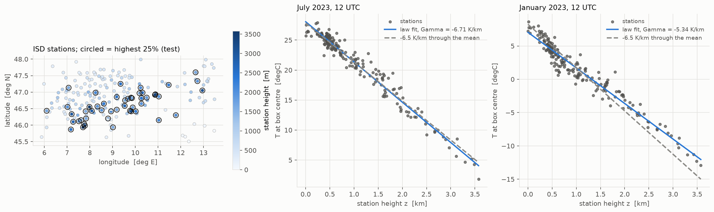
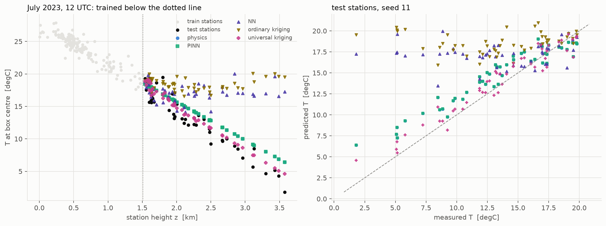
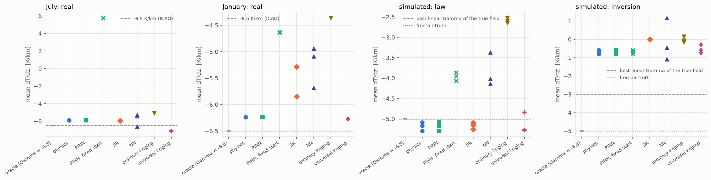
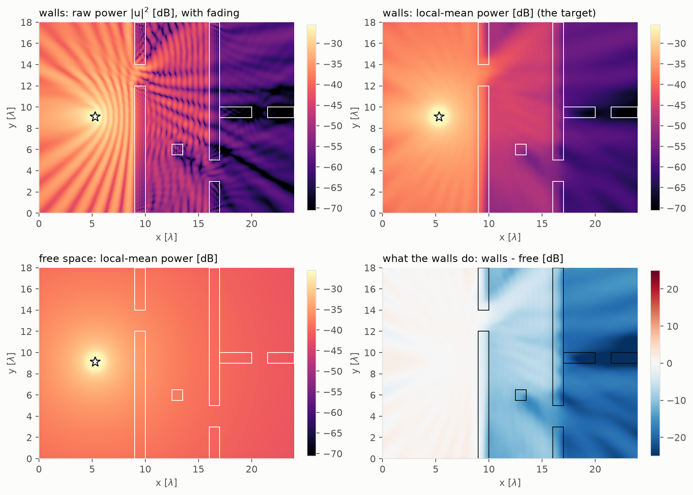
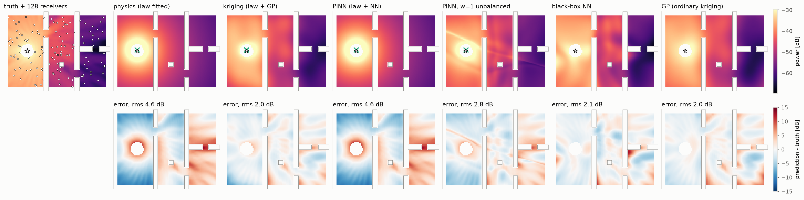
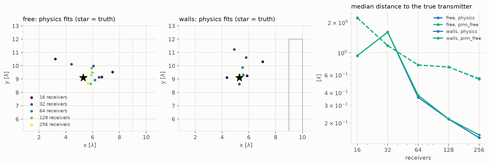

# fields

Spatial fields: estimating a physical quantity everywhere from readings at a
few places. The question is the project's usual one, moved from curves to
maps: what does a physical law buy a reconstruction, and what does it cost
when the law is incomplete?

**Real data**: near-surface air temperature at NOAA ISD stations over the Alps.
**Simulation**: a 2-D radio field solved from the Helmholtz equation, in free
space and in a building with concrete walls.

Code: [`src/physprior/problems/fields`](../../src/physprior/problems/fields)
· Results: [`results/fields`](../../results/fields)

---

## Temperature and the lapse rate: `fields/weather`

Temperature falls with height at a nearly constant rate, so a law with a
lapse rate and a horizontal gradient describes most of a monthly-mean field.
The standard-atmosphere value of the lapse rate is the published constant.
The test that matters is extrapolation *up the mountain*: every arm is
trained on the lower stations and scored on the highest ones, which a black
box has never seen. Kriging, the meteorologist's standard tool, is reported
beside the arms, both on its own and on the residuals of the law. January
adds the case where the law is known to fail: valley inversions.

A simulated control at the same station positions, with a known lapse rate
and a known correlated residual, separates the methods' own error from the
data's, and checks whether each method's error bar on the lapse rate is
calibrated. Full tables, generated from `results/`: [weather.md](weather.md).

## Radio propagation: `fields/rf`

A transmitter in a 2-D scene; the field is solved from the Helmholtz
equation with an absorbing boundary, and the solver ships with its grid
convergence study. The law is log-distance path loss with an unknown
transmitter position and exponent, so the physics fit is also a
localisation. In free space the law is complete; with walls it is not, which
is the H3 question in map form: does a learned correction repair what the
law leaves out?

The residual PINN that solves the Helmholtz equation directly (shape A) is
reported as a negative result: amplitude readings without phase and without
a boundary condition leave it under-determined. Full tables, generated from
`results/`: [rf.md](rf.md).

## Caveats, stated up front

- One year, one hour of day and two months of station data. Station heights
  come from the ISD list and are not checked against a terrain model.
- The radio study is simulation only, in 2-D with a line source, so the
  free-space path-loss exponent is 1, not the 2 of a point source in 3-D.
- On both tracks the frozen `pinn` arm reduces to the `physics` fit, for the
  reason measured in [optimization/](../optimization/) §5.
