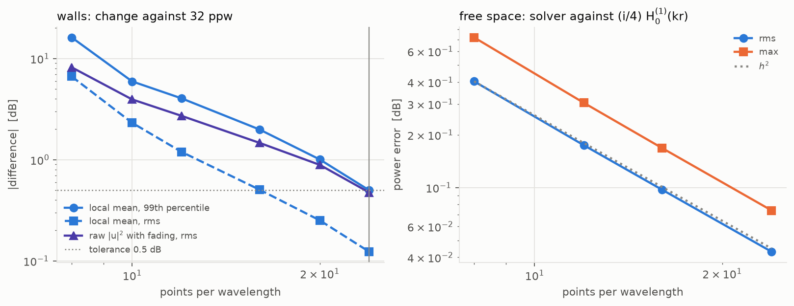
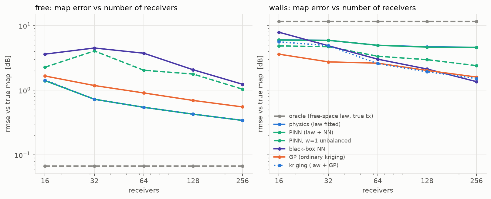
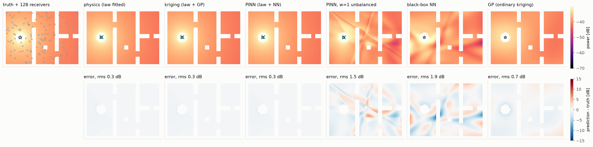
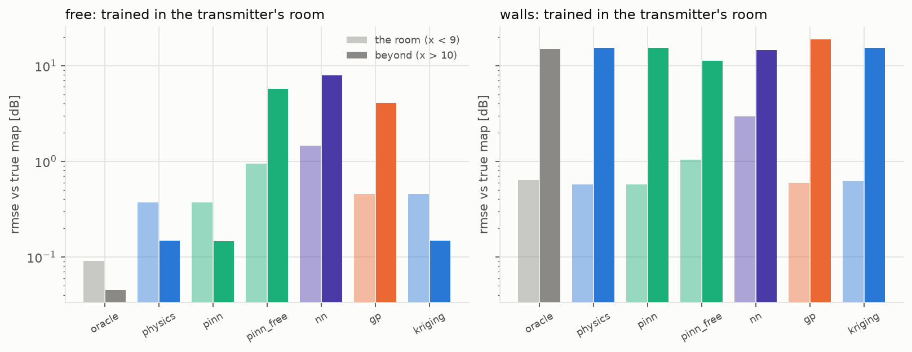
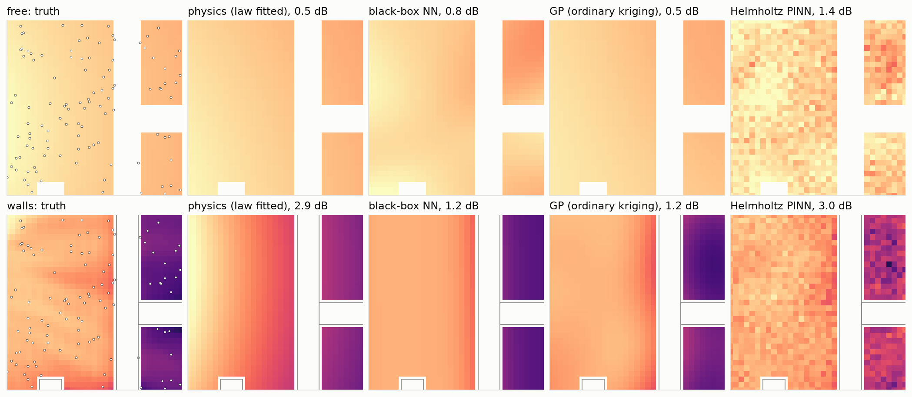

# fields / rf — radio propagation

Where is the transmitter, and what is the received-power map, given a few
noisy readings? A simulated track: the field is solved from the 2-D
Helmholtz equation, so the true map and the true transmitter position are
known and every arm is scored against them.

Code: [`src/physprior/problems/fields/rf.py`](../../src/physprior/problems/fields/rf.py),
[`rf_sim.py`](../../src/physprior/problems/fields/rf_sim.py)
· Results: [`results/fields/rf`](../../results/fields/rf)

This page is generated by `physprior.problems.fields.rf.render_doc()`.

## The simulation

A 2.4 GHz transmitter (12.5 cm wavelength)
in a 24 × 18 wavelength floor plan. The
field solves ∇²u + k²n(x)²u = −f with second-order finite differences, a
perfectly matched layer, and a sparse LU solve. Walls are concrete,
ε = 5.24 + 0.69i (ITU-R P.2040-1).
A receiver reads the mean of |u|² over a disk of radius 1 λ,
in dB, with 2 dB Gaussian noise. In two dimensions a source spreads
cylindrically, so the free-space path-loss exponent is n = 1, not 2.

### Convergence

Against the analytic free-space field (i/4)H₀⁽¹⁾(kr), power error in dB:

| ppw | rms_db_error | max_abs_db_error | seconds |
|---|---|---|---|
| 8 | 0.404 | 0.72 | 7.87 |
| 12 | 0.174 | 0.304 | 32 |
| 16 | 0.0974 | 0.168 | 71.5 |
| 24 | 0.043 | 0.074 | 175 |

Walls scene, change against the finest grid, in dB:

| ppw | n_unknowns | seconds | local_mean_p99_db | local_mean_max_db | local_mean_rms_db | raw_rms_db |
|---|---|---|---|---|---|---|
| 8 | 3.98e+04 | 7.27 | 16.1 | 17.5 | 6.64 | 8.18 |
| 10 | 6.21e+04 | 17 | 5.94 | 8.94 | 2.32 | 3.94 |
| 12 | 8.93e+04 | 19.8 | 4.04 | 5.14 | 1.19 | 2.71 |
| 16 | 1.58e+05 | 49.8 | 1.99 | 3.01 | 0.506 | 1.47 |
| 20 | 2.47e+05 | 108 | 1 | 1.65 | 0.251 | 0.888 |
| 24 | 3.56e+05 | 271 | 0.498 | 0.817 | 0.123 | 0.474 |
| 32 | 6.32e+05 | 726 | 0 | 0 | 0 | 0 |

Resolution used: **24 points per wavelength**, the coarsest grid whose
local-mean map is within 0.5 dB of the finest at 99% of points. The raw
power with fading converges more slowly, because the scheme's phase error
accumulates over the scene; the arms are not asked to reproduce it.

Assuming second order (the analytic check above falls as h²), the error of the 24-ppw map against the continuum is about 2.3× its difference from 32 ppw: 0.28 dB rms and 1.14 dB at the 99th percentile, against 2 dB of receiver noise.

## The arms

`physics` fits P = P0 − 10 n log10(d), d the distance to an unknown
transmitter (x_t, y_t), from several starts. `oracle` is the same law with
the true position, n = 1 and the analytic P0. `pinn` is the law plus a
network correction, started from the physics fit, with a physics weight
tuned per scene on the tuning seeds (pinned at the top of its grid in both
scenes, so the arm is the law by choice); `pinn_free` is the same with
w_phys = 1.
`nn` is a tuned MLP, `gp` is ordinary kriging, `kriging` is the fitted law
plus a GP on its residuals.

Oracle map error: free space 0.07 dB, walls 11.58 dB.

## Map error against the number of receivers

Median over reporting seeds of the RMSE against the true map, dB:

| scene | arm | n=16 | n=32 | n=64 | n=128 | n=256 |
|---|---|---|---|---|---|---|
| free | gp | 1.66 | 1.18 | 0.91 | 0.70 | 0.55 |
| free | kriging | 1.44 | 0.73 | 0.54 | 0.43 | 0.34 |
| free | nn | 3.62 | 4.51 | 3.74 | 2.07 | 1.24 |
| free | oracle | 0.07 | 0.07 | 0.07 | 0.07 | 0.07 |
| free | physics | 1.41 | 0.73 | 0.54 | 0.43 | 0.34 |
| free | pinn | 1.41 | 0.73 | 0.54 | 0.43 | 0.34 |
| free | pinn_free | 2.27 | 4.06 | 2.04 | 1.78 | 1.04 |
| walls | gp | 3.62 | 2.75 | 2.62 | 2.02 | 1.60 |
| walls | kriging | 5.60 | 4.90 | 2.58 | 1.94 | 1.52 |
| walls | nn | 7.90 | 4.89 | 3.02 | 2.13 | 1.36 |
| walls | oracle | 11.58 | 11.58 | 11.58 | 11.58 | 11.58 |
| walls | physics | 5.99 | 5.93 | 4.96 | 4.71 | 4.61 |
| walls | pinn | 5.99 | 5.93 | 4.96 | 4.65 | 4.61 |
| walls | pinn_free | 4.85 | 4.73 | 3.36 | 2.97 | 2.40 |

## Where is the transmitter?

Median distance from the true position (wavelengths), and the fitted
exponent and P0:

| scene | arm | n_train | tx_err_lambda | param_n | param_P0 |
|---|---|---|---|---|---|
| free | physics | 16 | 2.22 | 1.04 | -28.75 |
| free | physics | 32 | 1.18 | 0.98 | -29.09 |
| free | physics | 64 | 0.75 | 1.09 | -28.54 |
| free | physics | 128 | 0.72 | 0.99 | -29.21 |
| free | physics | 256 | 0.55 | 0.99 | -29.06 |
| free | pinn | 16 | 2.22 | 1.04 | -28.75 |
| free | pinn | 32 | 1.18 | 0.98 | -29.09 |
| free | pinn | 64 | 0.75 | 1.09 | -28.54 |
| free | pinn | 128 | 0.72 | 0.99 | -29.21 |
| free | pinn | 256 | 0.55 | 0.99 | -29.06 |
| free | pinn_free | 16 | 2.22 | 1.04 | -28.75 |
| free | pinn_free | 32 | 1.18 | 0.98 | -29.09 |
| free | pinn_free | 64 | 0.75 | 1.09 | -28.54 |
| free | pinn_free | 128 | 0.72 | 0.99 | -29.22 |
| free | pinn_free | 256 | 0.55 | 0.99 | -29.06 |
| walls | physics | 16 | 0.93 | 3.31 | -19.65 |
| walls | physics | 32 | 1.60 | 3.51 | -15.18 |
| walls | physics | 64 | 0.36 | 3.52 | -16.21 |
| walls | physics | 128 | 0.22 | 3.60 | -14.40 |
| walls | physics | 256 | 0.14 | 3.56 | -14.65 |
| walls | pinn | 16 | 0.93 | 3.31 | -19.65 |
| walls | pinn | 32 | 1.60 | 3.51 | -15.18 |
| walls | pinn | 64 | 0.36 | 3.53 | -16.21 |
| walls | pinn | 128 | 0.22 | 3.60 | -14.40 |
| walls | pinn | 256 | 0.14 | 3.56 | -14.65 |
| walls | pinn_free | 16 | 0.93 | 3.31 | -19.65 |
| walls | pinn_free | 32 | 1.60 | 3.51 | -15.18 |
| walls | pinn_free | 64 | 0.38 | 3.54 | -16.10 |
| walls | pinn_free | 128 | 0.22 | 3.60 | -14.36 |
| walls | pinn_free | 256 | 0.15 | 3.56 | -14.63 |

## Reconstructions (128 receivers, seed 11)

## Extrapolation: trained in the transmitter's room

| scene | arm | map_rmse_room_db | map_rmse_beyond_db | tx_err_lambda |
|---|---|---|---|---|
| free | gp | 0.45 | 4.10 | — |
| free | kriging | 0.45 | 0.15 | 0.48 |
| free | nn | 1.46 | 7.89 | — |
| free | oracle | 0.09 | 0.05 | 0.00 |
| free | physics | 0.37 | 0.15 | 0.48 |
| free | pinn | 0.37 | 0.15 | 0.48 |
| free | pinn_free | 0.94 | 5.73 | 0.48 |
| walls | gp | 0.60 | 18.94 | — |
| walls | kriging | 0.62 | 15.44 | 0.43 |
| walls | nn | 2.94 | 14.64 | — |
| walls | oracle | 0.64 | 14.97 | 0.00 |
| walls | physics | 0.57 | 15.44 | 0.43 |
| walls | pinn | 0.57 | 15.43 | 0.43 |
| walls | pinn_free | 1.04 | 11.25 | 0.43 |

## Noise (128 receivers, scored against the clean map)

| scene | arm | 0 dB | 2 dB | 4 dB | 8 dB |
|---|---|---|---|---|---|
| free | gp | 0.18 | 0.76 | 1.14 | 1.73 |
| free | kriging | 0.01 | 0.53 | 1.08 | 2.41 |
| free | nn | 0.12 | 2.12 | 6.25 | 12.51 |
| free | oracle | 0.07 | 0.07 | 0.07 | 0.07 |
| free | physics | 0.03 | 0.29 | 0.61 | 1.17 |
| free | pinn | 0.03 | 0.29 | 0.61 | 1.17 |
| free | pinn_free | 0.02 | 1.63 | 4.16 | 8.10 |
| walls | gp | 1.46 | 2.18 | 2.51 | 2.95 |
| walls | kriging | 1.44 | 1.97 | 2.66 | 3.99 |
| walls | nn | 1.20 | 2.05 | 4.50 | 10.90 |
| walls | oracle | 11.58 | 11.58 | 11.58 | 11.58 |
| walls | physics | 4.70 | 4.67 | 4.67 | 4.79 |
| walls | pinn | 4.58 | 4.57 | 4.59 | 4.79 |
| walls | pinn_free | 2.49 | 2.64 | 4.44 | 8.73 |

## Shape A: a Helmholtz-residual PINN on a window

Window x, y ∈ [11.0, 19.0, 6.0, 14.0] λ, all pool receivers in it. The PINN is
given the true refractive-index map; the readings carry no phase. w_pde = 1,
untuned.

| scene | arm | window_rmse_db | seconds |
|---|---|---|---|
| free | gp | 0.55 | 0.00 |
| free | nn | 3.90 | 19.07 |
| free | physics | 0.50 | 0.32 |
| free | pinn_helmholtz | 1.53 | 525.69 |
| walls | gp | 1.23 | 0.00 |
| walls | nn | 2.50 | 4.57 |
| walls | physics | 2.86 | 0.10 |
| walls | pinn_helmholtz | 2.96 | 334.45 |

