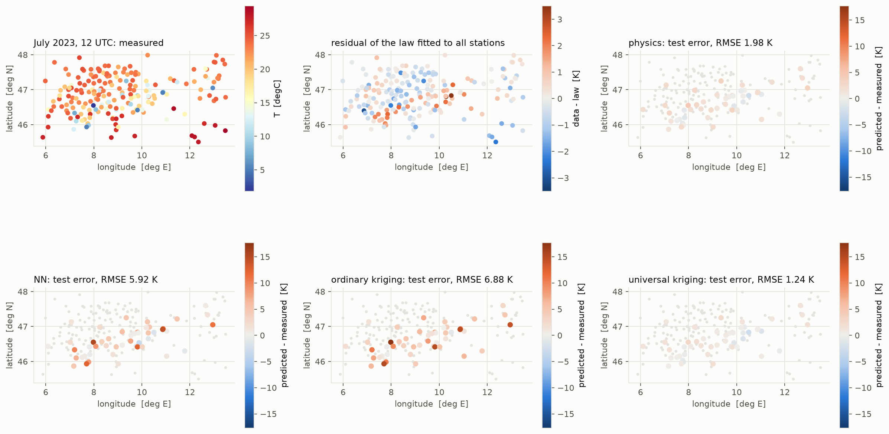
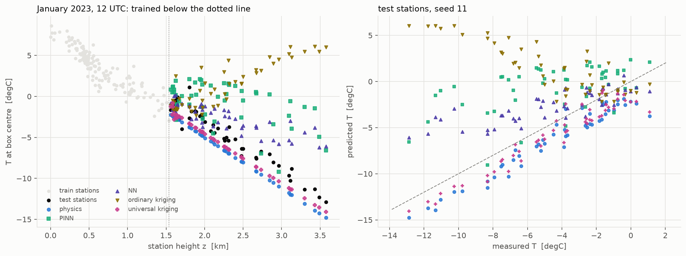
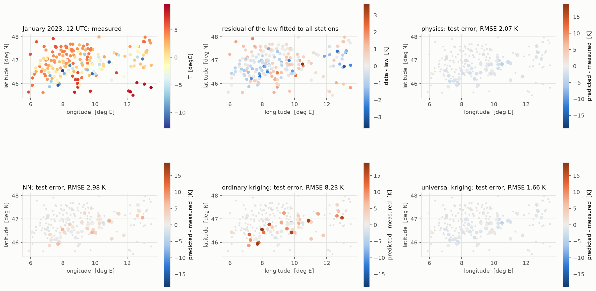
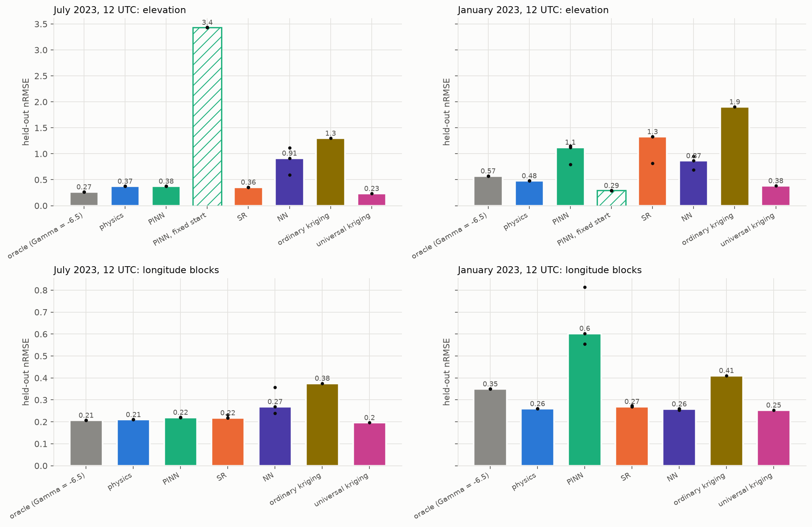
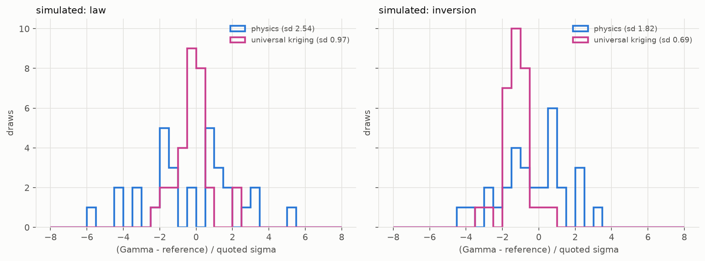

# fields/weather: near-surface temperature over the Alps

Code: [`src/physprior/problems/fields`](../../src/physprior/problems/fields)
· Results: [`results/fields/weather`](../../results/fields/weather)
· Tutorial: T10

*Generated by `physprior.problems.fields.weather_doc.render_doc()` from the
results files. Do not edit by hand.*

## Question

A monthly temperature field sampled at weather stations, with a physical law
for its large-scale structure: temperature falls linearly with height,

    T = T0 + a (lon - lon0) + b (lat - lat0) + Gamma z,     z in km.

The published reference for Gamma is the ICAO / ISO 2533 standard atmosphere,
-6.5 K/km (ICAO Doc 7488/3, 1993). It is a free-atmosphere value. Lapse
rates measured along mountain slopes near the ground are known to differ
from it and to vary with season (Rolland 2003; Kirchner et al. 2013), so the
fitted Gamma is compared with -6.5 as a reference, not as a truth. T0, a and
b have no published value. The `oracle` arm therefore holds Gamma at -6.5
and fits T0, a and b on the training stations; it tests the standard
lapse rate, and it is not a ceiling.

The `pinn` arm is the project's PINN with its constants scaled so
Adam can reach them: T0 starts at the mean training temperature and Gamma is
optimised in log space from -1 K/km. This was chosen on the tuning seeds by
one criterion, that the PINN's constants reach the least-squares constants
on the same training stations. The same PINN from fixed starts
(T0 = 10 degC, Gamma = 0) is reported as `PINN, fixed start` on the
elevation split: an additive constant moves by about one learning rate per
Adam step, and those constants do not get there in 4000 epochs. Its physics
weight is tuned per case on the tuning seeds, from the highest of the
training stations (`tune/w_phys_selection.csv`); where that block prefers no
correction, the weight is pinned at the top of its grid.

The arms see x = (z, lon, lat). Two held-out splits:

* **elevation**: train on the lowest 75% of stations by height, test on the
  highest 25%. The black box has never seen a mountain top.
* **longitude blocks**: four longitude quartiles, each held out in turn.

Kriging (Gaussian-process regression, ML-II on the training stations) is run
on the same splits: ordinary kriging with a constant mean, and universal
kriging with the law as the mean. They are reported beside the arms.

## Data

NOAA Integrated Surface Database, ISD-Lite hourly files, box lon 5.8 to
13.5 E, lat 45.5 to 48.0 N. The snapshot rule was fixed before any fit: the
mean over the month of the 12 UTC air temperature, for stations with a 12 UTC
reading on at least 80% of days, co-located duplicate records merged.
July 2023 is a mixed summer boundary layer; January 2023 is the harder case,
with valley cold pools in which the linear law is known to be wrong.

| case | stations | height km | T degC | hourly files | MB |
|---|---|---|---|---|---|
| july | 197 | 0.002 to 3.576 | 1.8 to 29.4 | 229 | 16.418 |
| january | 202 | 0.002 to 3.576 | -12.9 to 9.7 | 229 | 16.418 |

## Recovered lapse rate (all stations)

`physics` is ordinary least squares, and its error bar assumes independent
residuals. Universal kriging estimates the same four constants by
generalised least squares under the fitted spatial covariance, so its error
bar allows for stations that share weather. The pull is
(Gamma - (-6.5)) / sigma.

| case | physics Gamma | ± (OLS) | pull vs -6.5 (OLS) | PINN Gamma | PINN mean dT/dz | UK Gamma | ± (GLS) | pull vs -6.5 (GLS) |
|---|---|---|---|---|---|---|---|---|
| july | -6.709 | 0.097 | -2.143 | -6.547 | -6.546 | -7.045 | 0.163 | -3.349 |
| january | -5.338 | 0.093 | 12.469 | -2.936 | -5.337 | -5.395 | 0.124 | 8.901 |

## Elevation extrapolation

Median over the reporting seeds 11, 23, 42. nRMSE is RMSE divided by the
standard deviation of all station temperatures. Kriging is deterministic and
has one value. `mean dT/dz` is the derivative of each fitted function with
respect to height, averaged over all stations (central differences; its
step convergence is tabulated below).

### july

| arm | nRMSE in | nRMSE out (median) | per seed | RMSE out K | mean dT/dz |
|---|---|---|---|---|---|
| oracle (Gamma = -6.5) | 0.172 | 0.265 | 0.265, 0.265, 0.265 | 1.406 | -6.500 |
| physics | 0.168 | 0.374 | 0.374, 0.374, 0.374 | 1.982 | -5.909 |
| PINN | 0.168 | 0.375 | 0.374, 0.375, 0.376 | 1.987 | -5.905 |
| PINN, fixed start | 0.921 | 3.434 | 3.434, 3.438, 3.434 | 18.191 | 5.753 |
| SR | 0.181 | 0.356 | 0.356, 0.356, 0.356 | 1.885 | -5.952 |
| NN | 0.064 | 0.914 | 1.117, 0.914, 0.591 | 4.843 | -5.436 |
| ordinary kriging | 0.149 | 1.298 | 1.298 | 6.877 | -5.108 |
| universal kriging | 0.066 | 0.234 | 0.234 | 1.241 | -7.118 |

Lowest median held-out nRMSE among the arms and kriging (oracle and the fixed-start diagnostic excluded): universal kriging (0.234).

### january

| arm | nRMSE in | nRMSE out (median) | per seed | RMSE out K | mean dT/dz |
|---|---|---|---|---|---|
| oracle (Gamma = -6.5) | 0.230 | 0.572 | 0.572, 0.572, 0.572 | 2.472 | -6.500 |
| physics | 0.229 | 0.479 | 0.479, 0.479, 0.479 | 2.069 | -6.238 |
| PINN | 0.018 | 1.125 | 1.125, 1.149, 0.793 | 4.865 | -5.213 |
| PINN, fixed start | 0.263 | 0.291 | 0.291, 0.289, 0.291 | 1.259 | -4.630 |
| SR | 0.236 | 1.329 | 1.329, 1.329, 0.816 | 5.745 | -5.288 |
| NN | 0.163 | 0.865 | 0.688, 0.948, 0.865 | 3.740 | -5.089 |
| ordinary kriging | 0.152 | 1.903 | 1.903 | 8.229 | -4.362 |
| universal kriging | 0.066 | 0.384 | 0.384 | 1.659 | -6.280 |

Lowest median held-out nRMSE among the arms and kriging (oracle and the fixed-start diagnostic excluded): universal kriging (0.384).

## Longitude blocks

Held-out nRMSE per block (block 0 is the westernmost), median over seeds, and the RMS over the four blocks.

### july

| arm | block 0 | block 1 | block 2 | block 3 | RMS over blocks |
|---|---|---|---|---|---|
| oracle (Gamma = -6.5) | 0.185 | 0.214 | 0.176 | 0.245 | 0.207 |
| physics | 0.180 | 0.211 | 0.171 | 0.266 | 0.210 |
| PINN | 0.193 | 0.213 | 0.173 | 0.286 | 0.220 |
| SR | 0.195 | 0.224 | 0.179 | 0.264 | 0.223 |
| NN | 0.298 | 0.182 | 0.201 | 0.347 | 0.293 |
| ordinary kriging | 0.641 | 0.191 | 0.213 | 0.268 | 0.376 |
| universal kriging | 0.209 | 0.174 | 0.141 | 0.245 | 0.196 |

### january

| arm | block 0 | block 1 | block 2 | block 3 | RMS over blocks |
|---|---|---|---|---|---|
| oracle (Gamma = -6.5) | 0.306 | 0.315 | 0.271 | 0.473 | 0.350 |
| physics | 0.220 | 0.231 | 0.254 | 0.323 | 0.260 |
| PINN | 0.401 | 0.309 | 0.731 | 0.695 | 0.666 |
| SR | 0.226 | 0.240 | 0.301 | 0.316 | 0.271 |
| NN | 0.231 | 0.237 | 0.244 | 0.314 | 0.257 |
| ordinary kriging | 0.280 | 0.232 | 0.275 | 0.684 | 0.411 |
| universal kriging | 0.216 | 0.222 | 0.242 | 0.319 | 0.253 |

## Kriging hyperparameters (elevation split)

A length scale within 1% (in log) of its bound is marked not converged. Three fixed starting points; the count that reach the best likelihood is given.

| case | arm | l_h km | l_z km | s_f K | s_n K | converged | starts agreeing |
|---|---|---|---|---|---|---|---|
| july | ordinary kriging | 1000.000 | 1.826 | 12.947 | 0.813 | no | 3/3 |
| july | universal kriging | 34.973 | 0.544 | 0.965 | 0.472 | yes | 3/3 |
| january | ordinary kriging | 222.379 | 0.692 | 3.797 | 0.709 | yes | 3/3 |
| january | universal kriging | 48.920 | 0.111 | 1.015 | 0.431 | yes | 1/3 |

## Simulated control

The same station positions; a field with known constants
(T0, a, b, Gamma) = (16.0, -0.3, -1.0, -5.0), a GP residual (s_f = 1.0 K,
l_h = 40.0 km, l_z = 0.4 km), 0.3 K independent noise, and in the
`inversion` case a cold pool of 6.0 K at sea level fading linearly to zero
at 1.2 km. With the pool, the best linear Gamma at these stations is not
the free-air Gamma; both are listed. One realisation per reporting seed,
elevation split. `mean dT/dz` is taken over all stations of a model fitted
on the lowest 75%; in the `inversion` case most of those training stations
lie inside the pool, where the true slope is the free-air Gamma plus the
pool's gradient.

| case | arm | nRMSE out | mean dT/dz | free-air Gamma | best linear Gamma |
|---|---|---|---|---|---|
| law | oracle (Gamma = -6.5) | 0.234 | -5.000 | -5.000 | -5.000 |
| law | physics | 0.226 | -5.167 | -5.000 | -5.000 |
| law | PINN | 0.226 | -5.167 | -5.000 | -5.000 |
| law | PINN, fixed start | 0.535 | -3.954 | -5.000 | -5.000 |
| law | SR | 0.289 | -5.158 | -5.000 | -5.000 |
| law | NN | 0.869 | -4.018 | -5.000 | -5.000 |
| law | ordinary kriging | 1.629 | -2.599 | -5.000 | -5.000 |
| law | universal kriging | 0.253 | -5.278 | -5.000 | -5.000 |
| inversion | oracle (Gamma = -6.5) | 1.004 | -5.000 | -5.000 | -2.997 |
| inversion | physics | 1.689 | -0.670 | -5.000 | -2.997 |
| inversion | PINN | 1.689 | -0.670 | -5.000 | -2.997 |
| inversion | PINN, fixed start | 1.689 | -0.670 | -5.000 | -2.997 |
| inversion | SR | 2.126 | 0 | -5.000 | -2.997 |
| inversion | NN | 1.375 | -0.456 | -5.000 | -2.997 |
| inversion | ordinary kriging | 1.854 | -0.066 | -5.000 | -2.997 |
| inversion | universal kriging | 1.384 | -0.610 | -5.000 | -2.997 |

### Are the error bars calibrated?

Over 30 simulated draws, fitting all stations: the fraction of draws in which the quoted 1-sigma interval contains the reference Gamma (0.683 if the error bar is right), and the standard deviation of the pulls (1 if right). The reference is the best linear Gamma of the noise-free field.

| case | arm | draws | gamma_ref | gamma_mean | gamma_sd_over_draws | sigma_quoted_median | coverage_1sigma | pull_sd |
|---|---|---|---|---|---|---|---|---|
| inversion | physics | 30 | -2.997 | -3.024 | 0.226 | 0.129 | 0.433 | 1.821 |
| inversion | universal kriging | 30 | -2.997 | -3.272 | 0.147 | 0.234 | 0.367 | 0.689 |
| law | physics | 30 | -5.000 | -5.027 | 0.226 | 0.091 | 0.233 | 2.537 |
| law | universal kriging | 30 | -5.000 | -5.029 | 0.149 | 0.153 | 0.767 | 0.975 |

## Budget sweep (july, random splits)

Median held-out nRMSE. Symbolic regression is left out of the sweeps for compute; it runs on both splits above.

| arm | n_train = 25 | n_train = 50 | n_train = 100 |
|---|---|---|---|
| oracle (Gamma = -6.5) | 0.210 | 0.205 | 0.202 |
| physics | 0.215 | 0.206 | 0.207 |
| PINN | 0.219 | 0.203 | 0.205 |
| NN | 0.348 | 0.256 | 0.198 |

## Noise sweep (july, random splits)

Median held-out nRMSE. Symbolic regression is left out of the sweeps for compute; it runs on both splits above.

| arm | noise_frac = 0 | noise_frac = 0.1 |
|---|---|---|
| oracle (Gamma = -6.5) | 0.199 | 0.199 |
| physics | 0.197 | 0.198 |
| PINN | 0.199 | 0.200 |
| NN | 0.157 | 0.187 |

## Derivative convergence

Mean dT/dz by central differences with step h, for models fitted on the elevation training split. The value must stop moving as h shrinks.

| case | arm | h = 0.2 km | h = 0.1 km | h = 0.05 km | h = 0.025 km |
|---|---|---|---|---|---|
| july | physics | -5.9093 | -5.9093 | -5.9093 | -5.9093 |
| july | NN | -5.3700 | -5.4215 | -5.4356 | -5.4392 |
| july | ordinary kriging | -5.0833 | -5.1030 | -5.1080 | -5.1092 |
| january | physics | -6.2377 | -6.2377 | -6.2377 | -6.2377 |
| january | NN | -5.6010 | -5.6688 | -5.6867 | -5.6912 |
| january | ordinary kriging | -4.2836 | -4.3465 | -4.3624 | -4.3664 |

## Limitations

* One year, two months, one hour of day. Other hours (in particular early
  morning in winter, when inversions are strongest) are not studied.
* Station heights come from the ISD station list and are not checked
  against a terrain model.
* The law has no land-use, slope-aspect or distance-to-lake terms; the
  universal-kriging residual absorbs whatever of these is spatially smooth.
* The simulated cold pool is a function of absolute height. Real cold pools
  sit on each valley floor, at different heights.
