# gravity

Newtonian orbital mechanics, where the law is exact and the question is what
a method can recover from data that obeys it.

**Real data**: Kepler's third law from the JPL DE441 ephemeris, eight
planets. **Simulations**: the control. When the law is exactly what was put
in, whatever a method fails to recover is the method's own error.

Code: [`src/physprior/problems/gravity`](../../src/physprior/problems/gravity)
· Results: [`results/gravity`](../../results/gravity)

---

## The simulations

| What | Notes |
|---|---|
| `two_body` | Sun + one planet, started at perihelion from the vis-viva speed, in the centre-of-mass frame |
| `three_body` | the Chenciner–Montgomery figure-eight choreography, and a perturbed copy of it |
| `lyapunov_separation` | two figure-eights differing by 1 part in 10⁹, tracked until they separate (chaos as a measured exponent) |
| `solar_system` | eight planets from **real JPL initial conditions**, integrated forward |
| `integrator_comparison` | velocity Verlet against RK4 over 200 years |

<table>
<tr>
<td width="50%">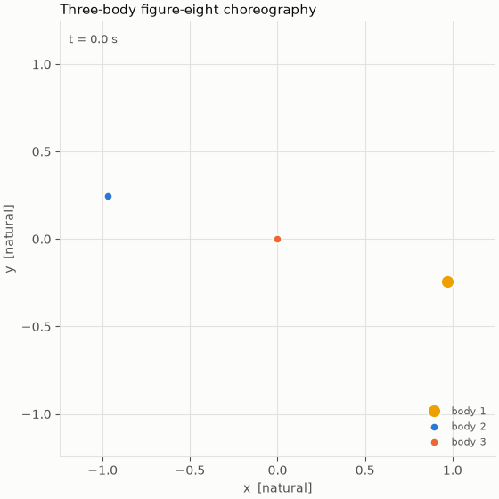 <b>The figure-eight choreography.</b> Three equal masses on one closed orbit.</td>
<td width="50%">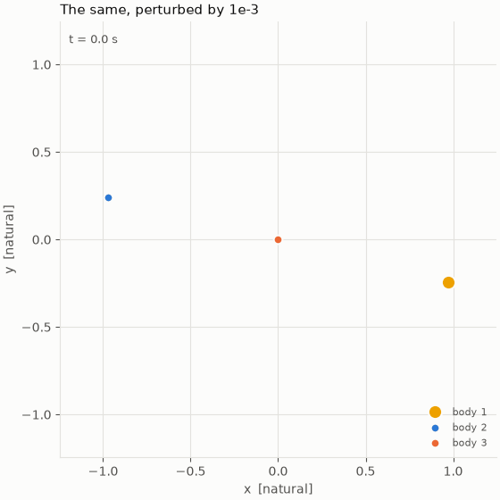 <b>The same, perturbed.</b> One part in 10⁹ is enough.</td>
</tr>
<tr>
<td>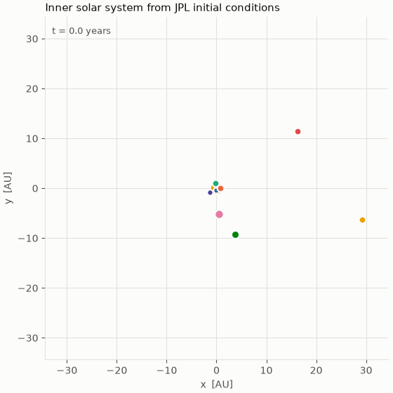 <b>The inner solar system</b>, from real JPL initial conditions.</td>
<td>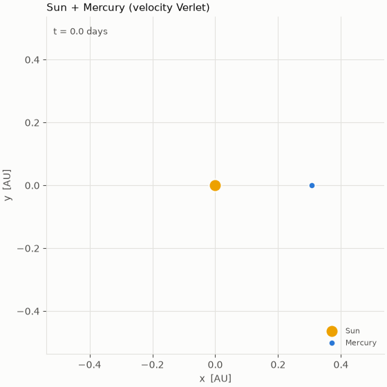 <b>Sun + Mercury.</b> <code>e = 0.206</code> makes perihelion the hard part.</td>
</tr>
</table>

**The integrator is part of the physics model.** Velocity Verlet is
symplectic: its energy error oscillates and stays bounded. RK4 has the better
local error and is not symplectic, so its error *drifts*. At 4-day steps over
200 years Verlet stays at 2% while RK4 reaches 412% and the orbit unbinds.

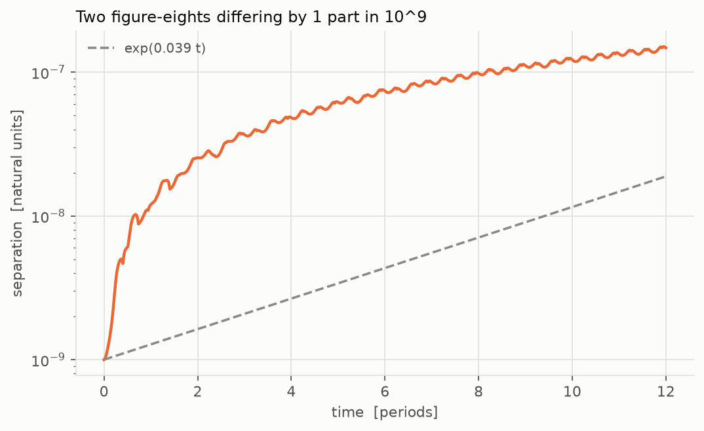

## Recovering the law from the simulation

[`discovery.py`](../../src/physprior/problems/gravity/discovery.py) recovers
the force-law exponent and `GM` from a simulated orbit, Kepler's 3/2 from
simulated periods, and the same force law from the *chaotic* three-body run.

Symbolic regression returns the exponent as **−1.9999969** and `GM` to
**0.6 ppb** from a simulated orbit. That is the floor: when the same
machinery returns `GM_sun` from the real ephemeris with a tens-of-ppm
residual, the residual cannot be blamed on the method; it is the two-body
formula neglecting the planets' masses.

## The real-data track: `gravity/kepler`

Kepler's third law, `P = 2π√(a³/GM)`, fitted to eight planets.

| | |
|---|---|
| 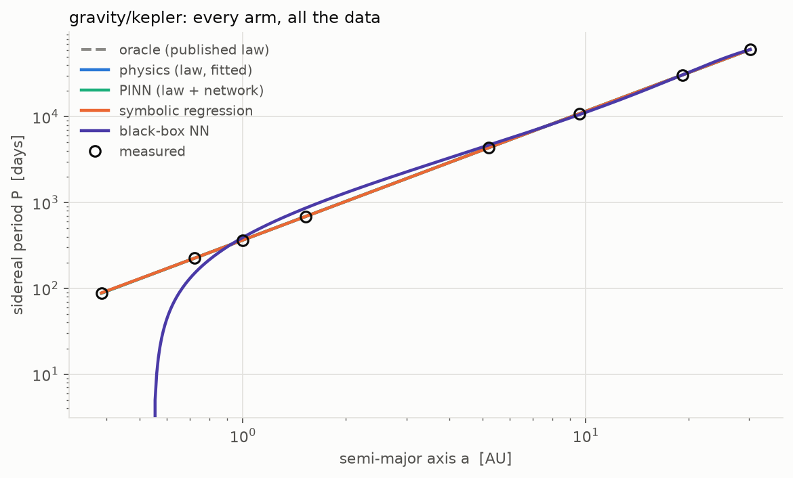 | 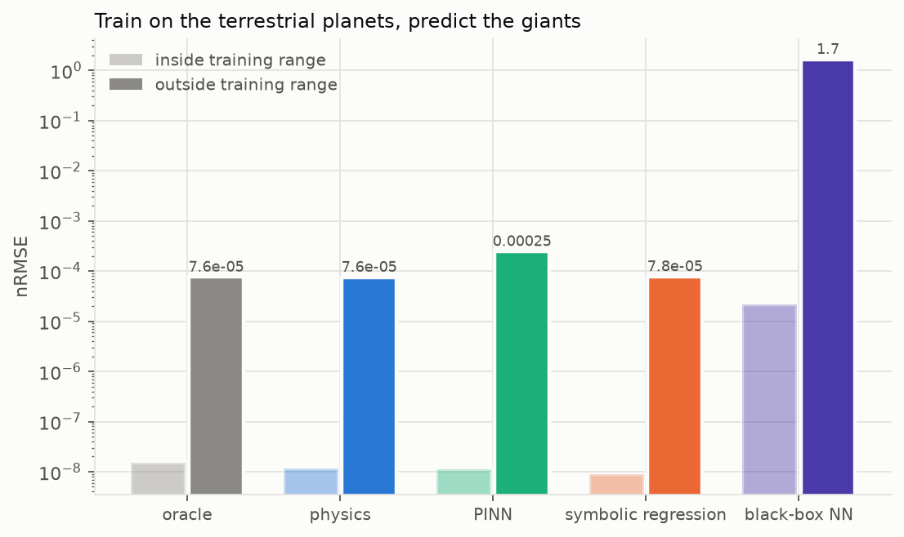 |
| **Overview**: every arm on the track. | **Extrapolation**: trained on the inner planets, asked about the outer. |
| 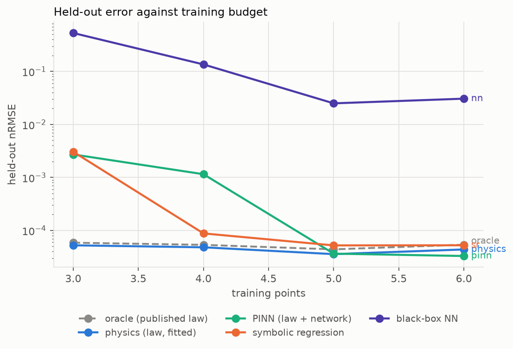 | 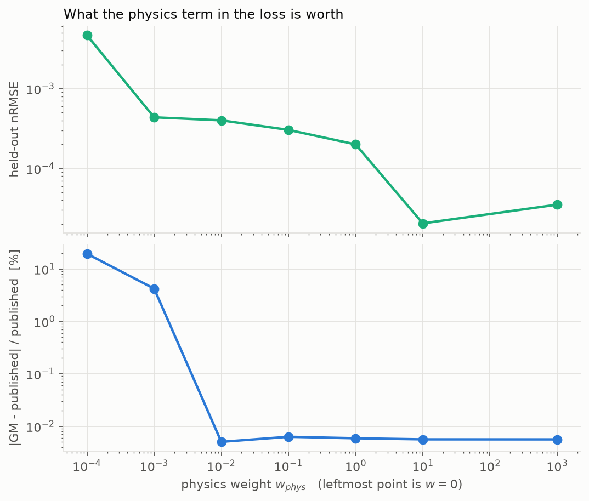 |
| **Data efficiency**: when does the black box catch up? | **The `w_phys` dial**: at `w_phys = 0` the recovered `GM_sun` is 19.5% wrong while the held-out error barely moves. |

A neural correction watching a constant converge:

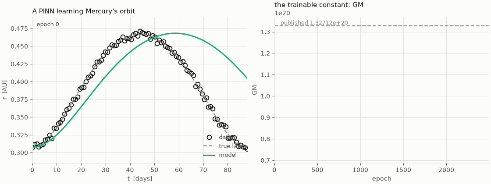

## The real-data track: `gravity/pulsar_spindown`

A magnetic dipole spinning in vacuum slows as `ν̇ = −K νⁿ` with `n = 3`, so
each pulsar's timing gives a braking index `n_obs = ν ν̈ / ν̇²` that the law
says is 3. The data are the ATNF Pulsar Catalogue (v2.8.1): of its 4393
pulsars, 13 pass a rule fixed before any fit (isolated, not in a globular
cluster, not a magnetar, younger than 10⁴ years, `ν̈` at 5σ or better). The
arms see the characteristic age and the surface field; the split trains on
the younger half and predicts the older. The four predictions, with what
would refute them, are in [`HYPOTHESES.md`](../HYPOTHESES.md) (H3) and were
committed before the runs.

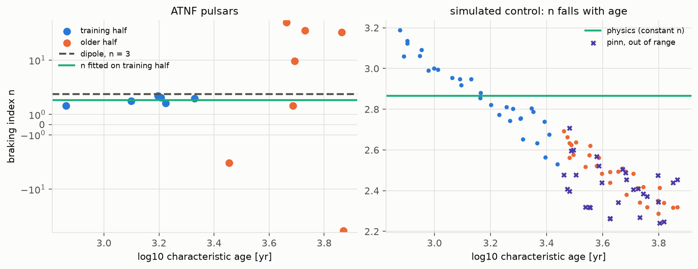

**The dipole law is incomplete.** Fitted on the six younger pulsars,
n = 2.40 ± 0.15, 4.1σ below 3. This is the known result that young pulsars
brake more gently than a vacuum dipole.

**No arm predicts the older pulsars.** Their indices run from large negative
to large positive values, the signature of glitch recovery and timing noise,
and every arm's out-of-range error is 1.37 to 1.38 times the data's spread.

**The correction has nothing to learn from age and field.** The tuning rule,
on its validation block, preferred no correction at all: the `pinn` arm's
weight is pinned at the top of its grid, and it matches `physics` out of
range on every reporting seed. That answers prediction 2, but by selection,
not by a trained correction failing.

**The method could have learned an age dependence.** In a simulated control
at the same ages and fields, where the index falls linearly with log age,
the `pinn` arm's out-of-range error is 0.27 to 0.35 of the constant-n fit's
on every reporting seed. So the result on real data is a property of the
data: the departure from n = 3 is pulsar-specific, not a function of the
inputs.

Tables: [`results/gravity/pulsar_spindown/`](../../results/gravity/pulsar_spindown).
The selected pulsars and the rule are in its `meta.json`.

## Caveats, stated up front

`P = 2π√(a³/GM)` ignores the planet's own mass and uses the osculating
semi-major axis. Both bias the recovered `GM_sun` at the tens-of-ppm level,
and the giant planets dominate the effect. Provenance for DE441 is in
[`docs/DATA.md`](../DATA.md).
