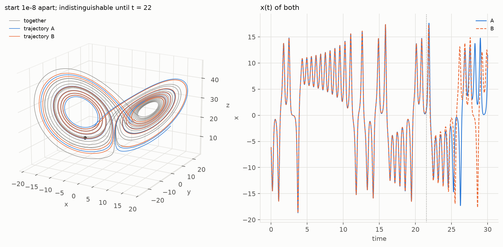
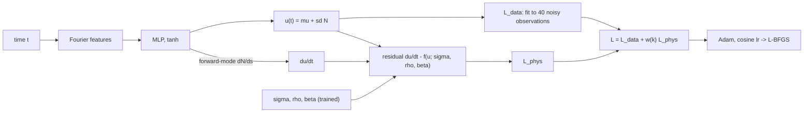
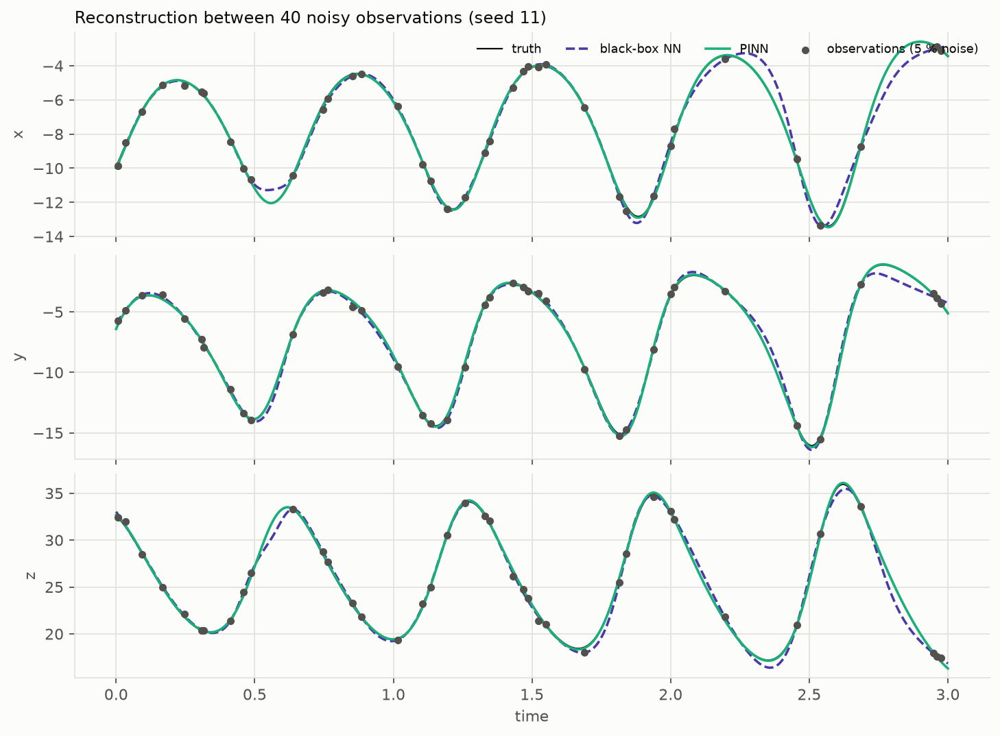
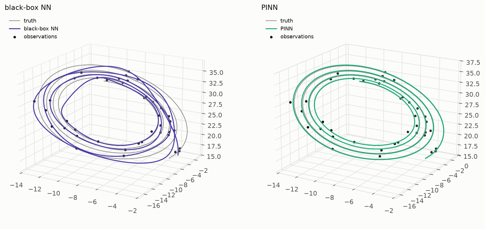
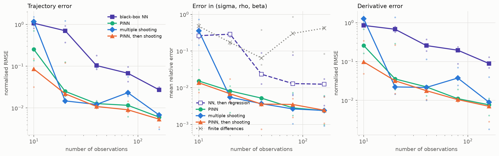
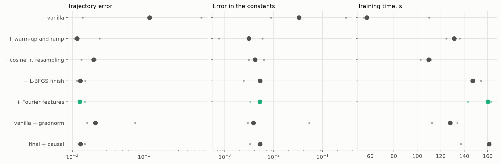
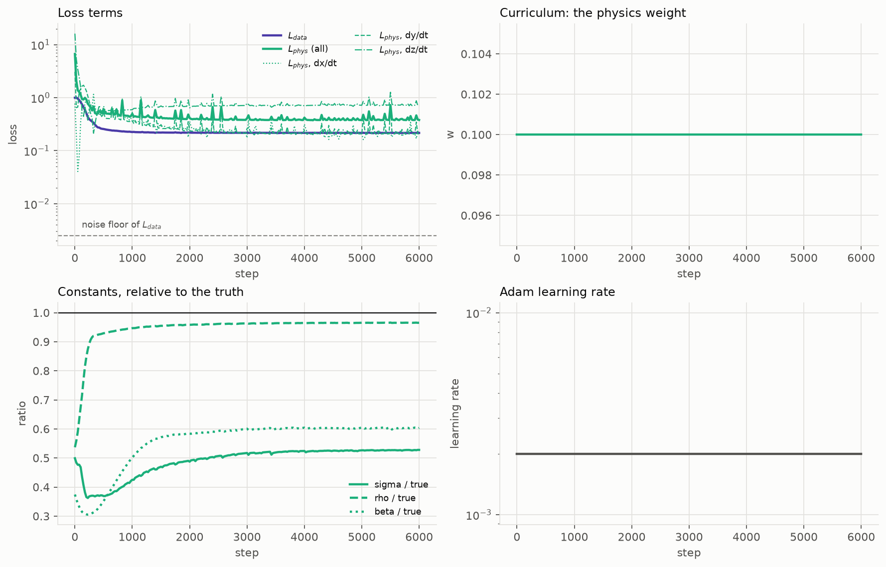
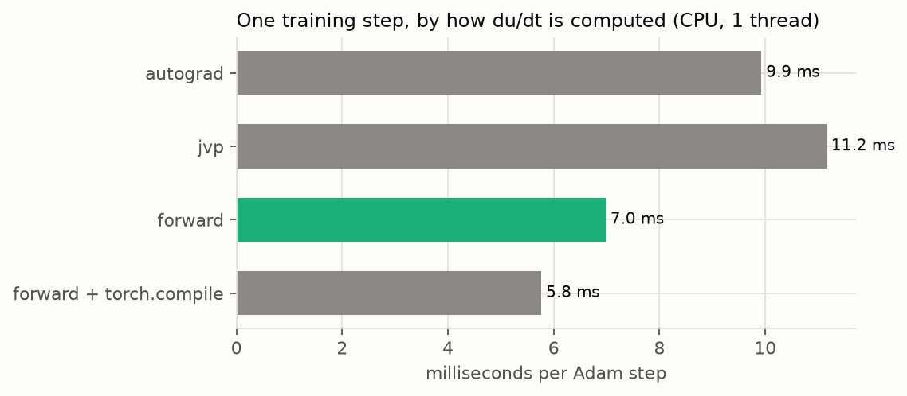
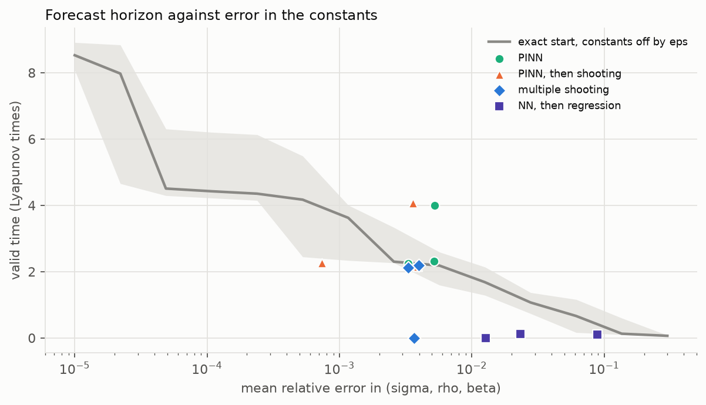
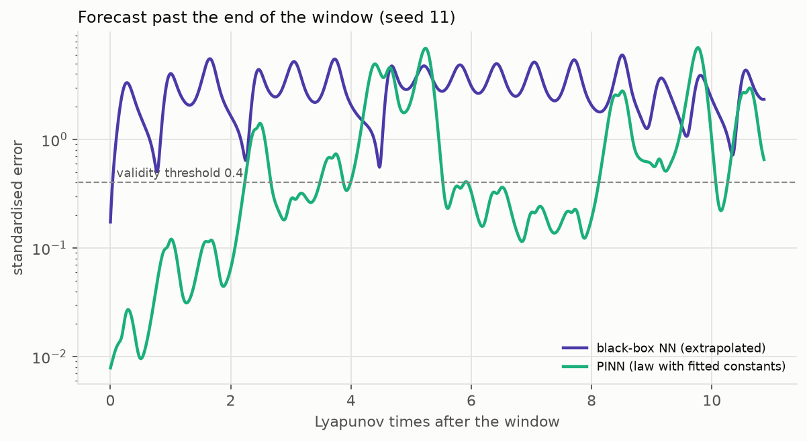

# Lorenz-63: a PINN against a black box, on a chaotic inverse problem

*Generated by `physprior lorenz` from `results/lorenz/`; do not edit by hand.*



## The problem

One Lorenz-63 trajectory over t in [0, 3] (about 2.7 Lyapunov times), observed at 40 random times with Gaussian noise of 5 % of each component's spread. From these observations alone:

1. reconstruct x(t), y(t), z(t) between the observations;
2. recover the three constants (sigma = 10, rho = 28, beta = 2.667), starting from sigma = 5, rho = 15, beta = 1;
3. forecast past the end of the window.

Every hyperparameter was chosen on the tuning seeds 3 / 7 / 19; every number below is on the reporting seeds 11 / 23 / 42 (median, with the worst seed where it matters).

## The method




The network maps time to state. The data term fits the observations; the physics term is the residual of the Lorenz equations at 256 collocation times redrawn every step, with the three constants as trainable parameters. The time derivative is carried through the network in forward mode, in the same pass as the state.

The black box is the same kind of network trained on the data term alone, its size and features tuned on the tuning seeds (chosen: `w32_d3`; PINN: `w0.1_f8`; multiple shooting: `seg12`).

## Results


| method | trajectory error | du/dt error | sigma error | rho error | beta error | worst seed, constants | valid forecast (Lyapunov times) |
|---|---|---|---|---|---|---|---|
| black-box NN | 0.104 | 0.258 | – | – | – | – | 0.0362 |
| NN, then regression | – | – | 0.0599 | 0.00744 | 0.00976 | 0.0889 | 0.0996 |
| finite differences | – | – | 0.094 | 0.0133 | 0.0863 | 0.378 | – |
| single shooting | 0.927 | 0.942 | 0.0312 | 0.102 | 0.865 | 1.21 | 0 |
| multiple shooting | 0.0122 | 0.0216 | 0.00699 | 0.00175 | 0.00274 | 0.00399 | 2.12 |
| PINN | 0.0127 | 0.0223 | 0.0106 | 0.000675 | 0.00311 | 0.00526 | 2.32 |
| PINN, then shooting | 0.0108 | 0.0178 | 0.00509 | 0.00203 | 0.00246 | 0.00391 | 2.25 |

- **Trajectory.** The PINN's reconstruction error is 0.0127 against the black box's 0.104, a factor 8.1 (better on 3 of 3 seeds). For du/dt the factor is 11.6.
- **Constants.** From a start that is off by a factor of about two in each constant, the PINN recovers them to 0.52 % (worst seed 0.53 %). Single shooting from the same start lands in a wrong local minimum on 2 of 3 seeds (median error 47.9 %). The black box, differentiated and regressed on the law, reaches 2.3 %; finite differences of the raw data reach 6.5 %.
- **Against the classical remedy.** Multiple shooting, the standard method for chaotic systems, recovers the constants to 0.37 % (worst seed 0.4 %) once its segment count is tuned; with too few segments it fails like single shooting (see the tuning table). On the constants it is as good as the PINN. On the trajectory it is as good in the median (0.0122) but not on every seed: its worst is 0.0924 against the PINN's 0.0149, because one trajectory integrated from the fitted start compounds its errors chaotically. Single shooting started from the PINN's answer reaches 0.36 %. With few observations the PINN is clearly ahead (next section).
- **Forecast.** Integrating the law with the PINN's constants from its own end state gives 2.3 Lyapunov times of valid forecast, 2.3 after polishing; multiple shooting gives 2.1. The black box extrapolated gives 0.036. The horizon is set by the error in the end state and the constants, amplified at the Lyapunov rate.





## Noise and data budget


| noise | black-box NN: trajectory | PINN: trajectory | multiple shooting: trajectory | PINN, then shooting: trajectory | NN, then regression: constants | PINN: constants | multiple shooting: constants |
|---|---|---|---|---|---|---|---|
| 0 | 0.0977 | 5.85e-05 | 8.35e-06 | 7.34e-06 | 0.0287 | 2.6e-05 | 2.48e-06 |
| 0.01 | 0.126 | 0.00299 | 0.00238 | 0.00218 | 0.0313 | 0.000841 | 0.000729 |
| 0.02 | 0.11 | 0.00517 | 0.00479 | 0.00434 | 0.0304 | 0.00188 | 0.00146 |
| 0.05 | 0.104 | 0.0127 | 0.0122 | 0.0108 | 0.0233 | 0.00521 | 0.00367 |
| 0.1 | 0.174 | 0.0279 | 0.0249 | 0.0217 | 0.0564 | 0.0107 | 0.0074 |
| 0.2 | 0.264 | 0.0597 | 0.0523 | 0.0433 | 0.128 | 0.022 | 0.0151 |



| n_obs | black-box NN: trajectory | PINN: trajectory | multiple shooting: trajectory | PINN, then shooting: trajectory | NN, then regression: constants | PINN: constants | multiple shooting: constants |
|---|---|---|---|---|---|---|---|
| 10 | 1.07 | 0.252 | 1.17 | 0.0856 | 0.262 | 0.0153 | 0.357 |
| 20 | 0.707 | 0.025 | 0.0148 | 0.0219 | 0.288 | 0.00817 | 0.00551 |
| 40 | 0.104 | 0.0127 | 0.0122 | 0.0108 | 0.0233 | 0.00521 | 0.00367 |
| 80 | 0.0679 | 0.0116 | 0.0232 | 0.00906 | 0.013 | 0.00283 | 0.00264 |
| 160 | 0.0271 | 0.00604 | 0.00678 | 0.00539 | 0.0125 | 0.00237 | 0.0024 |

**Noise.** The black box cannot interpolate a chaotic trajectory between 40 points even without noise: its error is 0.0977 at zero noise. The PINN's error scales with the noise, since the law fills in between the points. The factor between them is 1670 without noise and 4.4 at 20 % noise.

**Data budget.** The factor is 4.5 at 160 observations and largest, 28, at 20. At 10 observations neither network reconstructs the trajectory, but the PINN still recovers the constants to 1.5 %, against 36 % for multiple shooting and 26 % for the black box followed by regression.

## Optimising the PINN



| recipe | trajectory error | constants error | worst seed, trajectory | seconds |
|---|---|---|---|---|
| vanilla | 0.119 | 0.0328 | 0.626 | 57 |
| + warm-up and ramp | 0.0116 | 0.00311 | 0.0239 | 131 |
| + cosine lr, resampling | 0.0198 | 0.00417 | 0.021 | 110 |
| + L-BFGS finish | 0.0129 | 0.00525 | 0.0151 | 147 |
| + Fourier features | 0.0127 | 0.00521 | 0.0149 | 160 |
| vanilla + gradnorm | 0.021 | 0.00385 | 0.0754 | 128 |
| final + causal | 0.013 | 0.00527 | 0.0149 | 161 |

The vanilla PINN (constant learning rate, physics weight on from step 0, fixed collocation grid, Adam only) fails on 2 of 3 seeds (worst trajectory error 0.626). On its worst seed it stalls in a poor minimum that satisfies neither term: the data loss ends 86 times the noise floor, the residual at 0.38, and sigma, rho, beta at 0.53, 0.97, 0.60 of their true values. The data warm-up with a ramped physics weight is the piece that matters most. The later rungs change the median little and tighten the worst seed: the final recipe's worst seed is 0.0149, against 0.0239 for the warm-up alone. The L-BFGS finish improves the rung before it by a factor 1.5. Gradient-norm balancing, added to the vanilla recipe instead of the warm-up, brings it to 0.021 (worst seed 0.0754); causal weights on top of the final recipe give 0.013, no change.

### Where the loss goes


Top left: the data term and the physics term of each equation. During the warm-up the data term falls to 0.23 of the noise floor: alone, the network fits the noise. Within 125 steps of the physics term coming on, all three constants are within 5 % of the truth (bottom left), and the data term returns to the noise floor and stays there. For comparison, the vanilla recipe on seed 23:



### What the derivative costs



| derivative | compiled | ms_per_step | max_abs_diff_vs_autograd | torch |
|---|---|---|---|---|
| autograd | False | 9.93 | 0 | 2.11.0 |
| jvp | False | 11.2 | 7.77e-16 | 2.11.0 |
| forward | False | 6.98 | 7.77e-16 | 2.11.0 |
| forward | True | 5.76 | 7.77e-16 | 2.11.0 |

The time derivative computed by hand in forward mode costs 7 ms per step against 9.9 ms for reverse-mode autograd (1.4x) and 11 ms for `torch.func.jvp`; all three agree to rounding. `torch.compile` on the forward-mode step gives a further factor 1.21 (5.8 ms). On a CPU at this size the step is dominated by per-operation overhead, so fusing operations helps and fewer operations help more.

## The butterfly effect


Neighbouring trajectories separate like exp(lambda_1 t). The slope of the mean log-separation is 0.900, against the reference lambda_1 = 0.9056. That is why a forecast has a horizon whatever the method: an error e in the state grows to the validity threshold 0.4 in about ln(0.4 / e) / lambda_1.





## Reproduce

```bash
physprior lorenz            # tune, run, figures, this page (about an hour on 8 cores)
physprior lorenz --quick    # the same pipeline with short training
physprior lorenz --doc-only # figures and this page from results/lorenz
```

Tuning grid and every run: `results/lorenz/*.csv`; configuration and choices: `results/lorenz/meta.json`. RK4 step study for the shooting and forecast integrator: `results/lorenz/rk4_convergence.csv`.

## References

- E. N. Lorenz, Deterministic nonperiodic flow, J. Atmos. Sci. 20, 130 (1963).
- M. Raissi, P. Perdikaris, G. E. Karniadakis, Physics-informed neural networks, J. Comput. Phys. 378, 686 (2019).
- H. G. Bock, Numerical treatment of inverse problems in chemical reaction kinetics, Springer Ser. Chem. Phys. 18, 102 (1981).
- S. Wang, Y. Teng, P. Perdikaris, Understanding and mitigating gradient flow pathologies in physics-informed neural networks, SIAM J. Sci. Comput. 43, A3055 (2021).
- S. Wang, S. Sankaran, P. Perdikaris, Respecting causality for training physics-informed neural networks, Comput. Methods Appl. Mech. Eng. 421, 116813 (2024).
- M. Tancik et al., Fourier features let networks learn high frequency functions in low dimensional domains, NeurIPS (2020).
- J. Pathak et al., Model-free prediction of large spatiotemporally chaotic systems from data, Phys. Rev. Lett. 120, 024102 (2018).
