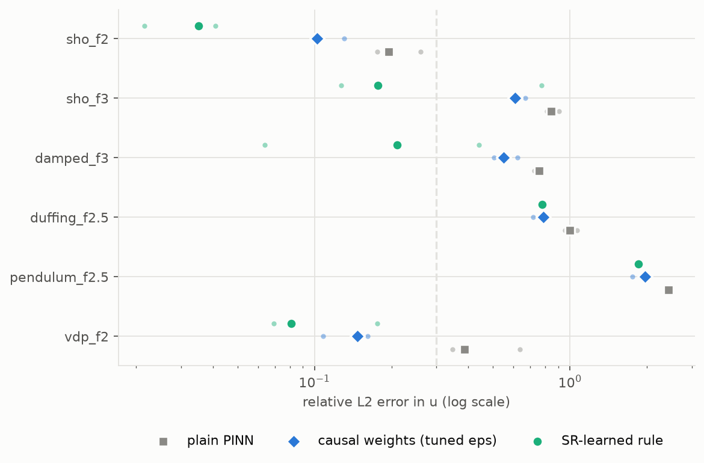
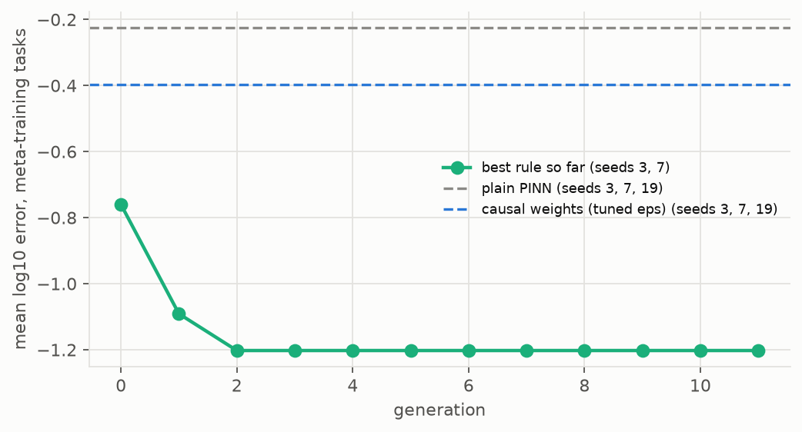
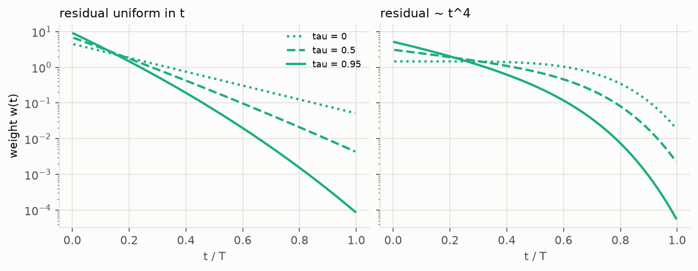
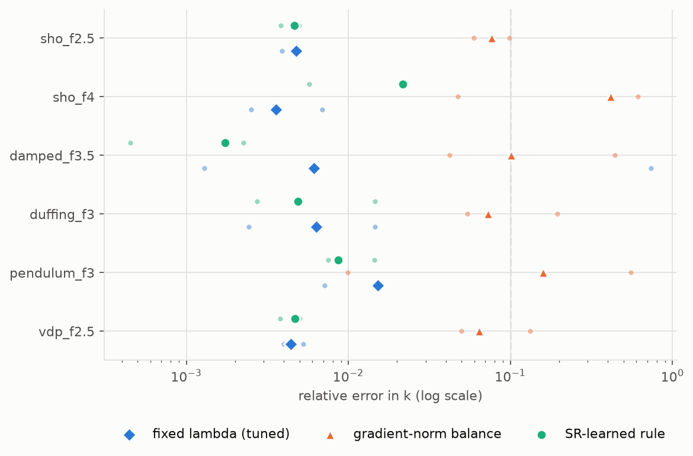
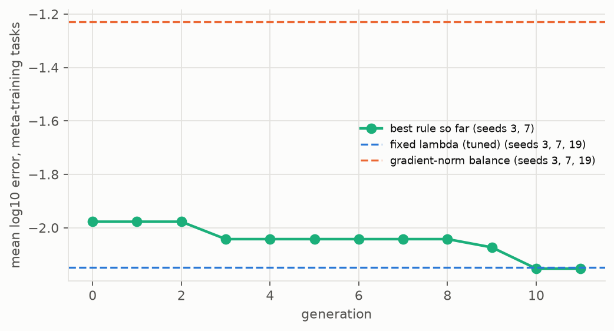

# Loss weightings for PINNs found by symbolic regression

<!-- Generated by physprior.lossdisc.doc.render_doc() from results/lossdisc. Do not edit by hand. -->

A PINN's loss is a weighted sum, and the weighting decides whether training converges. Here the weighting rule is itself the object of a symbolic search: a genetic program over expression trees whose fitness is the error of PINNs trained with the rule. The design and the protocol are in `docs/plans/LOSSDISC_PLAN.md`; the code is `src/physprior/lossdisc/`; `physprior lossdisc` reruns it.

Every method shares the network (tanh MLP, width 32, depth 3), Adam with a cosine schedule from 1e-2, 3000 steps, and 128 stratified collocation points redrawn every step. Only the weighting differs. Baselines are tuned on the same tasks and tuning seeds the search uses. A run counts as failed above a relative error of 0.3 (forward) or 0.1 in k (inverse).

## Trial A: residual weights for forward problems

Second-order ODEs over several periods, initial condition built into the network, no data. A plain PINN fits the early part of the window and then propagates a wrong solution. The rule maps (t, C, q, tau) to a per-point weight; `C` is the cumulative residual before t, `q` the same as a fraction of the total, `tau` the training progress. Causal weighting is g = -eps C. Weights are normalised to mean 1, so an additive constant in g has no effect.

Meta-training tasks: sho_f2.5, damped_f2.5, duffing_f2. Held-out tasks: sho_f2, sho_f3, damped_f3, duffing_f2.5, pendulum_f2.5, vdp_f2. The search trained 367 distinct rules in 92 minutes. Selected rule (11 nodes):

    ((4.489) * (-(exp((t * tau)) + ((-3.238) + q))))

Held-out tasks, reporting seeds 11, 23, 42:

| method | setting | median err | mean log10 error | failed | runs |
|---|---|---|---|---|---|
| plain PINN | g = 0 | 0.787 | -0.141 | 83% | 18 |
| causal weights (tuned eps) | eps = 30 | 0.602 | -0.354 | 67% | 18 |
| SR-learned rule | `((4.489) * (-(exp((t * tau)) + ((-3.238) + q))))` | 0.194 | -0.613 | 44% | 18 |

| learned rule against | wins | losses | mean gain (decades) | Wilcoxon p |
|---|---|---|---|---|
| causal weights (tuned eps) | 14 | 4 | 0.26 | 0.0047 |
| plain PINN | 18 | 0 | 0.47 | 7.6e-06 |

Meta-training tasks, reporting seeds (new initialisations and, for the inverse trial, new noise):

| method | setting | median err | mean log10 error | failed | runs |
|---|---|---|---|---|---|
| plain PINN | g = 0 | 0.525 | -0.202 | 100% | 9 |
| causal weights (tuned eps) | eps = 30 | 0.35 | -0.213 | 78% | 9 |
| SR-learned rule | `((4.489) * (-(exp((t * tau)) + ((-3.238) + q))))` | 0.109 | -0.76 | 33% | 9 |

| learned rule against | wins | losses | mean gain (decades) | Wilcoxon p |
|---|---|---|---|---|
| causal weights (tuned eps) | 8 | 1 | 0.55 | 0.012 |
| plain PINN | 9 | 0 | 0.56 | 0.0039 |

## Trial B: the data/physics balance for inverse problems

Thirty noisy observations (5 % noise), the form of the ODE known, k unknown and started at 0.3 of its value. The rule maps (tau, rho, gamma) to the physics weight lambda; `rho` is log10(L_data / L_phys) and `gamma` the log10 ratio of the two gradient norms.

Meta-training tasks: sho_f3, damped_f3, duffing_f2.5. Held-out tasks: sho_f2.5, sho_f4, damped_f3.5, duffing_f3, pendulum_f3, vdp_f2.5. The search trained 367 distinct rules in 123 minutes. Selected rule (1 node):

    (-2.631)

The selected rule is a constant, that is a fixed weight, lambda = 0.072. The search found no rule that depends on the training state and does better on these tasks.

Held-out tasks, reporting seeds 11, 23, 42:

| method | setting | median err in k | median err in u | mean log10 error | failed | runs |
|---|---|---|---|---|---|---|
| fixed lambda (tuned) | lambda = 0.1 | 0.00509 | 0.0235 | -1.85 | 6% | 18 |
| gradient-norm balance | scale = 0.1 | 0.0875 | 0.215 | -0.847 | 44% | 18 |
| SR-learned rule | `(-2.631)` | 0.00493 | 0.0241 | -1.94 | 0% | 18 |

| learned rule against | wins | losses | mean gain (decades) | Wilcoxon p |
|---|---|---|---|---|
| fixed lambda (tuned) | 9 | 9 | 0.091 | 1 |
| gradient-norm balance | 18 | 0 | 1.1 | 7.6e-06 |

Meta-training tasks, reporting seeds (new initialisations and, for the inverse trial, new noise):

| method | setting | median err in k | median err in u | mean log10 error | failed | runs |
|---|---|---|---|---|---|---|
| fixed lambda (tuned) | lambda = 0.1 | 0.00674 | 0.0217 | -1.96 | 0% | 9 |
| gradient-norm balance | scale = 0.1 | 0.0749 | 0.154 | -0.862 | 44% | 9 |
| SR-learned rule | `(-2.631)` | 0.00644 | 0.0225 | -1.9 | 0% | 9 |

| learned rule against | wins | losses | mean gain (decades) | Wilcoxon p |
|---|---|---|---|---|
| fixed lambda (tuned) | 2 | 7 | -0.056 | 0.43 |
| gradient-norm balance | 9 | 0 | 1 | 0.0039 |

## The first search

A first search with population 24 and 8 generations spent most of its budget on duplicate children. In trial B it returned a constant, as the second search did. The search above redraws duplicates and adds a scaling mutation (c * subtree). Tasks, seeds and baselines were not changed. The first search, on the held-out tasks and reporting seeds:

| trial | rule | rules trained | against | wins / losses | mean gain (decades) | Wilcoxon p |
|---|---|---|---|---|---|---|
| forward | `(-((t + tau))**2)` | 106 | causal weights (tuned eps) | 13 / 5 | 0.066 | 0.099 |
| forward | `(-((t + tau))**2)` | 106 | plain PINN | 18 / 0 | 0.28 | 7.6e-06 |
| inverse | `(-2.521)` | 111 | fixed lambda (tuned) | 9 / 9 | 0.08 | 0.93 |
| inverse | `(-2.521)` | 111 | gradient-norm balance | 18 / 0 | 1.1 | 7.6e-06 |
