# neglected terms — where a physics prior actually wins

Every other topic in this repository asks whether a physics prior helps on a
particular dataset. This one asks **when** it helps, under conditions where
the answer is known, and it gives the same answer three times on three
different kinds of law.

> **A physics prior helps when the missing piece is *distinguishable* from
> the law — not merely when the law is incomplete.**
>
> If what the law leaves out looks like the law itself, the fit absorbs it
> into the law's own constant. The curve then looks fine and the constant is
> wrong, which is the failure mode no goodness-of-fit statistic reports.

Regenerate everything here with:

```bash
physprior neglected              # all stages
physprior neglected detail       # just the single-run figures
physprior neglected tune         # the design sweeps, on the tuning seeds
```

---

## The construction

The truth is always **simulation + a term the model does not contain**:

| rung | the law the model is given | the term left out |
|---|---|---|
| algebraic | `y = GM / r²` | a localised bump, **or** `ε·GM·R/r³` |
| ODE | `θ̈ = −ω² sin θ` | velocity damping, **or** an anharmonic term |
| PDE | `u_t = α u_xx` | advection, **or** `ε·α·u_xx` |

Each rung has **two** missing terms on purpose. The first is
*distinguishable* — the law has no way to imitate it. The second is
*degenerate* — it is shaped like the law, so the law can swallow it. The
contrast between them is the whole result, and a study with only the first
kind would have reported that priors always help.

The three arms are `physics` (the law, constants fitted), `pinn`
(`law + σ·NN`, with `w_phys` weighting the correction toward zero) and `nn`
(a tuned black box). All numbers below are medians over the reporting seeds
11 / 23 / 42.

---

## Rung 1 — an algebraic law

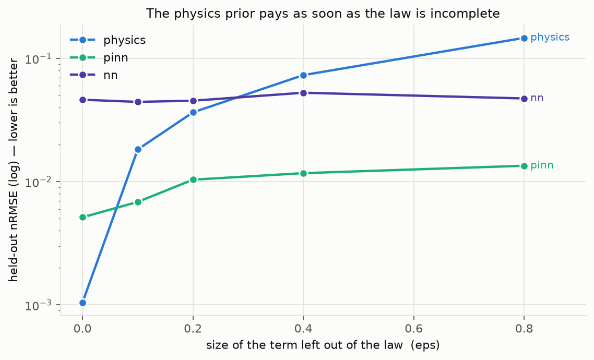

`ε` is how big the missing bump is. At `ε = 0` **the law is exact and
`physics` wins**, as it must: 0.0010 against the PINN's 0.0051. The PINN pays
5× for a correction it does not need, and that is the honest cost of the
prior being *more* flexible than the truth.

From `ε = 0.1` the ordering inverts and never comes back: at `ε = 0.8`,
`physics` is at 0.1468 and the PINN at 0.0135 — **10.9× better** — while the
black box sits at 0.0473 regardless, because it never knew the law and so has
nothing to lose.

### What the network actually learned

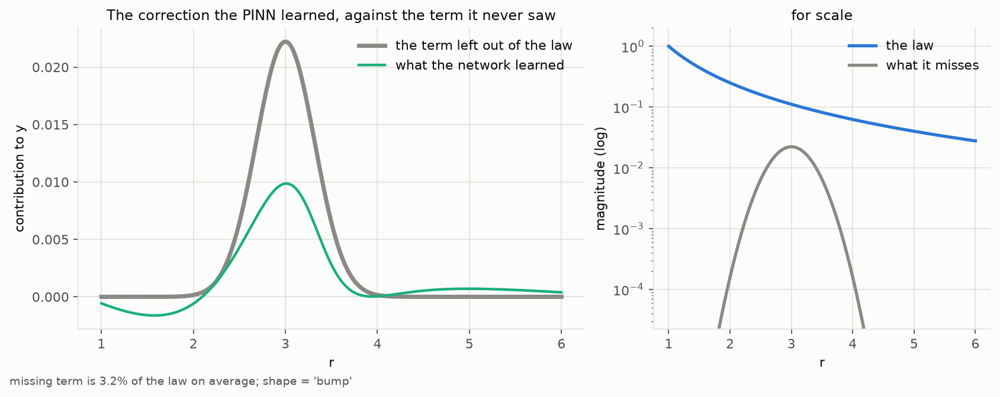

The correction is drawn against the term the network was **never shown**.
This is the plot that distinguishes "recovered missing physics" from
"absorbed noise", and no error metric answers it.

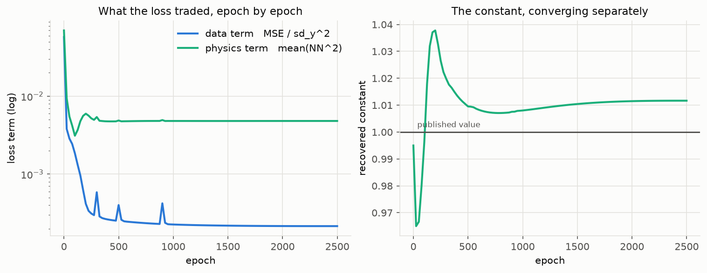

The loss is split into its data and physics parts, with the trainable
constant beside them, because **"the loss went down" and "the constant
converged" are different claims** and only the second one is physics.

### The prior is a bias–variance trade, not a free lunch

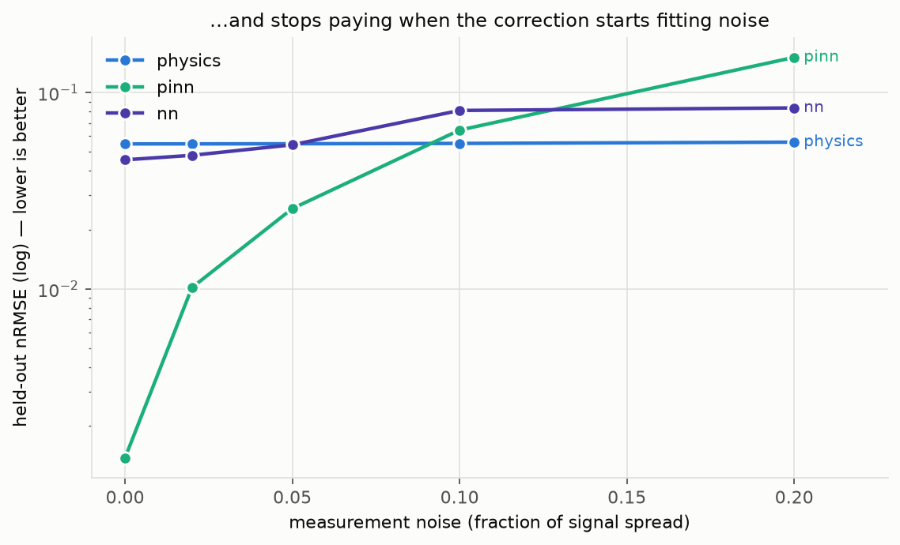

At `ε = 0.2`, against added noise:

| noise | `physics` | `pinn` | who wins |
|---|---|---|---|
| 0 % | 0.0548 | 0.0014 | PINN, by 39× |
| 5 % | 0.0549 | 0.0257 | PINN, by 2.1× |
| 10 % | 0.0551 | 0.0645 | **`physics`** |

`physics` is **biased but noise-immune** — it cannot fit the bump, and it
cannot fit the noise either, so it sits flat whatever happens. The PINN's
correction is flexible enough to represent the missing term, which means it
is flexible enough to represent noise. Above roughly 7 % it starts doing so.
The advantage is real and it is **conditional**, and the crossover is a
measurable property of the problem rather than a matter of taste.

### The control: a missing term shaped like the law

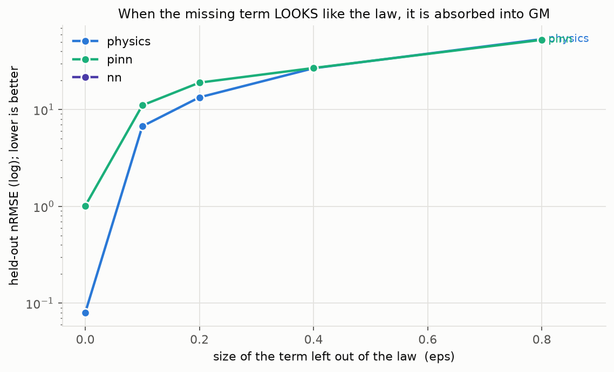

Replace the bump with `ε·GM·R/r³` — one order higher in `1/r`, which is how a
neglected oblateness or a first relativistic correction actually appears —
and the advantage disappears. The missing term is absorbed into `GM`, the fit
looks fine, and the recovered constant is wrong. **This is the control that
makes the rest of the study mean something.**

---

## Rung 2 — an ordinary differential equation

Now the missing piece is a missing **force**, and recovering it means the
network has learned a term of the equation of motion rather than a curve.

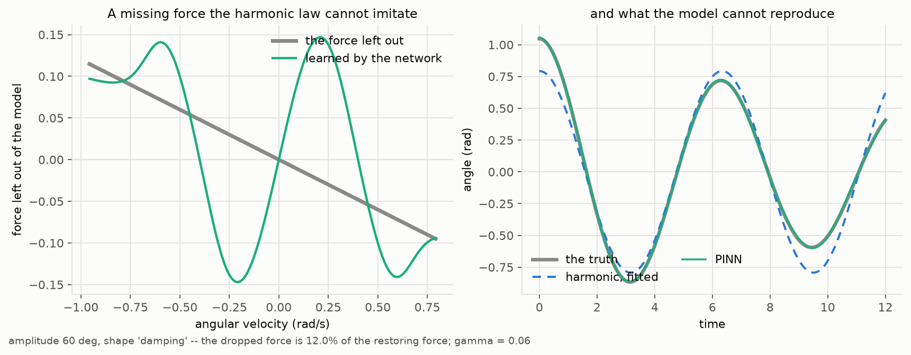

At a 60° initial amplitude, with damping left out of the law:

| arm | nRMSE | recovered `ω` error |
|---|---|---|
| `physics` (harmonic) | 0.2094 | 1.09 % |
| `pinn` | **0.0130** | 3.33 % |
| `nn` | 0.0146 | — |

**16× better.** A harmonic solution cannot decay, so there is no value of `ω`
that hides the missing term — it is distinguishable, and the residual PINN
recovers it.

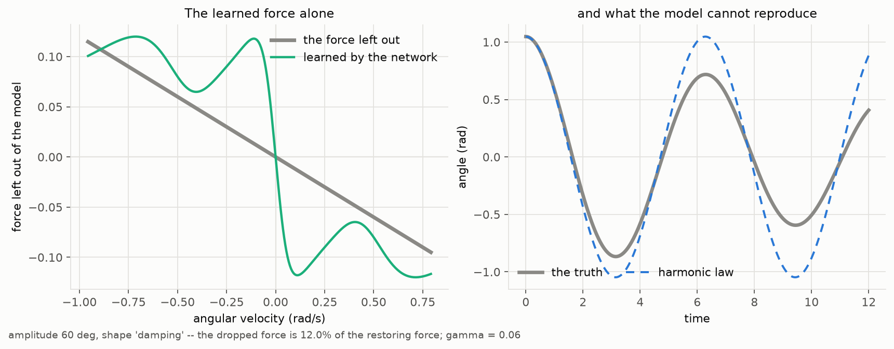

The correction is plotted against **what the missing force actually depends
on** — velocity for damping, angle for the anharmonic term. Plotting a
velocity-dependent force against angle draws a flat line and says nothing,
which is a mistake worth naming.

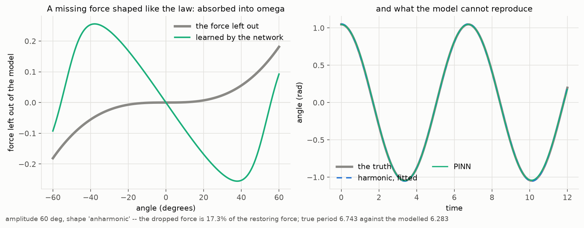

And the degenerate counterpart: leave out the anharmonic term and the
harmonic law absorbs it by **shifting `ω`** (6.79 % off). The trajectory error
is 0.0071 — better than the PINN's 0.0085 — so by fit quality alone you would
choose the wrong model. The same pattern as rung 1, in a different
mathematical setting.

---

## Rung 3 — a partial differential equation

The cleanest version of the whole result, because here the absorption is
**exact rather than approximate**. Adding `ε·α·u_xx` to a diffusion equation
produces a diffusion equation with a different `α`; nothing else changes.

Recovered `α` error, `physics` arm:

| `ε` | missing term = `ε·α·u_xx` (degenerate) | missing term = advection (distinguishable) |
|---|---|---|
| 0 | 2.2 % | 2.2 % |
| 0.15 | 18.1 % | 2.1 % |
| 0.30 | 34.2 % | 1.6 % |
| 0.60 | **67.0 %** | **0.8 %** |

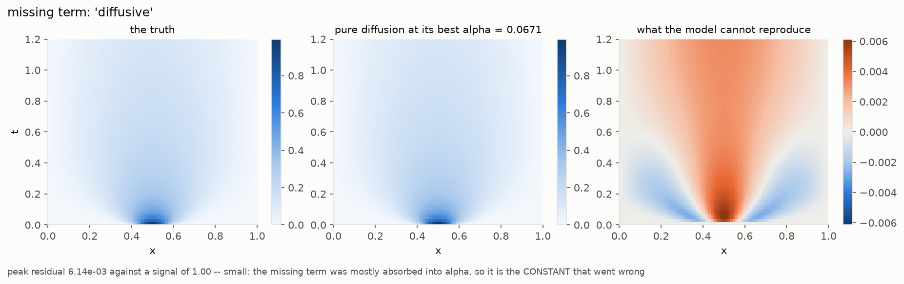
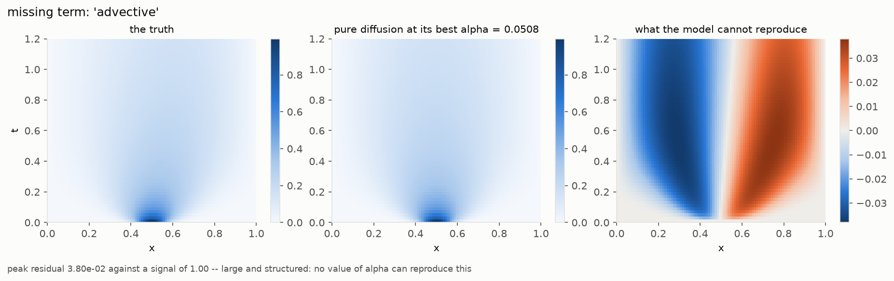

Read the difference panels. The degenerate case's residual is **small** —
the model reproduces the field almost perfectly — and its constant is 67 %
wrong. The advective case's residual is **large and structured**, a dipole
no diffusivity can remove, and its constant stays right to under 1 %.

**A small residual is not evidence of a right constant. A structured residual
is evidence of a missing term.** That sentence is the study.

> ### The `pinn` arm on this rung does not converge
>
> The 2-D residual PINN returns `α` about 69 % wrong even at `ε = 0`, where
> the modelled law is exactly right. It is marked `converged=False` by
> `pde_pinn_converged` and its number is not reported as a result.
>
> **The rung's conclusion does not depend on it**: the table above is the
> `physics` arm, and the absorption of `ε·α·u_xx` into `α` is a closed-form
> identity that needs no network at all.

---

## Why that PINN fails, which turned out to be the most useful thing here

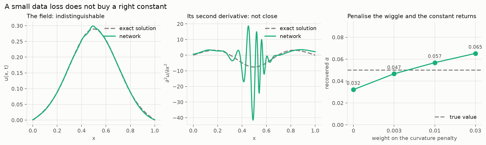

Fit the same network to the data **alone**, with no residual term, and read
the derivatives off the result
(`results/neglected/tune_derivative_accuracy.csv`):

| | mean \|u_xx\| | implied `α` | `α` · \|u_xx\| |
|---|---|---|---|
| exact solution | **3.59** | **0.0500** | 0.1793 |
| network, data loss 8.4×10⁻⁴ | **5.52** | 0.0322 | 0.1778 |

The field is excellent — a data loss of 8.4×10⁻⁴ — and the **second
derivative is 54 % too large**. Since `α` is exactly the ratio
`|u_t| / |u_xx|`, it comes out **36 % low** before any physics term has
spoken.

The third column is the proof that it is the *second* derivative and not the
first. The product `α·|u_xx|` is the `u_t` scale, and the network's is 0.1778
against the exact 0.1793 — **agreement to 0.8 %**. The first derivative is
right; the whole error is in the second, where nothing in the data loss can
see it.

Three controls say the excess curvature is the network's own rather than the
data's: at zero noise the error is unchanged, at eight times the data it is
slightly worse, and the least-squares estimator returns 0.05000 exactly on
the analytic field (`test_implied_alpha_is_exact_on_the_exact_field`).

**A network's accuracy in the k-th derivative is not controlled by its
accuracy in the value.** High-frequency content costs almost nothing in
function space and is amplified by every differentiation — which is why a
PINN can report a small residual and a wrong constant simultaneously, and why
"the residual converged" is not evidence that the physics was identified.

### The remedy, and the limit of it

Penalise the wiggle one derivative **above** the one the equation reads:

| curvature penalty | mean \|u_xx\| (exact 3.59) | implied `α` | error |
|---|---|---|---|
| 0 | 5.52 | 0.0322 | 36 % low |
| 0.003 | 3.92 | **0.0466** | **6.8 % low** |
| 0.01 | 3.65 | 0.0568 | 14 % high |
| 0.03 | 4.08 | 0.0652 | 30 % high |

Reading `α` off the field by least squares, the penalty takes it from 36 %
wrong to under 7 %, and the curvature it targets moves monotonically toward
the truth. **It does not transfer to the trained arm.** Inside the full
fitter, where `α` is optimised through the residual rather than read off the
field, the same sweep on the tuning seeds
(`results/neglected/tune_pde_smooth.csv`) moves the error only from 76 % to
68 % across a 33× range of the weight. So excess curvature is *a* real cause
and demonstrably not the only remaining one.

### One suspect tested and cleared

The obvious candidate for the rest was the free correction `C(u, u_x)`: with
it in the residual, `(α, C)` is not identified at all, since for **any** `α`
there is a `C` satisfying the equation exactly. At `ε = 0` the true
correction is zero, so removing `C` costs nothing and the test is clean
(`results/neglected/tune_pde_correction.csv`):

| | recovered `α` | error |
|---|---|---|
| `C` free, `w_phys = 1e-3` | 0.01535 | 69.3 % |
| `C` penalised, `w_phys = 1e3` | 0.01478 | 70.4 % |
| `C` removed entirely | 0.01406 | 71.9 % |

**Refuted.** A 10⁶ range on the penalty and then deleting the term moves `α`
by 0.0013, in the wrong direction.

### And the optimiser is innocent too

`α` is exactly `argmin |u_t − α u_xx|²`, so any field implies an `α` whether
or not one was trained. Train the residual PINN, then ask its own field what
`α` it implies (`results/neglected/tune_pde_consistency.csv`):

| | trained `α` | its field implies | ratio |
|---|---|---|---|
| `C` removed, 3 seeds | 0.0147 / 0.0148 / 0.0127 | 0.0146 / 0.0147 / 0.0126 | **1.00× / 1.00× / 0.99×** |

**Exactly self-consistent.** The optimiser returns the least-squares `α` of
the field it produced, on every seed. It is doing what it was asked. So the
error is entirely in the **field**, and nothing addressed to loss weights,
schedules, samplers or parameterisation can reach it — which is why none of
them did.

What is wrong with the field:

| the field | implied `α` (true 0.05) |
|---|---|
| fitted to the data alone, no residual | 0.032 |
| after full residual training | 0.0147 |

**Turning the physics term on makes the field about twice as bad at
identifying the constant as having no physics term at all.** The residual is
self-defeating here — it degrades the very field it needs. The honest
statement is not "the PINN did not converge" but: *on this problem, in this
configuration, the physics term costs more field accuracy than the physics
constraint buys.* See [METHOD.md](../METHOD.md).

The full post-mortem, including what was tried and did not work (gradient-norm
balancing, a data-only warmup, a hard initial condition, a curriculum in `t`,
residual-adaptive collocation, capping the residual weight, and a curvature
penalty), is in [METHOD.md](../METHOD.md) § "A small data loss does not buy a
right constant".

---

## What to take from this

1. **Ask what the prior cannot represent**, not whether it is "physics
   informed". A prior helps exactly to the extent that what it is missing is
   distinguishable from what it contains.
2. **A degenerate missing term is the dangerous case**, because it produces a
   good fit and a wrong constant, and the fit is what people look at.
3. **The prior is a bias–variance trade.** Above ~7 % noise here, the
   correction starts fitting noise and the rigid model wins.
4. **Check the constant, not the loss.** Three separate results in this
   repository — the Newtonian chirp-mass bias, the Mercury stencil, and this
   study — are all the same statement in different clothes.
