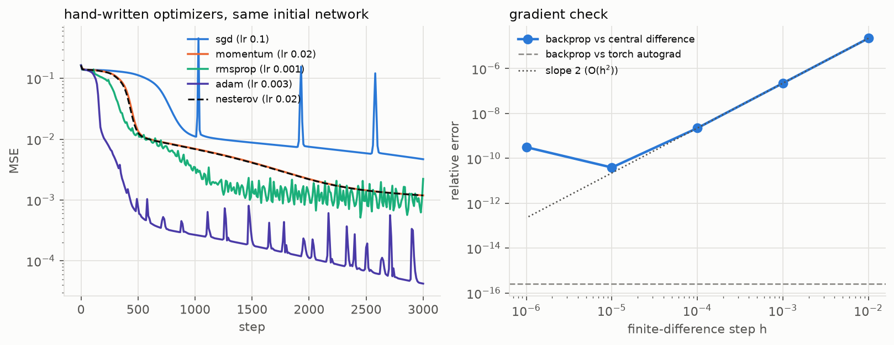
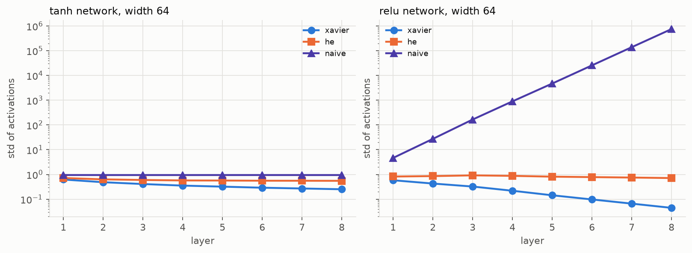
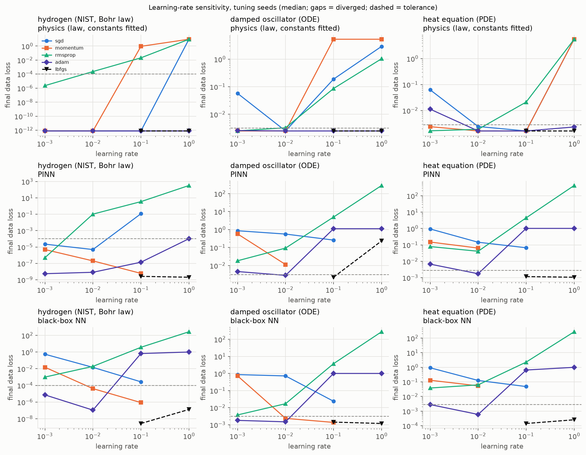
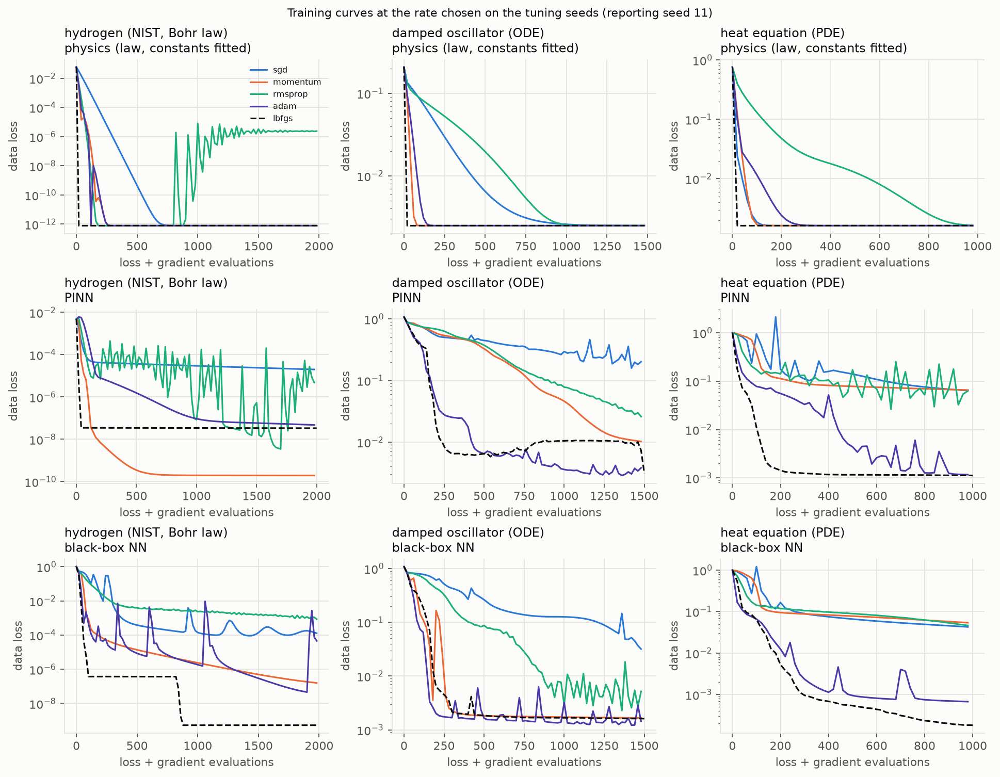
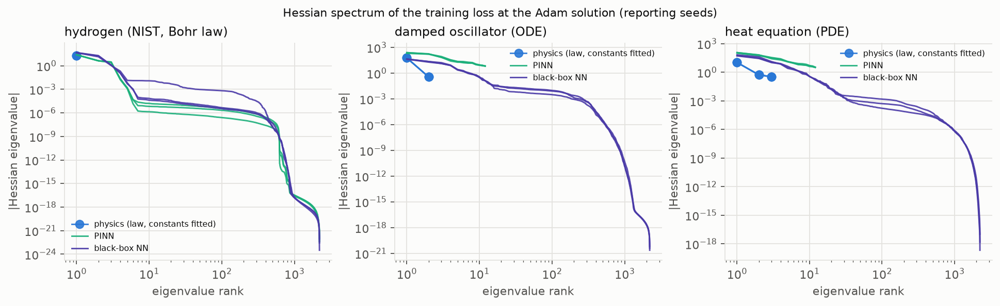
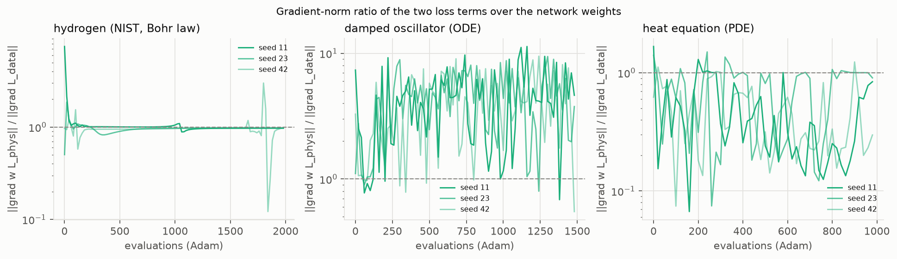
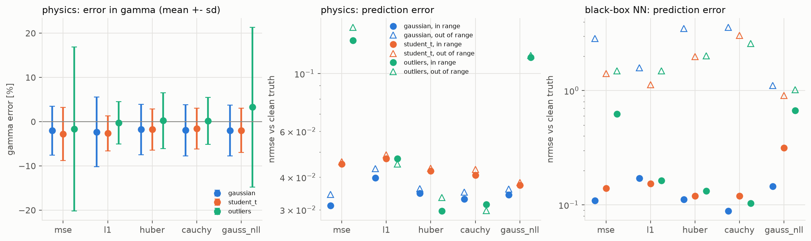
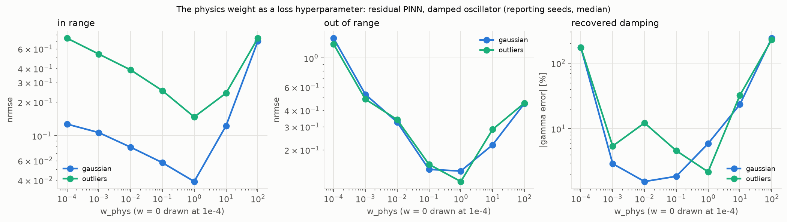
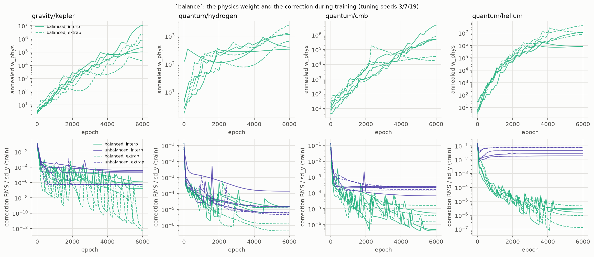
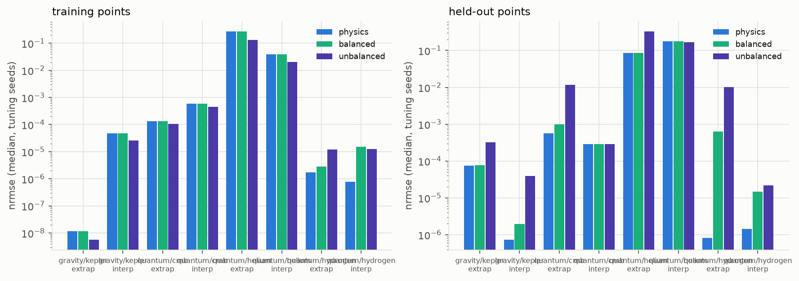

# Optimization: physics-constrained models versus black boxes

<!-- Generated by physprior.optim.report.render_doc() from results/optim.
     Do not edit by hand. -->

How optimizers, learning rates and loss functions behave for three model
families on the same problems:

- `physics`: the closed-form law with 1-3 constants trainable;
- `pinn`: on hydrogen the repo's shape B, `law(x; theta) + sd_y NN(x)` with
  the correction penalised (`w_phys = 1`, fixed); on the oscillator and the
  heat equation the residual PINN, where the network is the solution and the
  ODE/PDE residual is the physics term, constants trainable;
- `nn`: a tanh MLP, width 32, depth 3 (the repo's default arm).

Problems: `hydrogen` (real NIST H I levels, trained on n <= 15 minus five
held-out levels, out of range n = 16..40), `oscillator` (simulated
x'' + 2 gamma x' + omega0^2 x = 0, gamma and omega0 unknown, trained on
t in [0, 6], out of range t in (6, 10]), `heat` (simulated u_t = D u_xx,
D and two mode amplitudes unknown, trained on t in [0, 0.5], out of range
t in (0.5, 1]). Truth for the simulations is the analytic solution.

Code: `src/physprior/optim/`. Seeds: learning rates chosen on 3/7/19,
reported numbers on 11/23/42; the `balance` diagnostic uses 3/7/19 only, as
a diagnostic.


## 1. A network from scratch

`optim/scratch.py` is a NumPy MLP with the backward pass written out, and
SGD, heavy-ball momentum, Nesterov, RMSprop and Adam (with bias correction)
written by hand. It is teaching code; notebook T8 walks through it.

Initialisation: Xavier (variance 2/(fan_in + fan_out)) for tanh, He
(2/fan_in) for ReLU, because ReLU discards half the signal. The scan below
pushes random inputs through eight layers of width 64 and records the
spread of the activations and, for tanh, the fraction of units in the flat
tails (|a| > 0.99, where the derivative is below 0.02).

PINNs use tanh because their loss differentiates the network with respect to
its input. A ReLU network's second derivative is zero almost everywhere, so
an ODE residual containing u'' cannot be represented.

Backprop against torch autograd: relative difference 2.61e-16. Against central differences the error falls from 2.23e-05 at h = 0.01 to a minimum of 3.92e-11 at h = 1.00e-05, then rises as round-off takes over: the O(h^2) truncation line, then the eps/h floor.

Final training MSE after the same number of steps (one default rate each, not tuned): sgd 0.00469, momentum 0.00119, nesterov 0.00119, rmsprop 0.00223, adam 4.23e-05.

At layer 8: tanh with unit-variance weights has 0.724 of its units saturated, against 0 with Xavier (activation sd 0.252, a slow decay); ReLU's activation sd is 0.715 with He, 0.0447 with Xavier (vanishing) and 7.50e+05 with unit variance (exploding).






## 2. Optimizers x learning rates x models

Optimizers: SGD, SGD with momentum 0.9, RMSprop, Adam, L-BFGS (strong-Wolfe
line search, every line-search evaluation charged to the budget), and for
`physics` also MINPACK Levenberg-Marquardt (`scipy.optimize.least_squares`,
same parameterisation and starting point; its finite-difference Jacobian
evaluations are counted). Learning rates: 1e-3 to 1 for the first-order
methods, 0.1 and 1 for L-BFGS. Constant rates, no schedule, so the optimizer
is what is measured. Budgets in evaluations: hydrogen 2000, oscillator 1500, heat 1000. The seed sets the network initialisation and moves the starting
constants by ~30% in log space.

Median over the reporting seeds 11/23/42 at the learning rate chosen on the tuning seeds. `evals to tol` is the number of loss-and-gradient evaluations until the data loss first reached the task's tolerance (— = never); `failure` is the fraction of seeds that never reached it or diverged or ended more than 10x above it; `param err` is the error in the key constant (R, gamma, D).


**hydrogen (NIST, Bohr law)** (tolerance 1.00e-04 in units of sd_y^2)

| model | optimizer | lr | params | data loss | evals to tol | failure | nrmse in | nrmse out | param err % |
|---|---|---|---|---|---|---|---|---|---|
| physics | sgd | 0.001 | 1 | 7.86e-13 | 159 | 0 | 5.23e-07 | 1.37e-06 | 0.00111 |
| physics | momentum | 0.001 | 1 | 7.86e-13 | 13 | 0 | 5.23e-07 | 1.37e-06 | 0.00111 |
| physics | rmsprop | 0.001 | 1 | 2.34e-06 | 48 | 0 | 0.00305 | 0.00312 | 0.0489 |
| physics | adam | 0.01 | 1 | 7.86e-13 | 8 | 0 | 5.23e-07 | 1.37e-06 | 0.00111 |
| physics | lbfgs | 0.1 | 1 | 7.86e-13 | 3 | 0 | 5.25e-07 | 1.38e-06 | 0.00111 |
| physics | lm | — | 1 | 7.86e-13 | 3 | 0 | 5.23e-07 | 1.37e-06 | 0.00111 |
| pinn | sgd | 0.01 | 2210 | 8.29e-07 | 55 | 0 | 0.00376 | 0.0439 | 0.00339 |
| pinn | momentum | 0.1 | 2210 | 1.95e-10 | 36 | 0 | 6.73e-05 | 0.00354 | 0.00118 |
| pinn | rmsprop | 0.001 | 2210 | 8.96e-07 | 75 | 0 | 0.00173 | 0.00221 | 0.0118 |
| pinn | adam | 0.001 | 2210 | 4.72e-08 | 125 | 0 | 0.00137 | 0.0444 | 0.00226 |
| pinn | lbfgs | 1 | 2210 | 3.73e-09 | 5 | 0 | 2.32e-04 | 0.0304 | 9.68e-04 |
| nn | sgd | 0.1 | 2209 | 1.16e-04 | 1.18e+03 | 0.333 | 0.0331 | 0.0263 | — |
| nn | momentum | 0.1 | 2209 | 3.30e-07 | 115 | 0 | 0.0036 | 0.0075 | — |
| nn | rmsprop | 0.001 | 2209 | 0.00119 | — | 1 | 0.0549 | 0.292 | — |
| nn | adam | 0.01 | 2209 | 2.27e-07 | 105 | 0 | 0.00853 | 0.0118 | — |
| nn | lbfgs | 0.1 | 2209 | 3.04e-12 | 79 | 0 | 0.00322 | 0.232 | — |


**damped oscillator (ODE)** (tolerance 0.00313 in units of sd_y^2)

| model | optimizer | lr | params | data loss | evals to tol | failure | nrmse in | nrmse out | param err % |
|---|---|---|---|---|---|---|---|---|---|
| physics | sgd | 0.01 | 2 | 0.00249 | 795 | 0 | 0.0136 | 0.0156 | 2.38 |
| physics | momentum | 0.01 | 2 | 0.00249 | 74 | 0 | 0.0111 | 0.0127 | 1.93 |
| physics | rmsprop | 0.001 | 2 | 0.00249 | 1.04e+03 | 0 | 0.0109 | 0.013 | 1.93 |
| physics | adam | 0.01 | 2 | 0.00249 | 137 | 0 | 0.0111 | 0.0127 | 1.93 |
| physics | lbfgs | 1 | 2 | 0.00249 | 8 | 0 | 0.0111 | 0.0127 | 1.93 |
| physics | lm | — | 2 | 0.00249 | 13 | 0 | 0.0111 | 0.0127 | 1.93 |
| pinn | sgd | 0.1 | 2211 | 0.244 | — | 1 | 0.726 | 0.449 | 43.3 |
| pinn | momentum | 0.01 | 2211 | 0.0109 | — | 1 | 0.117 | 0.413 | 25.8 |
| pinn | rmsprop | 0.001 | 2211 | 0.0258 | — | 1 | 0.21 | 0.431 | 36.2 |
| pinn | adam | 0.01 | 2211 | 0.00316 | 845 | 0 | 0.055 | 0.17 | 11.5 |
| pinn | lbfgs | 0.1 | 2211 | 0.00253 | 1.24e+03 | 0.333 | 0.0326 | 0.041 | 3.61 |
| nn | sgd | 0.1 | 2209 | 0.0284 | — | 1 | 0.18 | 1.29 | — |
| nn | momentum | 0.1 | 2209 | 0.00166 | 264 | 0.333 | 0.0643 | 1.66 | — |
| nn | rmsprop | 0.001 | 2209 | 0.00468 | 953 | 0 | 0.084 | 1.26 | — |
| nn | adam | 0.01 | 2209 | 0.00131 | 153 | 0 | 0.0947 | 1.36 | — |
| nn | lbfgs | 1 | 2209 | 0.00126 | 156 | 0 | 0.0765 | 3.59 | — |


**heat equation (PDE)** (tolerance 0.00278 in units of sd_y^2)

| model | optimizer | lr | params | data loss | evals to tol | failure | nrmse in | nrmse out | param err % |
|---|---|---|---|---|---|---|---|---|---|
| physics | sgd | 0.1 | 3 | 0.00162 | 82 | 0 | 0.00934 | 0.00934 | 1.34 |
| physics | momentum | 0.01 | 3 | 0.00162 | 80 | 0 | 0.00934 | 0.00934 | 1.34 |
| physics | rmsprop | 0.001 | 3 | 0.00163 | 783 | 0 | 0.0123 | 0.014 | 1.99 |
| physics | adam | 0.01 | 3 | 0.00162 | 137 | 0 | 0.00934 | 0.00934 | 1.34 |
| physics | lbfgs | 1 | 3 | 0.00162 | 9 | 0 | 0.00934 | 0.00934 | 1.34 |
| physics | lm | — | 3 | 0.00162 | 9 | 0 | 0.00934 | 0.00934 | 1.34 |
| pinn | sgd | 0.1 | 2244 | 0.0629 | — | 1 | 0.285 | 0.0577 | 10.1 |
| pinn | momentum | 0.01 | 2244 | 0.0651 | — | 1 | 0.311 | 0.078 | 15.5 |
| pinn | rmsprop | 0.01 | 2244 | 0.0723 | — | 1 | 0.345 | 0.261 | 73.8 |
| pinn | adam | 0.01 | 2244 | 0.00223 | 546 | 0.333 | 0.054 | 0.035 | 2.79 |
| pinn | lbfgs | 1 | 2244 | 0.00112 | 163 | 0 | 0.0371 | 0.00593 | 0.777 |
| nn | sgd | 0.1 | 2241 | 0.0423 | — | 1 | 0.323 | 0.391 | — |
| nn | momentum | 0.01 | 2241 | 0.0481 | — | 1 | 0.315 | 0.386 | — |
| nn | rmsprop | 0.001 | 2241 | 0.0426 | — | 1 | 0.289 | 0.25 | — |
| nn | adam | 0.01 | 2241 | 6.67e-04 | 387 | 0 | 0.116 | 0.194 | — |
| nn | lbfgs | 0.1 | 2241 | 3.32e-04 | 244 | 0 | 0.154 | 0.52 | — |






Failure rate over the whole learning-rate grid on the tuning seeds, all tasks pooled (how forgiving each method is of a badly chosen rate):

| model | sgd | momentum | rmsprop | adam | lbfgs |
|---|---|---|---|---|---|
| physics | 0.5 | 0.389 | 0.528 | 0.139 | 0 |
| pinn | 0.833 | 0.778 | 0.917 | 0.528 | 0.167 |
| nn | 0.972 | 0.694 | 0.917 | 0.5 | 0 |


Fastest optimizer to the tolerance (median evaluations, reporting seeds):

| task | model | fastest | evals | Adam evals | L-BFGS evals |
|---|---|---|---|---|---|
| hydrogen | physics | lbfgs | 3 | 8 | 3 |
| hydrogen | pinn | lbfgs | 5 | 125 | 5 |
| hydrogen | nn | lbfgs | 79 | 105 | 79 |
| oscillator | physics | lbfgs | 8 | 137 | 8 |
| oscillator | pinn | adam | 845 | 845 | 1.24e+03 |
| oscillator | nn | adam | 153 | 153 | 156 |
| heat | physics | lbfgs | 9 | 137 | 9 |
| heat | pinn | lbfgs | 163 | 546 | 163 |
| heat | nn | lbfgs | 244 | 387 | 244 |

For `physics` the fastest method on every task is second-order (L-BFGS or LM): heat 9, hydrogen 3, oscillator 8 evaluations to tolerance. Over the whole learning-rate grid L-BFGS fails least for every family (physics 0, pinn 0.167, nn 0; first-order methods 0.139 to 0.972), and among first-order methods adam is the least sensitive to the rate. On the residual PINNs the methods that reach the tolerance on at least one seed are: adam, lbfgs.


45 learning rates were selected, all on the tuning seeds (`results/optim/lr_chosen.csv`).


## 3. Curvature at the solution

Hessian of the training loss with respect to every trainable parameter, by
double backpropagation (Hessian-vector products), at the end of the Adam and
L-BFGS runs on the reporting seeds. For `physics`, `nn` and the shape-B
PINN the full matrix is formed and diagonalised (at most a few thousand
parameters). For the residual PINNs, whose Hessian-vector product
differentiates the network three times, only the top 12 eigenvalues are
computed, by Lanczos (`scipy.sparse.linalg.eigsh` on the HVP operator), and
the columns that need the whole spectrum are left empty. The per-term top
eigenvalues also use Lanczos. A network's Hessian is singular, so its
condition number is not reported; instead the number of sharp directions
(eigenvalues above 1e-3 lambda_max), the fraction of flat ones (|lambda|
below 1e-6 lambda_max) and the number of negative ones. `cond. of constants block` is the
condition number of the sub-Hessian over the physical constants alone.
`physics / data` compares the sharpest curvature each loss term induces on
the network weights of a PINN.

What the theory predicts: the `physics` loss is low-dimensional and, in the
log parameterisation, reasonably conditioned, so Gauss-Newton methods (LM,
and L-BFGS which approximates them) converge in tens of evaluations. The
black box has a spectrum that is mostly flat with a few sharp directions:
the sharpest sets the largest stable step (lr < 2 / lambda_max for SGD) and
the flat ones make progress slow and leave the solution undetermined along
them. The residual PINN's physics term differentiates the network, which
multiplies each Fourier component of the error by its frequency (twice for
a second derivative), so its curvature on the network weights exceeds the
data term's and the gradients of the two terms are unbalanced (Wang, Teng &
Perdikaris 2021; Krishnapriyan et al. 2021).

| task | model | at | params | lambda_max | eig. > 1e-3 lambda_max | frac. abs(eig) < 1e-6 lambda_max | negative eig. | cond. (all) | cond. of constants block | lambda_max data (net) | lambda_max physics (net) | physics / data |
|---|---|---|---|---|---|---|---|---|---|---|---|---|
| heat | nn | adam | 2241 | 57.2 | 15 | 0.842 | 144 | — | — | — | — | — |
| heat | nn | lbfgs | 2241 | 178 | 17 | 0.88 | 117 | — | — | — | — | — |
| heat | physics | adam | 3 | 10.6 | 3 | 0 | 0 | 31.9 | 31.9 | — | — | — |
| heat | physics | lbfgs | 3 | 10.6 | 3 | 0 | 0 | 31.9 | 31.9 | — | — | — |
| heat | pinn | adam | 2244 | 115 | — | — | — | — | inf | 104 | 25.9 | 0.25 |
| heat | pinn | lbfgs | 2244 | 437 | — | — | — | — | inf | 405 | 120 | 0.298 |
| hydrogen | nn | adam | 2209 | 46.5 | 4 | 0.992 | 6 | — | — | — | — | — |
| hydrogen | nn | lbfgs | 2209 | 216 | 4 | 0.997 | 0 | — | — | — | — | — |
| hydrogen | physics | adam | 1 | 18.9 | 1 | 0 | 0 | 1 | 1 | — | — | — |
| hydrogen | physics | lbfgs | 1 | 18.9 | 1 | 0 | 0 | 1 | 1 | — | — | — |
| hydrogen | pinn | adam | 2210 | 25.1 | 3 | 0.997 | 0 | — | 1 | 5.22 | 5.22 | 1 |
| hydrogen | pinn | lbfgs | 2210 | 26 | 3 | 0.998 | 0 | — | 1 | 5.81 | 5.81 | 1 |
| oscillator | nn | adam | 2209 | 42.7 | 15 | 0.828 | 174 | — | — | — | — | — |
| oscillator | nn | lbfgs | 2209 | 3.89e+03 | 9 | 0.99 | 2 | — | — | — | — | — |
| oscillator | physics | adam | 2 | 60 | 2 | 0 | 0 | 165 | 165 | — | — | — |
| oscillator | physics | lbfgs | 2 | 60 | 2 | 0 | 0 | 165 | 165 | — | — | — |
| oscillator | pinn | adam | 2211 | 245 | — | — | — | — | 91.5 | 47 | 226 | 4.81 |
| oscillator | pinn | lbfgs | 2211 | 4.38e+03 | — | — | — | — | 108 | 916 | 3.46e+03 | 3.77 |



Findings, computed from the table (at the L-BFGS solutions). The `physics` Hessians are positive definite with condition numbers heat 31.9, hydrogen 1, oscillator 165. The black box's spectrum has 17 sharp directions of 2241 (heat), 4 sharp directions of 2209 (hydrogen), 9 sharp directions of 2209 (oscillator); the rest are flat or nearly so (flat fraction heat 0.88, hydrogen 0.997, oscillator 0.99). Negative eigenvalues at the Adam end points (see the `adam` rows) show that a constant-rate Adam run stops short of a minimum; L-BFGS ends closer to one. For the shape-B PINN on hydrogen the two terms induce the same sharpest curvature on the network (ratio 1): near a solution both are Gauss-Newton forms J^T J of the same network Jacobian, so shape B has no stiffness imbalance for loss balancing to correct. Residual PINN, oscillator: physics/data curvature ratio 3.77. Residual PINN, heat: physics/data curvature ratio 0.298. The prediction that the residual term is the stiffer one holds on oscillator and does not hold on heat, where the diffusivity (D = 0.1) scales the second-derivative term down. The cond. of the constants block is infinite for the heat PINN because the two mode amplitudes do not enter the residual loss at all (only D does); they are fitted by nothing and their values there are the starting guess.


Gradient-norm ratio ||grad w L_phys|| / ||grad L_data|| over the network weights, PINN with Adam, reporting seeds (median over the first 10% and the last 20% of training):

| task | early | late | max |
|---|---|---|---|
| heat | 0.733 | 0.589 | 1.67 |
| hydrogen | 1.04 | 0.973 | 7.45 |
| oscillator | 1.1 | 4.17 | 11.3 |




## 4. Loss functions

`optim/losses_study.py`. The oscillator with gamma and omega0 unknown, 40
training points, three noise models: Gaussian (sd 0.05), Student-t with
nu = 2 (scale 0.05, infinite variance), and Gaussian plus 10% outliers
displaced by 0.5-1.0. Losses: MSE, L1, Huber (delta = 1.345 s), Cauchy
(c = 2.385 s), with s = 1.4826 MAD of an MSE fit's residuals (the standard
95%-efficiency constants, not tuned), and the Gaussian NLL with a learned
sigma (log sigma linear in t for `physics`, a second network output for
`nn`). `physics` starts within ~10% of the truth, so the table measures the
estimator, not the optimizer. Reporting seeds, four noise draws each for
`physics`.

**physics** (gamma bias = mean signed error over 12 fits per cell; z = bias / standard error)

| noise | loss | gamma bias % | gamma sd % | z | nrmse in | nrmse out |
|---|---|---|---|---|---|---|
| gaussian | cauchy | -1.94 | 5.77 | -1.16 | 0.033 | 0.0351 |
| gaussian | gauss_nll | -2.02 | 5.75 | -1.22 | 0.0342 | 0.0361 |
| gaussian | huber | -1.78 | 5.73 | -1.07 | 0.0348 | 0.0362 |
| gaussian | l1 | -2.32 | 7.87 | -1.02 | 0.0398 | 0.0431 |
| gaussian | mse | -2.03 | 5.5 | -1.28 | 0.0312 | 0.0344 |
| outliers | cauchy | 0.19 | 5.3 | 0.125 | 0.0315 | 0.0298 |
| outliers | gauss_nll | 3.27 | 18 | 0.627 | 0.115 | 0.118 |
| outliers | huber | 0.218 | 6.27 | 0.121 | 0.0297 | 0.0334 |
| outliers | l1 | -0.243 | 4.8 | -0.176 | 0.0471 | 0.045 |
| outliers | mse | -1.67 | 18.5 | -0.311 | 0.134 | 0.15 |
| student_t | cauchy | -1.57 | 4.57 | -1.19 | 0.0407 | 0.0429 |
| student_t | gauss_nll | -1.97 | 5 | -1.36 | 0.0373 | 0.0382 |
| student_t | huber | -1.78 | 4.67 | -1.32 | 0.0423 | 0.0433 |
| student_t | l1 | -2.64 | 3.96 | -2.31 | 0.0471 | 0.0488 |
| student_t | mse | -2.76 | 5.99 | -1.6 | 0.045 | 0.0459 |

**black-box NN** (median over the reporting seeds)

| noise | loss | nrmse_in | nrmse_out |
|---|---|---|---|
| gaussian | cauchy | 0.0882 | 3.58 |
| gaussian | gauss_nll | 0.146 | 1.11 |
| gaussian | huber | 0.112 | 3.51 |
| gaussian | l1 | 0.171 | 1.58 |
| gaussian | mse | 0.109 | 2.86 |
| outliers | cauchy | 0.104 | 2.58 |
| outliers | gauss_nll | 0.672 | 1.02 |
| outliers | huber | 0.133 | 2.01 |
| outliers | l1 | 0.164 | 1.49 |
| outliers | mse | 0.624 | 1.49 |
| student_t | cauchy | 0.12 | 3.05 |
| student_t | gauss_nll | 0.315 | 0.909 |
| student_t | huber | 0.12 | 1.99 |
| student_t | l1 | 0.153 | 1.13 |
| student_t | mse | 0.14 | 1.41 |




Findings, computed from the table. No loss gives a gamma bias beyond three standard errors at these sample sizes: the largest |z| is 2.31 (student_t, l1). All losses in a row are fitted to the same noise draws, so their biases are correlated and an offset common to a row comes from the draws, not the losses. What outliers change is the spread: the scatter of gamma under MSE is 18.5% against 6.27% (Huber) and 5.3% (Cauchy), and the in-range prediction error is 0.134 (MSE) against 0.0297 (huber). The Gaussian NLL with a learned sigma does not help against outliers (0.115). The likely reason: a sigma smooth in t cannot single out isolated points, so it widens everywhere. For the black box the best in-range loss under outliers is cauchy (0.104 against 0.624 for MSE), but out of range every loss leaves it at an nrmse between 0.909 and 3.58, against at most 0.15 for `physics`: the loss function changes what the network fits, not what it knows outside the data.


### The physics weight as a loss hyperparameter

The residual PINN on the oscillator at w_phys from 0 to 100, Gaussian noise
and outliers. At w_phys = 0 the constants receive no gradient at all (they
appear only in the residual), so their "error" there is the starting guess.
Adam, rate 0.01 (chosen for this PINN on the tuning seeds), 3000 steps, cosine schedule. Medians over the reporting seeds.

| noise | w_phys | data loss | residual | nrmse in | nrmse out | gamma err % | omega0 err % |
|---|---|---|---|---|---|---|---|
| gaussian | 0 | 0.00726 | 6.06 | 0.127 | 1.42 | 174 | -19.9 |
| gaussian | 0.001 | 0.00777 | 0.734 | 0.107 | 0.53 | -2.93 | -5.29 |
| gaussian | 0.01 | 0.00949 | 0.116 | 0.0792 | 0.325 | 1.57 | -0.878 |
| gaussian | 0.1 | 0.0116 | 0.0137 | 0.0575 | 0.142 | 1.88 | -0.0653 |
| gaussian | 1 | 0.0135 | 0.00402 | 0.039 | 0.138 | 5.94 | -0.103 |
| gaussian | 10 | 0.0285 | 0.0019 | 0.123 | 0.219 | 23.5 | 0.218 |
| gaussian | 100 | 0.244 | 3.56e-04 | 0.702 | 0.451 | 241 | 4.1 |
| outliers | 0 | 0.0444 | 7.65e+03 | 0.748 | 1.28 | 174 | -19.9 |
| outliers | 0.001 | 0.0868 | 10.3 | 0.539 | 0.487 | 5.44 | -1.95 |
| outliers | 0.01 | 0.141 | 1.13 | 0.389 | 0.34 | -12.3 | 0.689 |
| outliers | 0.1 | 0.175 | 0.122 | 0.253 | 0.156 | -4.63 | -1.45 |
| outliers | 1 | 0.198 | 0.00973 | 0.147 | 0.115 | -2.2 | -1.45 |
| outliers | 10 | 0.227 | 0.00238 | 0.241 | 0.286 | 32.5 | -0.796 |
| outliers | 100 | 0.513 | 3.43e-04 | 0.746 | 0.455 | 229 | -2.69 |



Findings, computed from the table. With gaussian noise the out-of-range error is lowest at w_phys = 1 (0.138, against 1.42 at w = 0) and the damping error at w_phys = 0.01 (1.57%). At w_phys = 100 the residual is smallest (3.56e-04) but the data loss rises to 0.244 and gamma is off by 241%. With outliers noise the out-of-range error is lowest at w_phys = 1 (0.115, against 1.28 at w = 0) and the damping error at w_phys = 1 (-2.2%). At w_phys = 100 the residual is smallest (3.43e-04) but the data loss rises to 0.513 and gamma is off by 229%. The curve is a trade-off with an interior optimum (measured on the reporting seeds; nothing is selected from it): too little weight and the constants are unconstrained, too much and the optimizer satisfies the ODE with a solution that ignores the data, which the initial conditions alone permit for any damping.


## 5. The frozen `balance` option drives the physics weight up

`FROZEN_PINN = PinnOptions(balance=True)` anneals the physics weight every
100 epochs toward max|grad L_data| / mean|grad L_phys| over the correction
network's weights (`methods/pinn.py::_annealed_weight`). For shape B,
L_phys = mean(NN^2), so grad L_phys = 2 mean(NN grad NN) is proportional to
the correction itself. A larger weight shrinks the correction, which shrinks
the physics gradient, which raises the next weight: the annealing has no
fixed point short of NN = 0, and w keeps growing for as long as training
runs. (In Wang et al. the physics term is a PDE residual, whose gradient does
not vanish with the network's output.)

Measured with `fit_pinn` exactly as `fit_arm` calls it (6000 epochs, Adam,
cosine schedule, `w_phys = 1` start), on the four real tracks, both the
track's random interpolation split and its extrapolation split, tuning seeds
3/7/19. `unbalanced` is the same arm with `balance` off (`w_phys = 1`
fixed). `corr. RMS` is the correction's RMS in units of the training sd_y,
on the training points (`Fit.extra["correction_rms_frac"]`) and on the
held-out points (prediction minus the law at the PINN's own constants).
`gap to physics` is the RMS difference between the PINN's and the `physics`
fit's held-out predictions, in units of the spread of y.

| track | split | variant | w_phys final | corr. RMS (train) | corr. RMS (held out) | nrmse in | nrmse out | out / physics | gap to physics (out) |
|---|---|---|---|---|---|---|---|---|---|
| gravity/kepler | extrap | balanced | 7.96e+05 | 1.37e-12 | 3.54e-04 | 1.14e-08 | 7.80e-05 | 1.03 | 3.88e-06 |
| gravity/kepler | extrap | physics | — | — | — | 1.14e-08 | 7.56e-05 | 1 | — |
| gravity/kepler | extrap | unbalanced | 1 | 5.22e-07 | 0.0309 | 5.72e-09 | 3.20e-04 | 4.24 | 3.39e-04 |
| gravity/kepler | interp | balanced | 2.14e+05 | 6.06e-07 | 1.15e-06 | 4.67e-05 | 1.97e-06 | 2.66 | 1.23e-06 |
| gravity/kepler | interp | physics | — | — | — | 4.67e-05 | 7.40e-07 | 1 | — |
| gravity/kepler | interp | unbalanced | 1 | 2.44e-05 | 3.68e-05 | 2.57e-05 | 3.98e-05 | 53.8 | 3.94e-05 |
| quantum/cmb | extrap | balanced | 3.44e+04 | 3.83e-06 | 0.00157 | 1.34e-04 | 9.91e-04 | 1.73 | 7.26e-04 |
| quantum/cmb | extrap | physics | — | — | — | 1.34e-04 | 5.72e-04 | 1 | — |
| quantum/cmb | extrap | unbalanced | 1 | 1.62e-04 | 0.0258 | 1.05e-04 | 0.0117 | 20.4 | 0.0117 |
| quantum/cmb | interp | balanced | 5.20e+05 | 4.87e-07 | 7.95e-07 | 5.99e-04 | 2.88e-04 | 1 | 9.56e-06 |
| quantum/cmb | interp | physics | — | — | — | 5.99e-04 | 2.88e-04 | 1 | — |
| quantum/cmb | interp | unbalanced | 1 | 2.23e-04 | 1.74e-04 | 4.51e-04 | 2.91e-04 | 1.01 | 1.63e-04 |
| quantum/helium | extrap | balanced | 1.10e+07 | 9.59e-07 | 7.93e-05 | 0.269 | 0.0857 | 0.999 | 1.45e-04 |
| quantum/helium | extrap | physics | — | — | — | 0.269 | 0.0858 | 1 | — |
| quantum/helium | extrap | unbalanced | 1 | 0.0734 | 0.207 | 0.135 | 0.325 | 3.79 | 0.379 |
| quantum/helium | interp | balanced | 8.71e+05 | 2.42e-06 | 2.70e-06 | 0.0395 | 0.176 | 1 | 2.76e-06 |
| quantum/helium | interp | physics | — | — | — | 0.0395 | 0.176 | 1 | — |
| quantum/helium | interp | unbalanced | 1 | 0.0271 | 0.0353 | 0.0203 | 0.166 | 0.939 | 0.0213 |
| quantum/hydrogen | extrap | balanced | 1.25e+03 | 1.25e-06 | 3.49e-04 | 2.82e-06 | 6.35e-04 | 781 | 6.35e-04 |
| quantum/hydrogen | extrap | physics | — | — | — | 1.71e-06 | 8.12e-07 | 1 | — |
| quantum/hydrogen | extrap | unbalanced | 1 | 6.53e-06 | 0.00564 | 1.20e-05 | 0.0103 | 1.26e+04 | 0.0103 |
| quantum/hydrogen | interp | balanced | 403 | 1.45e-05 | 1.22e-05 | 1.50e-05 | 1.45e-05 | 10.2 | 1.44e-05 |
| quantum/hydrogen | interp | physics | — | — | — | 7.58e-07 | 1.43e-06 | 1 | — |
| quantum/hydrogen | interp | unbalanced | 1 | 1.54e-05 | 1.75e-05 | 1.23e-05 | 2.17e-05 | 15.2 | 2.19e-05 |


Largest annealed weight: 3.90e+07 (quantum/helium, extrap, seed 19). 
The weight is still rising at the end of training in 23 of 24 balanced runs (median growth over the second half: 9.41x); it has not settled. The pure feedback w ~ 1/|NN| would give a log-log slope of -1 between w and the correction's RMS; the measured slope over the second half has median -0.628 (range -1.75 to 3.8): shallower, because the data term's gradient also shrinks as the fit converges.


Out-of-range error ratios (median over tuning seeds; < 1 means the first variant is better):

| track | split | balanced / unbalanced | balanced / physics |
|---|---|---|---|
| gravity/kepler | extrap | 0.244 | 1.03 |
| gravity/kepler | interp | 0.0494 | 2.66 |
| quantum/cmb | extrap | 0.085 | 1.73 |
| quantum/cmb | interp | 0.99 | 1 |
| quantum/helium | extrap | 0.263 | 0.999 |
| quantum/helium | interp | 1.07 | 1 |
| quantum/hydrogen | extrap | 0.0619 | 781 |
| quantum/hydrogen | interp | 0.67 | 10.2 |






### What this implies for the Phase 2 conclusion

Across the 8 track/split cells the median annealed weight at the end of training is 3.67e+05, and the balanced correction's RMS on the training points is at most 1.45e-05 of sd_y. Out of range the balanced PINN beats the unbalanced one in 7 of 8 cells (median ratio 0.253). Against the `physics` fit it is within 5% in 4 cells, worse by 5% or more in 4 (gravity/kepler interp: 2.66x, quantum/cmb extrap: 1.73x, quantum/hydrogen extrap: 781x, quantum/hydrogen interp: 10.2x), and better by 5% or more in 0. The balanced PINN's constants agree with the `physics` fit's to within 2.44 ppm in every run. In no cell does it beat `physics` out of range by more than 5%.


So `balance` does not make the correction network useful; it switches it
off on the training points. The Phase 2 improvement is measured against the
unbalanced PINN, whose correction overfits and extrapolates badly, and the
balanced PINN wins that comparison by becoming the `physics` fit with a
residual network attached. Where it is worse, the constants are not the cause (they
match to the ppm figure above); the cause is what remains of the
correction. It is small in units of sd_y, but not small next to the `physics`
fit's own error on these tracks (hydrogen's is ~1e-6 of the spread), and on
the extrapolation splits it is larger on the held-out points than on the
training points (compare the two correction columns in the table).

Consequences for reading the results tables: every `pinn` number produced
with `FROZEN_PINN` on an algebraic track is, to within these ratios, a
second copy of `physics`. "The PINN ties `physics`" is then expected by
construction and is not evidence that a learned correction is harmless or
helpful. On helium, where the law is incomplete and hypothesis H3 asks what a
correction learns, the frozen arm cannot answer, which the helium track
already works around with its `pinn_unbalanced` diagnostic. The frozen
configuration is not changed here. Re-deciding it is a tuning-seed decision;
the options are to keep it and describe `pinn` as a regularised `physics`
fit, to cap the annealed weight, or to report `pinn` without `balance`.


## Reproduce

```bash
python -c "from physprior.optim import report; report.run_all()"   # full study
python -c "from physprior.optim import report; report.make_figures(); report.render_doc()"
```

Outputs: `results/optim/*.csv|json`, `figures/optim/*.png`, this file.
