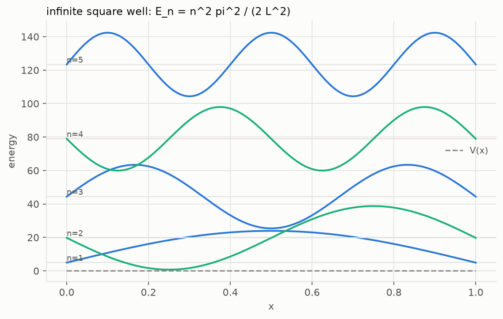
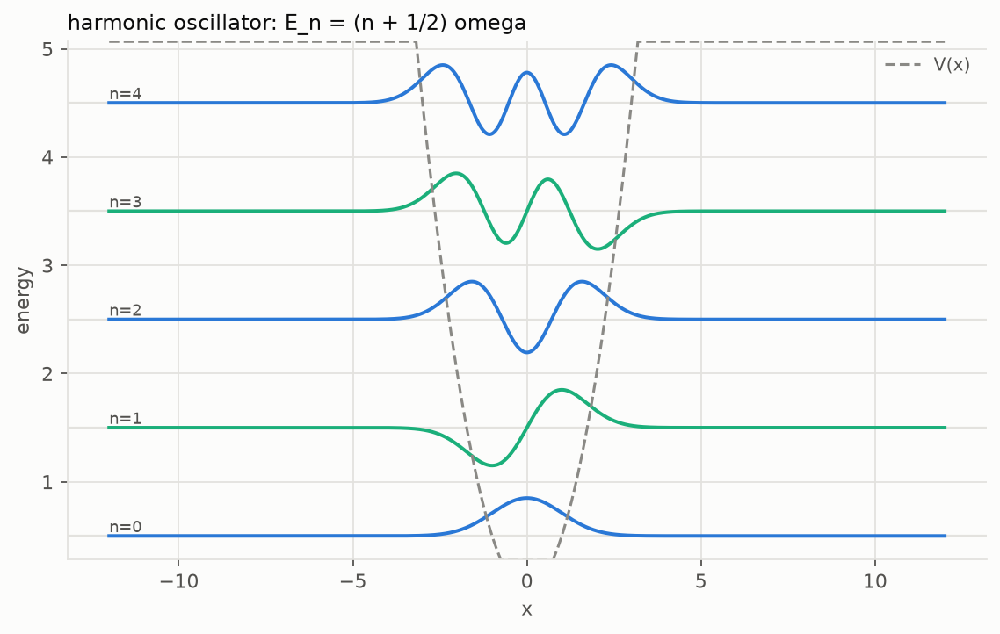
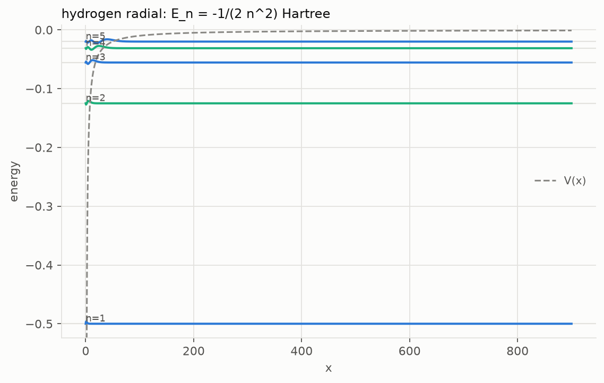
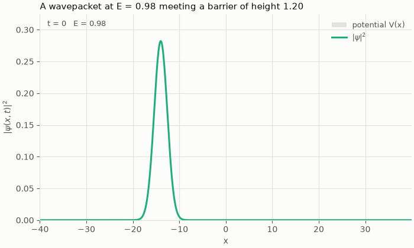
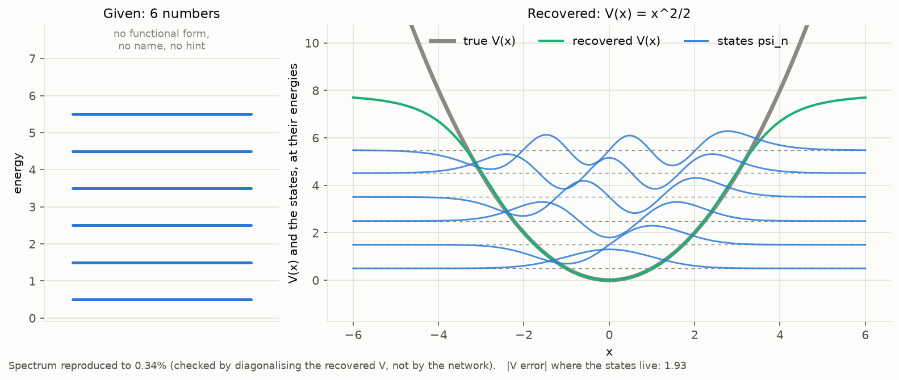
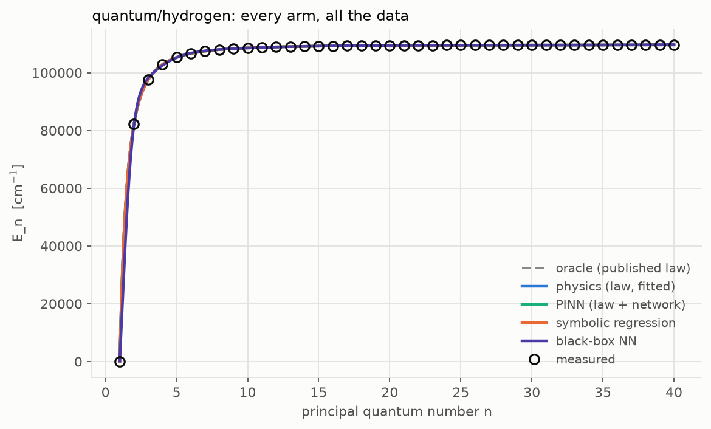
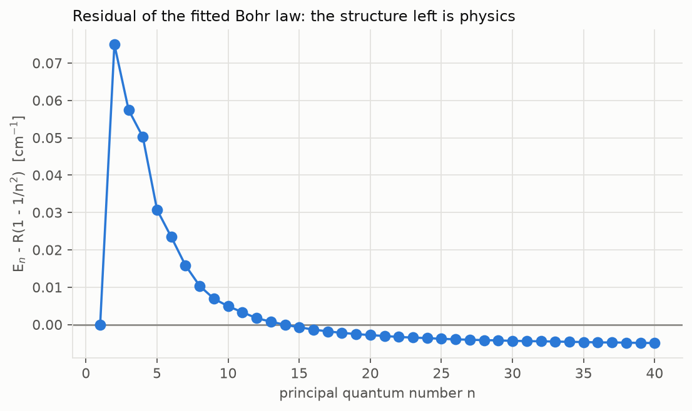
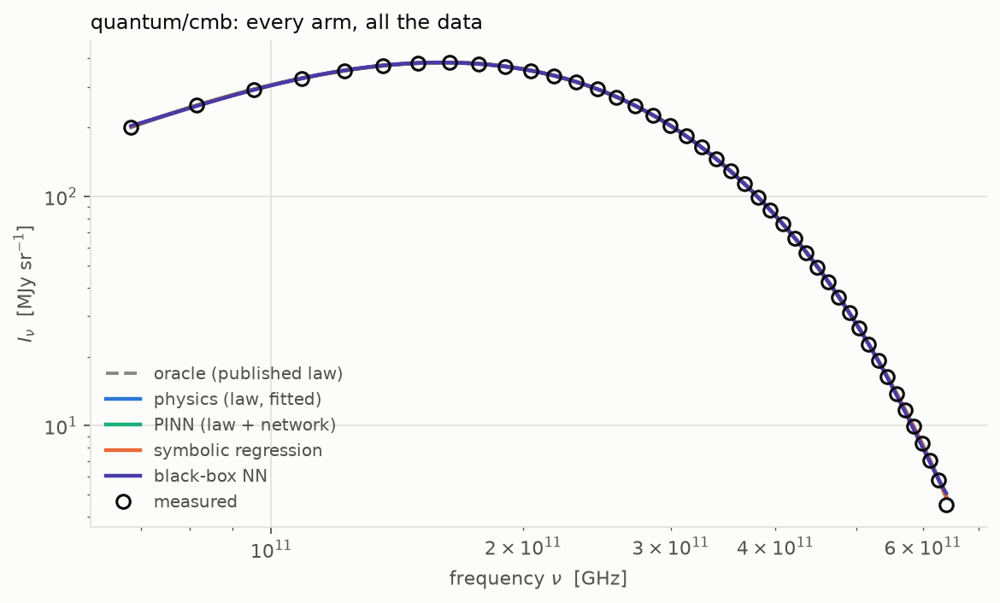
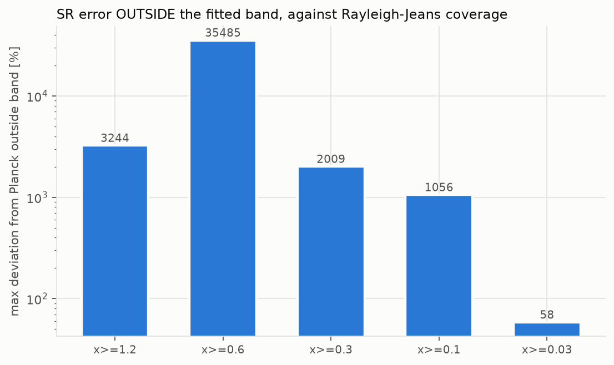

# quantum

Three tracks. Hydrogen, where the law is so nearly exact that **its own
failure is visible**; helium, where the law is incomplete by design and the
missing piece depends on inputs the law ignores; and the CMB, where the law is
transcendental and the observed band cannot identify it.

**Real data** — NIST hydrogen levels; NIST helium terms; the COBE/FIRAS
blackbody.
**Simulations** — the Schrödinger equation, solved and measured.

Code: [`src/physprior/problems/quantum`](../../src/physprior/problems/quantum)
· Results: [`results/quantum`](../../results/quantum)

---

## The simulations

| What | Notes |
|---|---|
| `infinite_well`, `harmonic_oscillator`, `hydrogen_radial` | bound states by direct diagonalisation of a finite-difference Laplacian |
| `hydrogen_richardson` | two grids combined to cancel the leading error: 300 ppm → 4 ppm |
| `grid_convergence`, `box_convergence`, `r_min_sweep` | the solver's error, measured rather than assumed |
| `wavepacket` | split-operator tunnelling, unitary to 5×10⁻¹⁵ |

| | | |
|---|---|---|
|  |  |  |

**Richardson extrapolation, because the solver was coarser than the effect.**
Plain second-order differences give the hydrogen levels to ~300 ppm. The
relativistic + QED shift in the real atom is 10.8 ppm. A solver 30× less
accurate than the effect cannot see it, and differencing anyway would have
reported discretisation error as physics.

## Learning the wave function, and inverting the spectrum

`methods/eigen_pinn.py` solves the Schrodinger equation as a PINN — **no data
at all**, only the operator equation and a boundary. The first four levels of
the infinite well come out at 0.000%, 0.041%, 0.060% and 0.045% of the exact
eigenvalues.

The inverse is the one worth caring about: given only a spectrum, recover the
potential that produced it.

Six numbers in, `V(x) = x²/2` out — the word "harmonic" appears nowhere. Four
things make it work, and each is a general lesson:

- **ψ = 0 solves the equation**, so every objective is a ratio of inner
  products and the zero function is not in the domain.
- **Boundaries are hard-constrained**, `ψ = (x−a)(b−x)·NN(x)`, so there is no
  boundary weight to justify.
- **One spectrum does not determine a 1-D potential** (Borg–Marchenko; "can
  one hear the shape of a drum?"). Symmetry is imposed architecturally, and
  it buys *identifiability* rather than accuracy.
- **Where no state has support, the data says nothing about `V`** — every
  term of the residual is proportional to ψ. An unconstrained network puts a
  bump in the tail and invents spurious bound states, so a Tikhonov term on
  `V''` states a preference for the smoothest potential consistent with the
  data. That is a prior, and it is reported as one.

**When a differentiable forward model exists, it beats the PINN.**
Differentiating through `torch.linalg.eigvalsh` rather than representing
every state with its own network:

| | residual PINN | differentiable solver |
|---|---|---|
| spectrum error | 0.17 | **0.0034** |
| time | 100 s | **18 s** |

Both are kept, because that comparison is a measurement rather than an
opinion — and the PINN is what remains when no such solver exists.

## The real-data track: `quantum/hydrogen`

Bohr's law fitted to the NIST levels.

| | |
|---|---|
|  |  |
| **Overview** — every arm on the track. | **The law's own failure.** The fitted ionisation limit sits **10.8 ppm above** Bohr's prediction. |

That shift is relativistic and QED corrections to the 1s level, and it is
reached **twice, independently**: by fitting Bohr's law to the NIST levels,
and by solving Schrödinger's equation and differencing against NIST. A black
box fits the same levels and can say nothing about QED.

## The real-data track: `quantum/helium`

Helium is the test H3 named in advance ([`HYPOTHESES.md`](../HYPOTHESES.md)).
The data are the 452 singly excited terms 1s·nl of He I from the NIST ASD,
n = 2–35, l = 0–7, singlet and triplet. The law given to the arms is the
hydrogenic `E = L − R/n²`. It is incomplete in a known way: each (l, S)
series is shifted by a quantum defect, large for S and near zero from F
upwards. The split trains on n ≤ 10 and predicts n = 11–35.

**The fitted law absorbs the defect into its constants.** Fitted to all
terms, R comes out 12.3% above the reduced-mass Rydberg for helium. Out of
range the fitted law is 59 times worse than the same law with the published
constants, because at high n most terms have high l and almost no defect,
so what hurts is the wrong constant, not the missing term.

**The frozen `pinn` arm is the `physics` fit.** Loss balancing raises the
physics weight until the correction is below 2×10⁻⁶ of the data's spread on
every reporting seed, and the out-of-range error matches `physics` to within
0.3%. Without balancing (reported as a diagnostic, not an arm) the correction
does fit the low-n defects, but it extrapolates in n badly: out-of-range error
is 5 to 8 times worse than `physics`. Neither variant reproduces the defect's
l structure. H3's predictions 1 and 3 are not supported on this track.

**Symbolic regression beats the hydrogenic law out of range on every
reporting seed**, by a factor of 1.3 to 2.5, with an expression that depends
on l and S. Given only (n, l, S) and no law, it found an l-dependent
correction to 1/n².

**The complete law.** The Rydberg–Ritz form with two defect coefficients per
series, fitted on the same n ≤ 10 terms, recovers the textbook defects and
extrapolates with an error of 2.8×10⁻⁵ of the data's spread. It is reported
beside the arms, not as one, because it is given the answer's form.

Tables: [`results/quantum/helium/`](../../results/quantum/helium). The
defect diagnostic is `defects.csv` and `defect_structure.csv`; the correction
size per seed is `pinn_correction.csv`.

## The real-data track: `quantum/cmb`

The Planck function fitted to the COBE/FIRAS monopole — the identifiability
track.

| | |
|---|---|
|  |  |
| **Overview.** | **The control.** Widening the fitted band downwards, on a synthetic spectrum where the answer is known. |

**In-band accuracy is anti-correlated with having found the law.** Out-of-band
error falls ~56× as the fitted band reaches into the Rayleigh–Jeans regime
while the *in-band* error gets worse. Over FIRAS's own coverage, `x = hν/kT`
runs from 1.2 to 11.3 — almost all Wien — and there `exp(−x)` and
`1/(exp(x) − 1)` are nearly the same function. The denominator is not
identifiable from the data.

Symbolic regression accordingly returns a Wien-like exponential rather than
Planck's law. **That negative result is reported at the same size as the
successes**, with the control that isolates its cause: the operator set is a
prior, and one without `^` cannot reach Planck's law at all.

## Caveats, stated up front

The distributed FIRAS monopole is constructed as *a 2.725 K blackbody plus
the measured residual*, so recovering `T = 2.725 K` is partly by construction
and is not scored as a discovery. The Planckian shape, the law-recovery
result and the extrapolation behaviour are unaffected. Provenance is in
[`docs/DATA.md`](../DATA.md).
