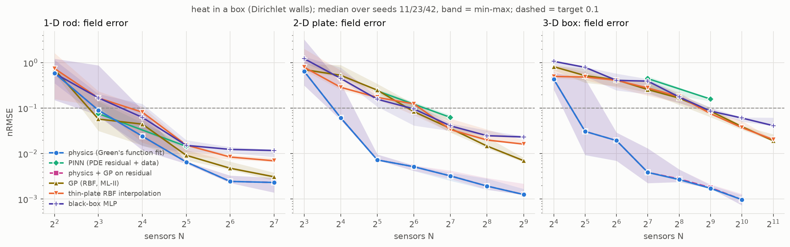
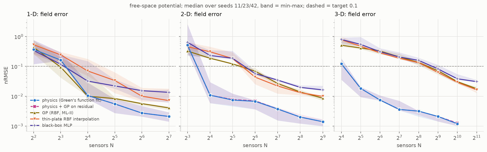
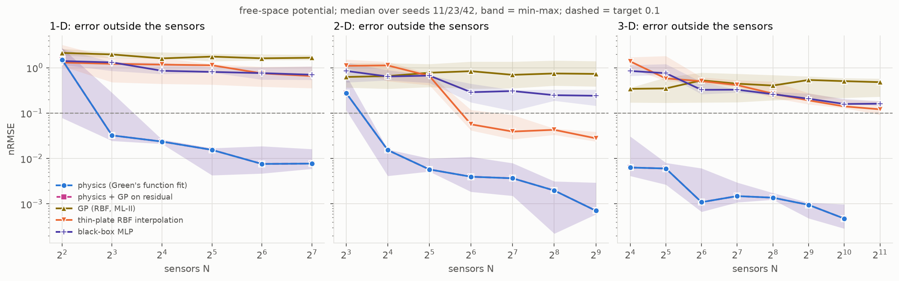
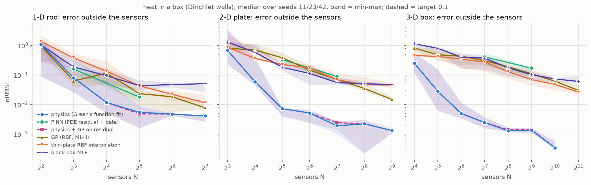
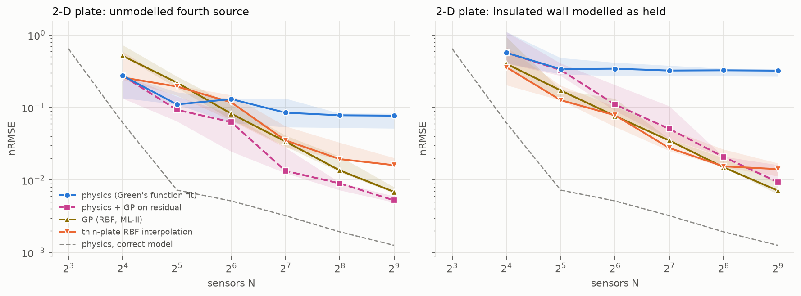
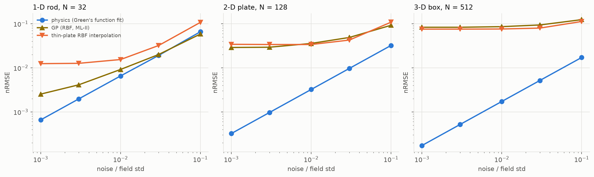
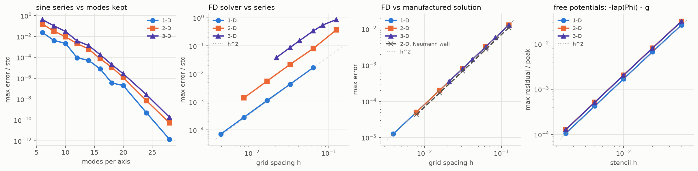
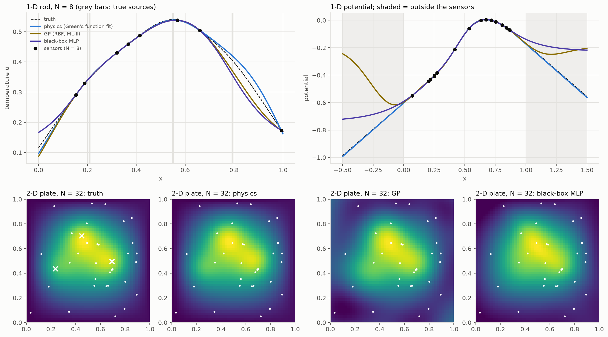

# Field reconstruction from sparse sensors: does the physics prior scale with dimension?

Generated by `physprior.reconstruction.doc.render_doc()` from `results/reconstruction/`. Do not edit by hand. The hypothesis and its refutation criteria were written before the study ran: [HYPOTHESIS.md](HYPOTHESIS.md).

## Setup

- Fields: Poisson's equation with 3 Gaussian sources of width 0.07 (box side = 1), in 1-D, 2-D and 3-D.
  - `box`: steady heat with Dirichlet walls held at an unknown linear temperature a0 + a.x. Unknowns P = K(d+1) + (d+1). Truth: the exact sine-series solution, kmax per axis {'1': 48, '2': 40, '3': 32}.
  - `free`: potential of mixed-sign charges in free space (closed-form Green's functions), plus an unknown offset. P = K(d+1) + 1. Sensors in the unit cube; the field is scored inside it and, as extrapolation, on the shell out to [-0.5, 1.5]^d.
- Sensors: N uniform random points, Gaussian noise of 0.01 field standard deviations. Designs are nested in N.
- Seeds: tuning [3, 7, 19], reporting [11, 23, 42]. Each seed draws a new field and a new design.
- Error: nRMSE = RMSE / std(truth in the sensor region), on a dense grid. `box`: whole domain; the in/out split is the convex hull of the sensors. `free`: inside the sensor cube; `out` is the shell.
- The physics fit is run up to N = 1024; beyond that it is at the noise floor.

Methods: `physics` (Green's function in the loop; matching-pursuit start on a candidate grid, then bounded least squares from that and from random starts), `pinn` (MLP + PDE residual with trainable sources; run at two N per dimension, `box` only), `pigp` (GP on the physics residual), `gp` (RBF, ML-II), `interp` (thin-plate RBF, smoothing tuned), `nn` (MLP, tuned).

Tuned choices (tuning seeds only): MLP per dimension `{'1': {'depth': 4, 'weight_decay': 0.0001, 'width': 64}, '2': {'depth': 4, 'weight_decay': 0.0001, 'width': 64}, '3': {'depth': 4, 'weight_decay': 0.0001, 'width': 64}}`, RBF smoothing `{'box': {'1': 0.0001, '2': 0.0, '3': 0.0}, 'free': {'1': 0.0001, '2': 0.0, '3': 0.0}}`, PINN w_pde fixed at 0.01 (not tuned).

## Headline: sensors needed to reach nRMSE 0.1

| case | method | 1-D | 2-D | 3-D |
|---|---|---|---|---|
| box | physics | 8 | 14 | 24 |
| box | pigp | 8 | 14 | 24 |
| box | gp | 7 | 57 | 437 |
| box | interp | 13 | 72 | 411 |
| box | nn | 12 | 61 | 444 |
| free | physics | 9 | 11 | 17 |
| free | pigp | 9 | 11 | 17 |
| free | gp | 8 | 41 | 354 |
| free | interp | 13 | 43 | 332 |
| free | nn | 9 | 46 | 417 |
| box | unknowns P | 8 | 12 | 16 |
| free | unknowns P | 7 | 10 | 13 |

`> N`: never reached within the budget (lower bound). `<= N`: already reached at the smallest N tried.

Stricter target, nRMSE 0.03:

| case | method | 1-D | 2-D | 3-D |
|---|---|---|---|---|
| box | physics | 14 | 20 | 33 |
| box | pigp | 14 | 20 | 33 |
| box | gp | 19 | 147 | 1332 |
| box | interp | 24 | 150 | 1314 |
| box | nn | 23 | 197 | > 2048 |
| free | physics | 12 | 13 | 27 |
| free | pigp | 12 | 13 | 27 |
| free | gp | 11 | 118 | 1065 |
| free | interp | 34 | 93 | 1000 |
| free | nn | 18 | 153 | > 2048 |
| box | unknowns P | 8 | 12 | 16 |
| free | unknowns P | 7 | 10 | 13 |

Growth of N* with dimension (target 0.1; slope of log10 N* on d; censored or first-grid-point values make the slope a bound):

| case | method | decades_per_dim | ratio_3d_1d | any_censored | any_at_first_grid_point |
|---|---|---|---|---|---|
| box | physics | 0.242 | 3.05 | no | no |
| box | pigp | 0.242 | 3.05 | no | no |
| box | gp | 0.902 | 63.6 | no | no |
| box | interp | 0.747 | 31.3 | no | no |
| box | nn | 0.793 | 38.5 | no | no |
| free | physics | 0.14 | 1.9 | no | no |
| free | pigp | 0.14 | 1.9 | no | no |
| free | gp | 0.829 | 45.4 | no | no |
| free | interp | 0.702 | 25.3 | no | no |
| free | nn | 0.839 | 47.7 | no | no |

## Verdict on the pre-registered hypothesis

`box`:

| criterion | measured | holds |
|---|---|---|
| 1. best non-physics N*(3-D)/N*(1-D) > 3 | 59.8 | yes |
| 2. physics N*(3-D) <= 3 x N*(1-D) P(3)/P(1) | 23.5 vs 46.2 | yes |
| 3. gap N*(best non-physics)/N*(physics) grows 1-D -> 3-D | 0.892 -> 17.5 | yes |
| all ratios defined (no censored 1-D or physics value) | | yes |
| hypothesis supported (all three) | | yes |

Best non-physics method by dimension: 1-D: gp, 2-D: gp, 3-D: interp.

`free`:

| criterion | measured | holds |
|---|---|---|
| 1. best non-physics N*(3-D)/N*(1-D) > 3 | 42.6 | yes |
| 2. physics N*(3-D) <= 3 x N*(1-D) P(3)/P(1) | 17.2 vs 50.4 | yes |
| 3. gap N*(best non-physics)/N*(physics) grows 1-D -> 3-D | 0.862 -> 19.3 | yes |
| all ratios defined (no censored 1-D or physics value) | | yes |
| hypothesis supported (all three) | | yes |

Best non-physics method by dimension: 1-D: gp, 2-D: gp, 3-D: interp.

## Error against number of sensors

| d | method | 4 | 8 | 16 | 32 | 64 | 128 |
|---|---|---|---|---|---|---|---|
| 1 | physics | 0.592 | 0.0902 | 0.0242 | 0.00655 | 0.00245 | 0.00232 |
| 1 | pinn | – | 0.0758 | – | 0.0145 | – | – |
| 1 | pigp | 0.592 | 0.0902 | 0.0242 | 0.00655 | 0.00245 | 0.00232 |
| 1 | gp | 0.707 | 0.0577 | 0.0446 | 0.0092 | 0.00478 | 0.0031 |
| 1 | interp | 0.746 | 0.168 | 0.0815 | 0.0154 | 0.00843 | 0.00696 |
| 1 | nn | 0.586 | 0.169 | 0.0628 | 0.0152 | 0.0124 | 0.0117 |

| d | method | 8 | 16 | 32 | 64 | 128 | 256 | 512 |
|---|---|---|---|---|---|---|---|---|
| 2 | physics | 0.649 | 0.0615 | 0.00727 | 0.00516 | 0.00323 | 0.00193 | 0.00126 |
| 2 | pinn | – | – | 0.239 | – | 0.0627 | – | – |
| 2 | pigp | 0.649 | 0.0615 | 0.00729 | 0.00516 | 0.00324 | 0.00193 | 0.00126 |
| 2 | gp | 0.706 | 0.529 | 0.249 | 0.0842 | 0.0358 | 0.0147 | 0.007 |
| 2 | interp | 0.796 | 0.288 | 0.173 | 0.124 | 0.0338 | 0.0199 | 0.0162 |
| 2 | nn | 1.23 | 0.452 | 0.157 | 0.0963 | 0.0409 | 0.0248 | 0.0233 |

| d | method | 16 | 32 | 64 | 128 | 256 | 512 | 1024 | 2048 |
|---|---|---|---|---|---|---|---|---|---|
| 3 | physics | 0.433 | 0.0308 | 0.0194 | 0.00386 | 0.00269 | 0.00173 | 0.000973 | – |
| 3 | pinn | – | – | – | 0.448 | – | 0.159 | – | – |
| 3 | pigp | 0.433 | 0.0309 | 0.0194 | 0.00386 | 0.00278 | 0.00179 | 0.000973 | – |
| 3 | gp | 0.819 | 0.52 | 0.419 | 0.257 | 0.166 | 0.086 | 0.0393 | 0.0193 |
| 3 | interp | 0.5 | 0.485 | 0.412 | 0.278 | 0.18 | 0.0761 | 0.0373 | 0.0204 |
| 3 | nn | 1.07 | 0.792 | 0.409 | 0.394 | 0.176 | 0.0864 | 0.0608 | 0.0413 |

| d | method | 4 | 8 | 16 | 32 | 64 | 128 |
|---|---|---|---|---|---|---|---|
| 1 | physics | 0.372 | 0.163 | 0.0106 | 0.00551 | 0.00272 | 0.0021 |
| 1 | pigp | 0.372 | 0.163 | 0.0106 | 0.00551 | 0.00272 | 0.0021 |
| 1 | gp | 0.434 | 0.0946 | 0.00997 | 0.00835 | 0.00564 | 0.00405 |
| 1 | interp | 0.534 | 0.244 | 0.0702 | 0.0336 | 0.01 | 0.00715 |
| 1 | nn | 0.343 | 0.118 | 0.0321 | 0.0222 | 0.0153 | 0.0135 |

| d | method | 8 | 16 | 32 | 64 | 128 | 256 | 512 |
|---|---|---|---|---|---|---|---|---|
| 2 | physics | 0.516 | 0.0108 | 0.00745 | 0.00674 | 0.00372 | 0.002 | 0.00139 |
| 2 | pigp | 0.516 | 0.0108 | 0.00772 | 0.007 | 0.00372 | 0.002 | 0.00139 |
| 2 | gp | 0.327 | 0.187 | 0.121 | 0.069 | 0.0268 | 0.0139 | 0.00857 |
| 2 | interp | 0.456 | 0.31 | 0.184 | 0.0435 | 0.022 | 0.0132 | 0.00986 |
| 2 | nn | 0.641 | 0.233 | 0.187 | 0.0574 | 0.0347 | 0.0198 | 0.0163 |

| d | method | 16 | 32 | 64 | 128 | 256 | 512 | 1024 | 2048 |
|---|---|---|---|---|---|---|---|---|---|
| 3 | physics | 0.122 | 0.0183 | 0.00744 | 0.0036 | 0.00316 | 0.00209 | 0.00119 | – |
| 3 | pigp | 0.122 | 0.0183 | 0.00744 | 0.0036 | 0.00316 | 0.00209 | 0.00126 | – |
| 3 | gp | 0.513 | 0.414 | 0.328 | 0.208 | 0.135 | 0.0712 | 0.0309 | 0.0179 |
| 3 | interp | 0.785 | 0.473 | 0.283 | 0.188 | 0.133 | 0.0624 | 0.0292 | 0.0164 |
| 3 | nn | 0.802 | 0.547 | 0.31 | 0.207 | 0.159 | 0.0822 | 0.0385 | 0.0308 |

## Extrapolation

Error outside the region the sensors cover: outside their convex hull (`box`), on the shell around the sensor cube (`free`).

| d | method | 4 | 8 | 16 | 32 | 64 | 128 |
|---|---|---|---|---|---|---|---|
| 1 | physics | 1.5 | 0.0323 | 0.0236 | 0.0155 | 0.00759 | 0.00772 |
| 1 | pigp | 1.5 | 0.0323 | 0.0236 | 0.0155 | 0.00759 | 0.00772 |
| 1 | gp | 2.12 | 1.96 | 1.6 | 1.76 | 1.61 | 1.66 |
| 1 | interp | 1.3 | 1.22 | 1.17 | 1.13 | 0.751 | 0.655 |
| 1 | nn | 1.4 | 1.31 | 0.856 | 0.808 | 0.76 | 0.7 |

| d | method | 8 | 16 | 32 | 64 | 128 | 256 | 512 |
|---|---|---|---|---|---|---|---|---|
| 2 | physics | 0.279 | 0.0153 | 0.00574 | 0.00397 | 0.00367 | 0.00197 | 0.000707 |
| 2 | pigp | 0.279 | 0.0153 | 0.00574 | 0.00397 | 0.00367 | 0.00197 | 0.000707 |
| 2 | gp | 0.625 | 0.653 | 0.775 | 0.838 | 0.696 | 0.746 | 0.73 |
| 2 | interp | 1.1 | 1.12 | 0.66 | 0.0565 | 0.0392 | 0.0428 | 0.0278 |
| 2 | nn | 0.85 | 0.641 | 0.67 | 0.289 | 0.306 | 0.248 | 0.241 |

| d | method | 16 | 32 | 64 | 128 | 256 | 512 | 1024 | 2048 |
|---|---|---|---|---|---|---|---|---|---|
| 3 | physics | 0.00633 | 0.00602 | 0.00109 | 0.00149 | 0.00137 | 0.000952 | 0.000475 | – |
| 3 | pigp | 0.00633 | 0.00602 | 0.00109 | 0.00149 | 0.00137 | 0.000952 | 0.000475 | – |
| 3 | gp | 0.342 | 0.35 | 0.526 | 0.445 | 0.405 | 0.537 | 0.506 | 0.48 |
| 3 | interp | 1.38 | 0.581 | 0.505 | 0.414 | 0.269 | 0.191 | 0.141 | 0.121 |
| 3 | nn | 0.848 | 0.757 | 0.325 | 0.328 | 0.261 | 0.208 | 0.159 | 0.161 |

Sensors needed for nRMSE 0.1 outside the sensors:

| case | method | 1-D | 2-D | 3-D |
|---|---|---|---|---|
| box | physics | 8 | 14 | 21 |
| box | pigp | 8 | 14 | 21 |
| box | gp | 7 | 92 | 572 |
| box | interp | 19 | 97 | 341 |
| box | nn | 15 | 72 | 538 |
| free | physics | 7 | 10 | <= 16 |
| free | pigp | 7 | 10 | <= 16 |
| free | gp | > 128 | > 512 | > 2048 |
| free | interp | > 128 | 54 | > 2048 |
| free | nn | > 128 | > 512 | > 2048 |
| box | unknowns P | 8 | 12 | 16 |
| free | unknowns P | 7 | 10 | 13 |

## Where are the sources?

Median distance between true and recovered source positions (optimal matching; box side = 1).

`box`:

| d | method | 4 | 8 | 16 | 32 | 64 | 128 | 256 | 512 | 1024 |
|---|---|---|---|---|---|---|---|---|---|---|
| 1 | physics | 0.108 | 0.0383 | 0.0375 | 0.0045 | 0.00256 | 0.00176 | – | – | – |
| 1 | pinn | – | 0.103 | – | 0.0363 | – | – | – | – | – |
| 2 | physics | – | 0.154 | 0.0322 | 0.00189 | 0.000964 | 0.000702 | 0.000471 | 0.000302 | – |
| 2 | pinn | – | – | – | 0.147 | – | 0.0159 | – | – | – |
| 3 | physics | – | – | 0.141 | 0.00734 | 0.00484 | 0.00117 | 0.000763 | 0.000487 | 0.000292 |
| 3 | pinn | – | – | – | – | – | 0.28 | – | 0.193 | – |

`free`:

| d | method | 4 | 8 | 16 | 32 | 64 | 128 | 256 | 512 | 1024 |
|---|---|---|---|---|---|---|---|---|---|---|
| 1 | physics | 0.0763 | 0.0674 | 0.00603 | 0.00272 | 0.00202 | 0.00106 | – | – | – |
| 2 | physics | – | 0.23 | 0.00317 | 0.00436 | 0.00246 | 0.00124 | 0.000505 | 0.000485 | – |
| 3 | physics | – | – | 0.0344 | 0.00463 | 0.00224 | 0.00105 | 0.000808 | 0.000538 | 0.000321 |

Physics fits with a source position on its search bound (not converged, flagged): 0 of 120.

## Model mismatch (2-D plate)

The physics model is given three sources and Dirichlet walls. The truth has either a fourth, weaker source or an insulated wall. `pigp` adds a GP on the physics residual; the dashed line is the physics fit on the clean field.

| kind | method | 16 | 32 | 64 | 128 | 256 | 512 |
|---|---|---|---|---|---|---|---|
| extra_source | physics | 0.275 | 0.111 | 0.131 | 0.085 | 0.0783 | 0.0773 |
| extra_source | pigp | 0.275 | 0.093 | 0.0632 | 0.0134 | 0.009 | 0.00525 |
| extra_source | gp | 0.516 | 0.221 | 0.0824 | 0.034 | 0.0136 | 0.00688 |
| extra_source | interp | 0.26 | 0.195 | 0.118 | 0.0353 | 0.0194 | 0.0161 |
| neumann_wall | physics | 0.569 | 0.339 | 0.344 | 0.324 | 0.327 | 0.323 |
| neumann_wall | pigp | 0.569 | 0.33 | 0.11 | 0.0509 | 0.0209 | 0.0094 |
| neumann_wall | gp | 0.402 | 0.172 | 0.0768 | 0.0351 | 0.015 | 0.00716 |
| neumann_wall | interp | 0.36 | 0.127 | 0.0784 | 0.0277 | 0.0155 | 0.0142 |

## Noise

| d | method | 0.001 | 0.003 | 0.01 | 0.03 | 0.1 |
|---|---|---|---|---|---|---|
| 1 | gp | 0.00254 | 0.00413 | 0.0092 | 0.0201 | 0.0586 |
| 1 | interp | 0.0124 | 0.0127 | 0.0154 | 0.0322 | 0.108 |
| 1 | physics | 0.00066 | 0.00198 | 0.00655 | 0.0192 | 0.066 |
| 2 | gp | 0.029 | 0.0294 | 0.0358 | 0.0489 | 0.0925 |
| 2 | interp | 0.0342 | 0.0339 | 0.0338 | 0.0427 | 0.109 |
| 2 | physics | 0.000323 | 0.000969 | 0.00323 | 0.00969 | 0.0323 |
| 3 | gp | 0.0833 | 0.0833 | 0.086 | 0.094 | 0.124 |
| 3 | interp | 0.0756 | 0.0756 | 0.0761 | 0.0798 | 0.113 |
| 3 | physics | 0.000173 | 0.000518 | 0.00173 | 0.00518 | 0.0172 |

## Compute

Median seconds per fit (one thread per worker, shared machine):

| d | physics | pinn | pigp | gp | interp | nn |
|---|---|---|---|---|---|---|
| 1 | 0.136 | 19 | 0.268 | 0.0218 | 0.000256 | 6.07 |
| 2 | 0.364 | 31.1 | 0.48 | 0.0656 | 0.0005 | 7.38 |
| 3 | 1.07 | 41.3 | 2.48 | 0.311 | 0.00249 | 18.6 |

Wall time of the run, seconds: convergence 8.98, figures 19.1, sweeps 1.24e+03, total 1.48e+03, tuning 203.

## Numerical checks (convergence studies)

Series truncation at the kmax the physics fit uses:

| d | kmax | rel_max_err |
|---|---|---|
| 1 | 24 | 4.92e-10 |
| 2 | 20 | 1.16e-06 |
| 3 | 18 | 2.04e-05 |

FD solver against the series (observed order should approach 2):

| d | n | h | rel_max_err | observed_order |
|---|---|---|---|---|
| 1 | 16 | 0.0625 | 0.0167 | – |
| 1 | 32 | 0.0312 | 0.00428 | 1.97 |
| 1 | 64 | 0.0156 | 0.00111 | 1.94 |
| 1 | 128 | 0.00781 | 0.000283 | 1.98 |
| 1 | 256 | 0.00391 | 7.12e-05 | 1.99 |
| 2 | 8 | 0.125 | 0.371 | – |
| 2 | 16 | 0.0625 | 0.08 | 2.21 |
| 2 | 32 | 0.0312 | 0.0219 | 1.87 |
| 2 | 64 | 0.0156 | 0.00552 | 1.99 |
| 2 | 128 | 0.00781 | 0.00139 | 1.99 |
| 3 | 8 | 0.125 | 0.864 | – |
| 3 | 12 | 0.0833 | 0.555 | 1.09 |
| 3 | 16 | 0.0625 | 0.341 | 1.69 |
| 3 | 24 | 0.0417 | 0.155 | 1.95 |
| 3 | 32 | 0.0312 | 0.0875 | 1.98 |
| 3 | 48 | 0.0208 | 0.0385 | 2.03 |

FD solver against manufactured solutions:

| d | boundary | n | h | max_err | observed_order |
|---|---|---|---|---|---|
| 1 | dirichlet | 16 | 0.0625 | 0.00322 | – |
| 1 | dirichlet | 32 | 0.0312 | 0.000804 | 2 |
| 1 | dirichlet | 64 | 0.0156 | 0.000201 | 2 |
| 1 | dirichlet | 128 | 0.00781 | 5.02e-05 | 2 |
| 1 | dirichlet | 256 | 0.00391 | 1.25e-05 | 2 |
| 2 | dirichlet | 8 | 0.125 | 0.013 | – |
| 2 | dirichlet | 16 | 0.0625 | 0.00322 | 2.01 |
| 2 | dirichlet | 32 | 0.0312 | 0.000804 | 2 |
| 2 | dirichlet | 64 | 0.0156 | 0.000201 | 2 |
| 2 | dirichlet | 128 | 0.00781 | 5.02e-05 | 2 |
| 2 | neumann_x1 | 8 | 0.125 | 0.011 | – |
| 2 | neumann_x1 | 16 | 0.0625 | 0.00273 | 2.01 |
| 2 | neumann_x1 | 32 | 0.0312 | 0.000683 | 2 |
| 2 | neumann_x1 | 64 | 0.0156 | 0.000171 | 2 |
| 2 | neumann_x1 | 128 | 0.00781 | 4.27e-05 | 2 |
| 3 | dirichlet | 8 | 0.125 | 0.013 | – |
| 3 | dirichlet | 12 | 0.0833 | 0.00573 | 2.01 |
| 3 | dirichlet | 16 | 0.0625 | 0.00322 | 2.01 |
| 3 | dirichlet | 24 | 0.0417 | 0.00143 | 2 |
| 3 | dirichlet | 32 | 0.0312 | 0.000804 | 2 |
| 3 | dirichlet | 48 | 0.0208 | 0.000357 | 2 |

Closed-form free-space potentials, central-difference residual:

| d | h | rel_max_residual | observed_order |
|---|---|---|---|
| 1 | 0.04 | 0.0263 | – |
| 1 | 0.02 | 0.00675 | 1.97 |
| 1 | 0.01 | 0.0017 | 1.99 |
| 1 | 0.005 | 0.000425 | 2 |
| 1 | 0.0025 | 0.000106 | 2 |
| 2 | 0.04 | 0.032 | – |
| 2 | 0.02 | 0.00819 | 1.97 |
| 2 | 0.01 | 0.00206 | 1.99 |
| 2 | 0.005 | 0.000516 | 2 |
| 2 | 0.0025 | 0.000129 | 2 |
| 3 | 0.04 | 0.0318 | – |
| 3 | 0.02 | 0.00813 | 1.97 |
| 3 | 0.01 | 0.00205 | 1.99 |
| 3 | 0.005 | 0.000512 | 2 |
| 3 | 0.0025 | 0.000128 | 2 |

## Examples

