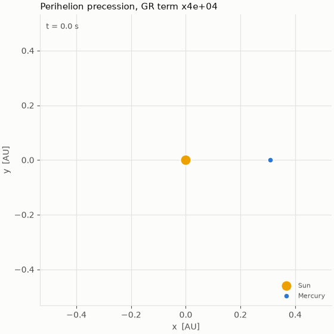
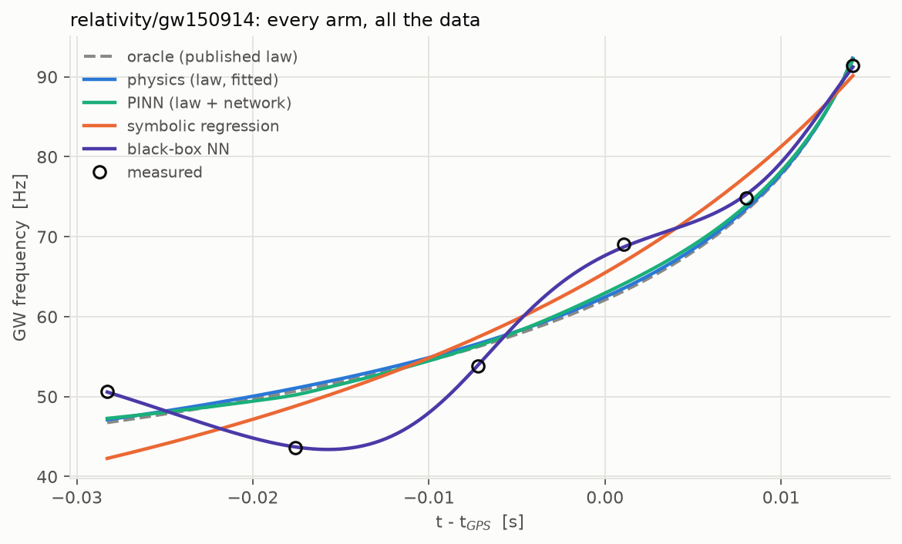
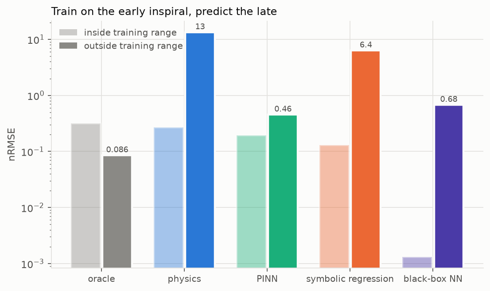
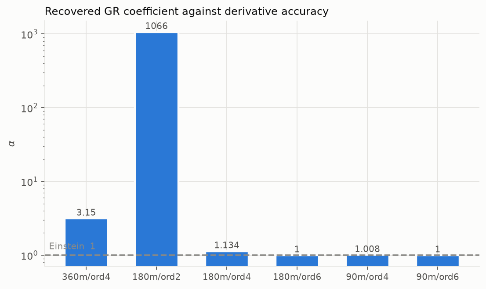

# relativity

The problem where the law is an **expansion that can be truncated at the
wrong order**, and where a plausible numerical choice once produced a 56σ
refutation of general relativity.

**Real data** — GW150914 strain from LIGO; Mercury's acceleration from
DE441. **Simulations** — Schwarzschild orbits, post-Newtonian inspirals, and
light bending.

Code: [`src/physprior/problems/relativity`](../../src/physprior/problems/relativity)
· Results: [`results/relativity`](../../results/relativity)

---

## The simulations

| What | Notes |
|---|---|
| `schwarzschild_orbit` | `d²u/dφ² + u = GM/h² + (3GM/c²)u²`, run with the GR term on and off |
| `mercury_precession` | the difference of those two runs, in arcsec/century |
| `inspiral_chirp` | a post-Newtonian binary inspiral with a damped ringdown |
| `light_deflection` | a photon's null geodesic past the Sun |

**Perihelion location is root-finding, not parabola-fitting.** Mercury's GR
shift is 5×10⁻⁷ rad per orbit. Fitting a parabola to a sampled `u(φ)` grid is
good to about 10⁻⁶ rad — *bigger than the effect* — and the first version of
this simulation duly reported a Newtonian "precession" 20% larger than the GR
one. Finding the root of `du/dφ` on the solver's dense output reaches ~10⁻⁹,
and the simulated precession then matches `6πGM/(c²a(1−e²))` to six
significant figures.

## The real-data track: `relativity/gw150914`

A model-free frequency track from the strain: seven cycles, which is a
physical limit rather than a choice.

| | |
|---|---|
|  |  |
| **Overview.** With 4–5 training points against 2+ free parameters, everything overfits in-range. | **Extrapolation** — the counter-control. From four faint early cycles *every* fitted arm fails, physics included. |

**Goodness of fit does not diagnose a wrong law.** The Newtonian inspiral law
recovers a chirp mass biased by **+9 M☉** with a formal error of 4.1 — a
confident wrong answer. Adding the 1.5PN tail and 2PN terms removes the bias
while the RMSE barely moves.

**A pipeline you have not injected into has no error budget.** The extraction
keeps cycles whose envelope SNR clears a threshold, set to 2.0 a priori.
Injecting a *known* chirp mass into the *real detector noise* and running the
identical code showed that threshold to be badly wrong:

| SNR cut | median `Mc` (true 31.17) | bias | trials within 20% |
|---|---|---|---|
| 2.0 | 9.3 | **−70 %** | 0 / 10 |
| 3.0 | **30.9** | **−0.9 %** | **9 / 10** |

The cut was re-chosen **on injections, never on the real event**.

## The real-data track: `relativity/mercury`

The acceleration differentiated out of the ephemeris, fitted for a GR
coefficient `α` that general relativity says is exactly 1.

At a plausible step size a 4th-order stencil gives **α = 1.1343 ± 0.0024**: a
13.4% violation of general relativity at **56 formal sigma**, entirely
finite-difference truncation error. With a 6th-order stencil α agrees with
Einstein to one part in 10⁴.

> **The result is not α; it is α once it has stopped moving.**

### What is left once it has stopped moving

The converged α still sits **+1.2×10⁻⁴** above 1, at 7 formal σ. That is
0.005″ per century out of 43″. The physical question is what produces it.

- **Not the derivative.** Halving the step with the 6th-order stencil moves
  α by 2×10⁻⁵. A 6th-order error shrinks 64× per halving, so what remains of
  it at the finer step is about 3.5×10⁻⁷, far below the residual.
- **Not the Sun's shape or spin.** DE441 gives the Sun an oblateness (J2)
  and includes frame dragging (Lense–Thirring), and our model has neither.
  Putting back the ephemeris' *own* values moves α further from 1, to
  **+4.7×10⁻⁴**. Letting the data choose J2 gives about half DE441's value,
  and α still does not reach 1. So the oblateness was partly *hiding* a
  larger discrepancy, not causing it.
- **Leading candidate, untested.** DE441 integrates the full n-body
  relativistic (EIH) equations in the solar-system barycentric frame. Our GR
  term is the one-body Schwarzschild term about the Sun. The Sun moves about
  13 m/s around the barycentre, mostly because of Jupiter, and terms in that
  velocity enter at about 10⁻³ of the GR term. That is the right size. The
  test is to write the EIH term with barycentric velocities and see whether
  α goes to 1.

The rows are in `results/relativity/mercury/neglected_terms.csv`, produced
by `neglected_terms()` in the track. This is the neglected-terms question of
[the study](../neglected/) meeting real data: a model can fit to 10⁻¹⁰ and
still be missing physics that its one free coefficient quietly absorbs.

Provenance for GWOSC and DE441 is in [`docs/DATA.md`](../DATA.md); the
post-mortem is in [`docs/METHOD.md`](../METHOD.md).
