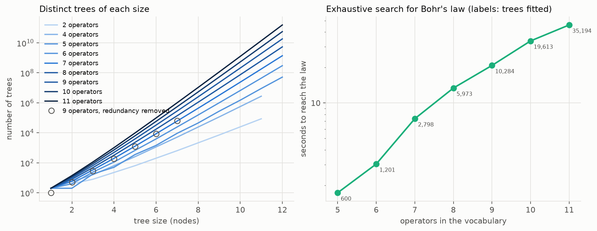
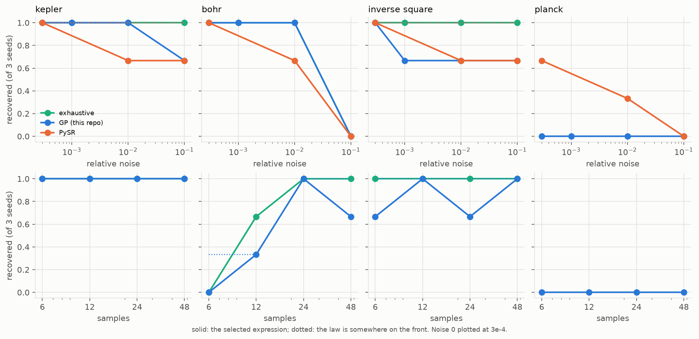
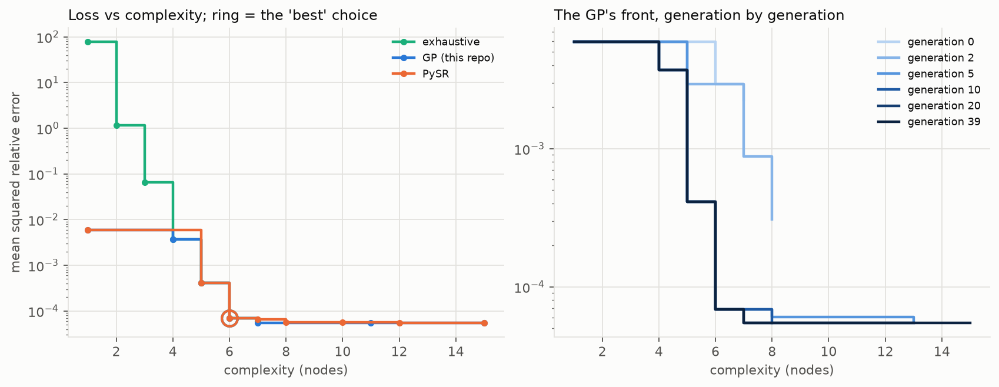
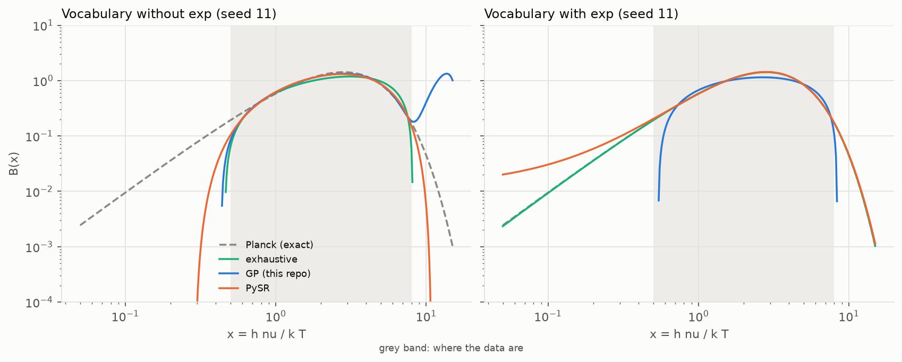
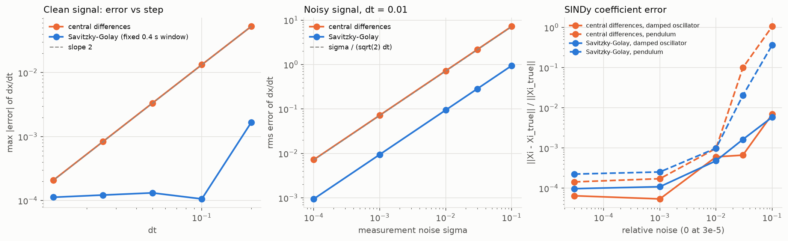

# How symbolic regression works

<!-- Generated by physprior.symbolic.report.render_doc() from results/symbolic/.
     Edit src/physprior/symbolic/text.py, not this file. -->

Symbolic regression (SR) looks for a closed-form expression `f(x)` that fits
data, choosing both the form and its constants. It is the `sr` arm of this
project (`src/physprior/methods/symbolic.py`, which drives PySR). This page
explains how it works, from the size of the problem to the specific choices
PySR makes, and measures each claim with a small implementation in
`src/physprior/symbolic/`:

| module | what it is |
|---|---|
| `expressions.py` | expression trees, evaluation, complexity, constant fitting, the Pareto front and PySR's selection rules |
| `enumerate.py` | exact counts of the search space; exhaustive search with constant fitting |
| `gp.py` | a small genetic-programming SR |
| `sindy.py` | sparse regression of dynamics (STLSQ), with the derivative studies |
| `studies.py` | the experiments below; `report.py` renders this page |

Notebook: T11, `physprior.reporting.tutorials_sr.t11_how_symbolic_regression_works`.

## 1 · Two problems in one

A candidate law is a tree: internal nodes are operators, leaves are input
variables or free constants. `c0 - c1/square(n)` is Bohr's formula in six
nodes. SR therefore has to solve

1. a **discrete** problem, which tree; and
2. a **continuous** problem, which constants for that tree.

Every method here treats the second as ordinary least squares for a fixed
form, and differs in how it searches the first. The loss throughout is the
weighted mean squared error; with weights `1/y^2` it is the mean squared
*relative* error, which suits laws spanning decades (Kepler's periods).

**Complexity** is the node count, the default in PySR
(`compute_complexity` falls back to `count_nodes` in SymbolicRegression.jl
unless `complexity_of_operators`/`complexity_of_constants` are set).

## 2 · The size of the search space

With `L` leaf types, `U` unary and `B` binary operators, the number of
distinct trees of size `s` is

    T(1) = L
    T(s) = U T(s-1) + B sum_{i+j=s-1} T(i) T(j)

The binary term is a convolution of the same kind that produces the Catalan
numbers, so `T(s)` grows geometrically with a ratio that itself grows with
the vocabulary. Every tree with a constant needs its own nonlinear fit, so
the cost of exhaustive search is the count times a least-squares solve.
`enumerate.py` generates the trees and the tests check the enumeration
against the recurrence exactly.

Distinct trees of each size, two leaf types (the variable and a constant), from the recurrence (`growth_counts.csv`):

| size | 2 operators | 4 operators | 6 operators | 9 operators | 11 operators |
|---|---|---|---|---|---|
| 1 | 2 | 2 | 2 | 2 | 2 |
| 2 | 0 | 0 | 4 | 10 | 14 |
| 3 | 8 | 16 | 24 | 66 | 114 |
| 4 | 0 | 0 | 112 | 490 | 1,022 |
| 5 | 64 | 256 | 672 | 3,906 | 9,762 |
| 6 | 0 | 0 | 3,904 | 32,650 | 97,454 |
| 7 | 640 | 5,120 | 24,448 | 282,370 | 1,004,818 |
| 8 | 0 | 0 | 154,368 | 2,505,450 | 10,618,398 |
| 9 | 7,168 | 114,688 | 1,004,032 | 22,679,938 | 114,401,602 |
| 10 | 0 | 0 | 6,611,968 | 208,627,210 | 1.25e+09 |
| 11 | 86,016 | 2,752,512 | 44,226,560 | 1.94e+09 | 1.39e+10 |
| 12 | 0 | 0 | 298,905,600 | 1.83e+10 | 1.55e+11 |

Removing syntactic redundancy (operators on constants only, commutative duplicates, `exp(log(.))`, more than two constants) before fitting (`growth_pruned.csv`):

| vocabulary | size | n_trees_raw | n_trees_pruned | kept |
|---|---|---|---|---|
| `{+, -, *, /}` | 1 | 2 | 1 | 0.5 |
| `{+, -, *, /}` | 2 | 0 | 0 |  |
| `{+, -, *, /}` | 3 | 16 | 8 | 0.5 |
| `{+, -, *, /}` | 4 | 0 | 0 |  |
| `{+, -, *, /}` | 5 | 256 | 96 | 0.375 |
| `{+, -, *, /}` | 6 | 0 | 0 |  |
| `{+, -, *, /}` | 7 | 5,120 | 1,120 | 0.219 |
| `{+, -, *, /, sqrt, square, cube, exp, log}` | 1 | 2 | 1 | 0.5 |
| `{+, -, *, /, sqrt, square, cube, exp, log}` | 2 | 10 | 5 | 0.5 |
| `{+, -, *, /, sqrt, square, cube, exp, log}` | 3 | 66 | 29 | 0.439 |
| `{+, -, *, /, sqrt, square, cube, exp, log}` | 4 | 490 | 189 | 0.386 |
| `{+, -, *, /, sqrt, square, cube, exp, log}` | 5 | 3,906 | 1,263 | 0.323 |
| `{+, -, *, /, sqrt, square, cube, exp, log}` | 6 | 32,650 | 8,797 | 0.269 |
| `{+, -, *, /, sqrt, square, cube, exp, log}` | 7 | 282,370 | 62,693 | 0.222 |

By depth instead of size the growth is doubly exponential, $D(d) = L + U D(d-1) + B D(d-1)^2$ (`growth_depth.csv`, nine operators):

| depth | n_trees_le_depth |
|---|---|
| 0 | 2 |
| 1 | 28 |
| 2 | 3,278 |
| 3 | 42,997,528 |
| 4 | 7.4e+15 |
| 5 | 2.19e+32 |

Exhaustive search to the noise floor on noise-free data, 24 points, nine operators (`time_to_find.csv`; seconds are wall time on a shared machine, so read them as relative):

| law | seeds | size | trees | seconds | recovered |
|---|---|---|---|---|---|
| bohr | 3 | 6 | 10,284 | 31.1 | 3 |
| inverse_square | 3 | 4 | 224 | 0.254 | 3 |
| kepler | 3 | 3 | 35 | 0.923 | 3 |
| planck | 1 | 7 | 72,977 | 265 | 1 |

The same target (Bohr, size 6) as the vocabulary grows (`time_vs_vocabulary.csv`):

| n_ops | n_evaluated | seconds | recovered |
|---|---|---|---|
| 5 | 600 | 1.73 | yes |
| 6 | 1,201 | 3.03 | yes |
| 7 | 2,798 | 7.35 | yes |
| 8 | 5,973 | 13.4 | yes |
| 9 | 10,284 | 20.8 | yes |
| 10 | 19,613 | 33.6 | yes |
| 11 | 35,194 | 45.9 | yes |

Exhaustive search is exact and complete up to its size cap and hopeless
beyond it: every added node multiplies the work by roughly the ratio in the
table, and every added operator raises that ratio. Many laws of interest need
more nodes than the cap. That is why every practical SR method is a heuristic
search, and why they all return the same kind of object: a list of the best
expressions found at each complexity.

## 3 · Genetic programming

Genetic programming (Koza 1992) keeps a **population** of trees and improves
it by selection and variation:

- **Selection.** A tournament samples `k` members and picks the one with the
  lowest cost. Cost = loss plus a **parsimony** penalty proportional to
  complexity, without which trees grow without bound ("bloat").
- **Crossover.** Replace a random subtree of one parent by a random subtree
  of another.
- **Mutation.** Change one node's label keeping its arity (point mutation),
  replace a subtree by a random one (subtree mutation), or perturb the
  constants.
- **Constants.** Evolving constants by mutation is slow and imprecise.
  Modern SR fits them with a local optimiser for each candidate form.
- **Hall of fame.** Keep the best expression ever seen at each complexity.
  Sorted by complexity with loss strictly decreasing, this is the **Pareto
  front** of loss against complexity, and it is the output of the search.

`gp.py` implements exactly this: ramped half-and-half initialisation;
tournament selection on `loss/baseline + parsimony * size`; subtree
crossover, subtree and point mutation, constant perturbation; every new
structure's constants fitted once by Levenberg-Marquardt (or BFGS) with a
restart, cached by structure; the front re-injected into each generation;
and a stop a few generations after the front reaches the measurement-noise
floor (the searchers know the error bars, not the law).

## 4 · How PySR does it

PySR is a Python front end to the Julia package SymbolicRegression.jl
(Cranmer 2023, arXiv:2305.01582). What follows was read from the installed
sources, PySR 2.5.0 (`pysr/sr.py`) and SymbolicRegression.jl 2.4.1 (the
version resolved in PySR's Julia environment), and names the file where
each behaviour lives. Defaults are PySR's, per its documentation strings.

**Islands.** The search runs `populations` (default 31) independent
populations of `population_size` (27) members. Each outer `niterations`
step (default 100) evolves every population for `ncycles_per_iteration`
(380) cycles, then **migrates**: a fraction of each population is replaced
by copies of the best members of the others (`fraction_replaced`,
0.00036) and of the hall of fame (`fraction_replaced_hof`, 0.0614)
(`Migration.jl`, `migrate!` draws the number replaced from a Poisson).

**Regularized (age-based) evolution.** Within a cycle
(`RegularizedEvolution.jl`, `reg_evol_cycle`), each step either mutates one
tournament winner (probability 1 - `crossover_probability`, default
1 - 0.2) or crosses two winners. The child replaces the **oldest** member of
the population, not the worst. Selection pressure comes only from the
tournament.

**Tournament.** `tournament_selection_n` (15) members are sampled; the best
is chosen with probability `p = tournament_selection_p` (0.982), otherwise
the k-th best with weight `p (1-p)^k` (`Population.jl`,
`_best_of_sample`). Costs are first multiplied by the adaptive-parsimony
factor below.

**Cost.** `loss / baseline + parsimony * complexity` (`LossFunctions.jl`,
`loss_to_cost`), where the baseline is the loss of a constant expression
(floored at 0.01) and `parsimony` defaults to 0. Parsimony is instead
applied **adaptively**: PySR tracks how often each complexity occurs in the
populations and, in the tournament, multiplies a member's cost by
`exp(adaptive_parsimony_scaling * frequency)` (scaling 1040;
`plugins/AdaptiveParsimony.jl`). Crowded complexities are penalised, so the
search keeps exploring all sizes rather than a fixed trade-off.

**Simulated-annealing acceptance.** A mutated child is kept with
probability `exp(-(cost_new - cost_old) / (T * alpha))` times
`frequency(old size) / frequency(new size)`, capped at 1 by the comparison
against one uniform draw (`Mutate.jl` multiplies the plugins' factors;
`plugins/SimulatedAnnealing.jl`, `plugins/AdaptiveParsimony.jl`). The
temperature `T` falls linearly from 1 to 0 over the cycles of each
iteration, so early cycles accept worse children and late ones are greedy.
PySR's `alpha` defaults to 3.17 (`annealing=True`). With the default
`skip_mutation_failures=True` a rejected mutation changes nothing: no member
is replaced.

**Mutations.** Chosen with relative weights (PySR defaults): add a node
2.47, delete 0.870, insert 0.0112, rotate the tree 4.26, mutate an operator
0.293, swap operands 0.198, mutate a feature 0.1, perturb a constant 0.0346
(scaled by the temperature), do nothing 0.273, simplify 0.00209, randomise
the whole tree 0.000502.

**Constants.** At the end of each iteration every member has its constants
optimised with probability `optimize_probability` (0.14): BFGS by default,
Newton when there is a single constant (`ConstantOptimization.jl`), for
`optimizer_iterations` (8) steps, from the current values plus
`optimizer_nrestarts` (2) restarts at `x0 * (1 + eps/2)`, `eps ~ N(0,1)`;
the result is kept only if it lowers the loss. Trees are also simplified
algebraically with a few rules when `should_simplify=True`.

**Hall of fame and the returned table.** The hall of fame holds the best
member seen at each complexity (`HallOfFame.jl`). `equations_` is its Pareto
frontier: complexity, loss, the expression, and a **score**,

    score_i = -log(loss_i / loss_(i-1)) / (complexity_i - complexity_(i-1)),   score_1 = 0

(`calculate_scores` in `pysr/sr.py`): the fractional drop in loss bought
per added node. `model_selection` then picks one row (`idx_model_selection`):

- `"accuracy"`: lowest loss;
- `"score"`: highest score;
- `"best"` (default): highest score **among rows with loss <= 1.5 x the
  lowest loss**.

"best" guards against choosing a very simple expression that happens to
have a large score but is much worse than the most accurate row. The flip
side is measured below: when the most complex rows fit the noise, the 1.5x
window excludes the law and "best" picks an over-fitted expression.
`expressions.select` implements the three rules with the same arithmetic,
and the tests check it.

**What this means for the repo.** The wrapper (`methods/symbolic.py`) runs
PySR with `deterministic=True, parallelism="serial"` and an explicit
`random_state`, so a cached search is reproducible; this page's PySR runs do
the same with a short budget, recorded in `results/symbolic/recovery_pysr_meta.json`.

**Where the in-repo GP differs.** One population (no islands, no
migration); generational replacement with the front as elite, not age-based;
no annealing; a fixed parsimony (chosen on tuning seeds) rather than
adaptive parsimony; every new structure has its constants fitted (cached),
not 14 % per iteration; Levenberg-Marquardt by default rather than BFGS; no
algebraic simplification; pure Python, so orders of magnitude slower per
evaluation. It is here to make the algorithm visible and to be measured next
to PySR and to exhaustive search on the same data.

## 5 · Measured: recovering laws from this repository

Four laws, each at the scale where it appears in the repo's tracks:

| law | form | nodes (default vocabulary) |
|---|---|---|
| Kepler III | `P = a^(3/2)`, years and AU, a in 0.39-5.2 | 3 (`sqrt(cube(a))`) |
| inverse square | `g = GM_sun / r^2`, mm/s^2 and AU | 4 |
| Bohr | `nu = R_H (1 - 1/n^2)`, 1e5 cm^-1, n = 2, 3, ... | 6 |
| Planck | `B = x^3/(e^x - 1)`, `x = h nu / k T` in 0.5-8 | 7 |

Vocabulary: `+ - * /` and `sqrt square cube exp log`, the repo's PySR
default. Noise is relative and Gaussian. A law counts as **recovered** when
the selected expression's form, with its constants freed, reproduces the
exact law to 1e-4 relative RMS on a grid reaching far outside the data
(`studies.form_check`), **and** the expression as fitted is within 5 % of
the law everywhere on that grid. The first condition is about the form, the
second rejects bloated forms that nest the law but carry nonsense extra
terms. As elsewhere in the repo, this is measured on the function, not
parsed from the string. "On front" means some expression on the returned
front passes, whether or not it was selected.

Exhaustive search is capped at size 7 with two constants; it is not run on
Planck in the sweeps (minutes per data set), only in the vocabulary study.

GP parsimony was chosen on the tuning seeds [3, 7, 19] at 1 % noise, 24 points: recovery rate by parsimony 0: 0.50, 0.001: 0.58, 0.01: 0.67, 0.1: 0.67, 1: 0.50; chosen **0.1** (`tune_gp.json`).

Recovery vs relative noise, 24 points, reporting seeds 11/23/42 (`recovery_noise.csv`, `recovery_pysr.csv`). Each cell is recovered/runs for the **selected** expression:

| law | method | noise = 0 | noise = 0.001 | noise = 0.01 | noise = 0.1 |
|---|---|---|---|---|---|
| bohr | exhaustive | 3/3 | 3/3 | 3/3 | 0/3 |
| bohr | gp | 3/3 | 3/3 | 3/3 | 0/3 |
| bohr | pysr | 3/3 |  | 2/3 | 0/3 |
| inverse_square | exhaustive | 3/3 | 3/3 | 3/3 | 3/3 |
| inverse_square | gp | 3/3 | 2/3 | 2/3 | 2/3 |
| inverse_square | pysr | 3/3 |  | 2/3 | 2/3 |
| kepler | exhaustive | 3/3 | 3/3 | 3/3 | 3/3 |
| kepler | gp | 3/3 | 3/3 | 3/3 | 2/3 |
| kepler | pysr | 3/3 |  | 2/3 | 2/3 |
| planck | gp | 0/3 | 0/3 | 0/3 | 0/3 |
| planck | pysr | 2/3 |  | 1/3 | 0/3 |

Selected vs anywhere on the front, pooled over the noise levels and the three laws every method was run on (Planck excluded, since exhaustive search was not). The difference between the columns is what the selection rule loses:

| method | selected | on_front |
|---|---|---|
| exhaustive | 0.92 | 0.92 |
| gp | 0.81 | 0.92 |
| pysr | 0.70 | 0.85 |

Recovery vs number of samples at 1 % noise (`recovery_budget.csv`; the n = 24 column is the noise sweep's):

| law | method | n = 6 | n = 12 | n = 24 | n = 48 |
|---|---|---|---|---|---|
| bohr | exhaustive | 0/3 | 2/3 | 3/3 | 3/3 |
| bohr | gp | 0/3 | 1/3 | 3/3 | 2/3 |
| inverse_square | exhaustive | 3/3 | 3/3 | 3/3 | 3/3 |
| inverse_square | gp | 2/3 | 3/3 | 2/3 | 3/3 |
| kepler | exhaustive | 3/3 | 3/3 | 3/3 | 3/3 |
| kepler | gp | 3/3 | 3/3 | 3/3 | 3/3 |
| planck | gp | 0/3 | 0/3 | 0/3 | 0/3 |

Median wall time per run:

| method | median_seconds | runs |
|---|---|---|
| exhaustive | 0.104 | 36 |
| gp | 1.46 | 48 |
| pysr | 15.5 | 36 |

Examples of what was selected instead of the law (noise <= 1 %):

| law | method | noise | seed | form_err | extrap_dev | expression |
|---|---|---|---|---|---|---|
| inverse_square | gp | 0.001 | 11 | 7.59e-17 | 0.174 | `(((((2.445037))**2 - (x0 * (0.02693491))) / x0) / ((0.003389981) + ...` |
| planck | gp | 0 | 11 | 29.5 | 1.81e+03 | `(log((x0 * (2.856947))) - ((0.374697) * x0))` |
| kepler | pysr | 0.01 | 11 | 6.07e-17 | 0.157 | `sqrt(x0**3 - 0.0023189012)` |
| bohr | pysr | 0.01 | 23 | 0.00666 | 0.0268 | `1.1077296661543*((x0 - 1.8089746)/x0)**(1/8)` |
| inverse_square | pysr | 0.01 | 11 | 0 | 26.9 | `-0.09981767 + 6.19356547265625/(x0 + 0.01237931)**2` |
| planck | pysr | 0 | 23 | 0.547 | 8.23e+03 | `(-0.51930696*x0 + 1.4329976*log(x0) + 1.0435077)**2 + 0.28360248` |

## 6 · The Pareto front and the score

Bohr's formula, 1 % noise, 16 levels, seed 11 (`pareto.csv`). For PySR the losses are recomputed with this module's loss on the same data so that the three fronts share an axis:

| method | complexity | loss | score | selected | expression |
|---|---|---|---|---|---|
| gp | 1 | 0.00592 | 0 | no | `(1.046855)` |
| gp | 4 | 0.00369 | 0.158 | no | `exp((x0 / (155.8405)))` |
| gp | 5 | 0.000412 | 2.19 | no | `((1.146282) - ((0.5820345) / x0))` |
| gp | 6 | 6.87e-05 | 1.79 | yes | `((1.098008) - ((1.0857) / (x0)**2))` |
| gp | 7 | 5.49e-05 | 0.225 | no | `(((-0.2038284) / (x0 - (1.287007))) + (1.108706))` |
| gp | 11 | 5.49e-05 | 2.71e-06 | no | `(((((-0.2654656) / ((-1.280828) + x0)) + (-0.2024181)) / x0) + (1.1...` |
| gp | 15 | 5.48e-05 | 0.000314 | no | `(((((-0.9399187) / ((-0.8355033) + x0)) + (((0.9654873) / x0) + (-0...` |
| exhaustive | 1 | 77.6 | 0 | no | `x0` |
| exhaustive | 2 | 1.17 | 4.2 | no | `log(x0)` |
| exhaustive | 3 | 0.0659 | 2.87 | no | `log(sqrt(x0))` |
| exhaustive | 4 | 0.00369 | 2.88 | no | `exp(((0.006416817) * x0))` |
| exhaustive | 5 | 0.000412 | 2.19 | no | `((1.146282) - ((0.5820345) / x0))` |
| exhaustive | 6 | 6.87e-05 | 1.79 | yes | `((1.098008) - (((1.041969) / x0))**2)` |
| exhaustive | 7 | 6.07e-05 | 0.124 | no | `(((-0.1394304) / (log(x0))**2) - (-1.110759))` |
| pysr | 1 | 0.00592 | 0 | no | `1.04685440000000` |
| pysr | 5 | 0.000412 | 0.667 | no | `1.1462828 - 0.5820367/x0` |
| pysr | 6 | 6.87e-05 | 1.79 | yes | `1.0980074 - 1.085698/(x0**2)` |
| pysr | 7 | 6.47e-05 | 0.0593 | no | `1.108109 - 0.20546302/(x0 - 1*1.3034903)` |
| pysr | 8 | 5.66e-05 | 0.134 | no | `1.1027572 - 0.38669342/(x0*log(x0))` |
| pysr | 10 | 5.62e-05 | 0.00401 | no | `1.1018045 + 0.36349007/(x0*(0.041146778 - log(x0)))` |
| pysr | 12 | 5.5e-05 | 0.0107 | no | `1.108109 - (0.20546304 + 0.5056904/(x0*log(x0)))/x0` |
| pysr | 15 | 5.49e-05 | 0.0006 | no | `1.11006432 - (0.21638598 + 0.17211978/log(x0)**2)/x0` |

The front is the object to look at, not the selected string. A law shows up
as a large drop in loss at its complexity followed by a flat tail; with
noise the tail is not flat, because extra nodes can always fit some of the
noise, and whether the knee is visible depends on the noise level relative
to the size of the term the law contributes.

## 7 · The operator set is a prior

SR can only return expressions its vocabulary can write. Planck's law needs
`exp` (or `^` with a constant base). Without it, the search returns the best
curve it can build from powers and ratios, and that curve can match the data
closely while failing outside them. This is hypothesis H6 in
`docs/HYPOTHESES.md`; on the real FIRAS data the repo also shows a second,
independent cause, identifiability, with a band-widening control in
`problems/quantum/cmb.py::band_coverage_control`. The experiment here isolates
the vocabulary: same data, same methods, only `exp` (and `log`) removed.

Planck's law, 24 points in x = 0.5-8, 0.1 % noise; the form check runs over x = 0.05-15 (`vocabulary.csv`):

| vocabulary | method | recovered | runs | median_extrap_dev |
|---|---|---|---|---|
| `with exp` | exhaustive | 1 | 1 | 0.0367 |
| `with exp` | gp | 0 | 3 | 3.09e+03 |
| `with exp` | pysr | 2 | 3 | 0.0093 |
| `without exp` | exhaustive | 0 | 1 | 3.15e+03 |
| `without exp` | gp | 0 | 3 | 2.29e+03 |
| `without exp` | pysr | 0 | 3 | 3.18e+04 |

Every run:

| vocabulary | method | seed | recovered | form_err | extrap_dev | expression |
|---|---|---|---|---|---|---|
| `without exp` | gp | 11 | no | 0.854 | 977 | `(((-0.001318459) * ((((x0 + (-8.271056)))**2 + (-29.58761)))**2) - ...` |
| `without exp` | exhaustive | 11 | no | 31.9 | 3.15e+03 | `((1.185364) - ((sqrt(x0) - (1.766197)))**2)` |
| `without exp` | pysr | 11 | no | 0.46 | 3.18e+04 | `(1.09574495207598*sqrt(x0) - 0.3622823*x0 + 0.36190798992764 - 0.24...` |
| `without exp` | gp | 23 | no | 0.52 | 2.29e+03 | `((((-0.4049619) + x0) * (-0.001403682)) * ((x0 - (10.13394)))**3)` |
| `without exp` | pysr | 23 | no | 58.5 | 1.76e+04 | `sqrt((-0.14613834*x0**2 + x0 - 0.30673623)**2)` |
| `without exp` | gp | 42 | no | 0.956 | 1.01e+05 | `(x0 * ((0.02551713) - (((-0.01228577) * ((69.25491) - (x0)**2)))**3))` |
| `without exp` | pysr | 42 | no | 0.723 | 2.2e+05 | `(x0*(-0.2084465 - 1.268703/(x0*x0)) - 1*(-2.2095711))**2` |
| `with exp` | gp | 11 | no | 14.8 | 3.09e+03 | `(log(x0) - ((((-3.332339) + x0) - ((-0.7100045) / x0)) * (0.4147628)))` |
| `with exp` | exhaustive | 11 | yes | 3.9e-16 | 0.0367 | `((x0)**3 / (exp(x0) - (0.9980443)))` |
| `with exp` | pysr | 11 | no | 0.179 | 7.25 | `(0.923557769877665*x0 + 0.230252492382265)**3*exp(-0.98088923690839...` |
| `with exp` | gp | 23 | no | 0.945 | 8.92e+03 | `(((0.08028796) * x0) * ((7.355987) - x0))` |
| `with exp` | pysr | 23 | yes | 3.9e-16 | 0.0093 | `x0**3/(exp(x0) - 1*0.99951875)` |
| `with exp` | gp | 42 | no | 0.396 | 248 | `(exp(((0.008197235) - x0)) * ((x0)**3 + (0.6337155)))` |
| `with exp` | pysr | 42 | yes | 3.9e-16 | 0.00393 | `x0**3/(exp(x0) - 0.9997976)` |

The vocabulary is chosen before the search and nothing in the output reports
it. Every SR result should therefore be read together with its operator set,
and a failure to find a law is only informative if the law was expressible.

## 8 · SINDy: sparse regression instead of search

For dynamics `dX/dt = F(X)`, SINDy (Brunton, Proctor & Kutz 2016) replaces
the tree search with linear algebra. Choose a library of candidate terms
`Theta(X) = [1, x, v, x^2, x v, ..., sin x, cos x]`, then solve

    dX/dt = Theta(X) Xi,   Xi sparse

by **sequentially thresholded least squares** (STLSQ): least squares,
zero every coefficient below a threshold, refit on the survivors, repeat.
Columns are normalised first so one threshold means the same for every term
(`sindy.stlsq`). It is fast and deterministic, and it has the same prior as
SR in a different place: the law must be a sparse linear combination of
library terms. A pendulum is found only if `sin(theta)` is in the library.

Its weak point is the left-hand side. `dX/dt` is not measured; it is
estimated from samples. A central difference has truncation error
`O(dt^2)` and noise error `sigma / (sqrt(2) dt)`: at `dt = 0.01` it
amplifies white measurement noise about seventy-fold. A Savitzky-Golay
filter (a local least-squares polynomial, differentiated analytically)
trades that noise for a smoothing bias. Both are measured, with the
convergence study CONTRIBUTING rule 5 asks of any derivative.

Two systems, simulated with DOP853 at `rtol = 1e-12`: a damped oscillator
`x'' + 2 zeta omega x' + omega^2 x = 0` (omega = 2, zeta = 0.1) and a damped
pendulum `theta'' = -(g/L) sin theta - b theta'` (g/L = 9.80665 s^-2,
b = 0.2) started at 2 rad, where `sin theta` is far from `theta`. Noise is
Gaussian with standard deviation `sigma * std(state)`, added to the states.

Derivative of sin(2t) on a clean signal vs step (`sindy_derivative_convergence.csv`). Central differences converge at the observed order in the last column; Savitzky-Golay at a fixed 0.4 s window stops improving, which is its smoothing bias:

| dt | fd_max_err | savgol_window | savgol_max_err | fd_observed_order |
|---|---|---|---|---|
| 0.2 | 0.0528 | 5 | 0.00167 |  |
| 0.1 | 0.0133 | 5 | 0.000106 | 1.99 |
| 0.05 | 0.00333 | 9 | 0.000132 | 2 |
| 0.025 | 0.000833 | 17 | 0.000122 | 2 |
| 0.0125 | 0.000208 | 33 | 0.000113 | 2 |

Noise in the derivative at dt = 0.01 (`sindy_noise_amplification.csv`). For central differences the measured error matches sigma/(sqrt(2) dt):

| sigma | method | rms_err | fd_theory |
|---|---|---|---|
| 0.0001 | fd | 0.00723 | 0.00707 |
| 0.0001 | savgol | 0.000946 | 0.00707 |
| 0.001 | fd | 0.0723 | 0.0707 |
| 0.001 | savgol | 0.00946 | 0.0707 |
| 0.01 | fd | 0.723 | 0.707 |
| 0.01 | savgol | 0.0946 | 0.707 |
| 0.03 | fd | 2.17 | 2.12 |
| 0.03 | savgol | 0.284 | 2.12 |
| 0.1 | fd | 7.23 | 7.07 |
| 0.1 | savgol | 0.946 | 7.07 |

Threshold and window chosen on seeds 3/7/19 (`sindy_tune.csv`, `sindy_chosen.json`):

| err | method | support | system | threshold | window |
|---|---|---|---|---|---|
| 0.000553 | savgol | 1 | damped_oscillator | 0.2 | 51 |
| 0.000647 | fd | 0.867 | damped_oscillator | 0.1 | 0 |
| 0.0204 | savgol | 0.467 | pendulum | 0.2 | 51 |
| 0.0508 | fd | 0.467 | pendulum | 0.1 | 0 |

SINDy on the reporting seeds (`sindy_recovery.csv`): fraction with exactly the right terms, median relative coefficient error, mean number of spurious terms:

| system | method | noise | support | coef_rel_err | extra_terms |
|---|---|---|---|---|---|
| damped_oscillator | fd | 0 | 1 | 6.5e-05 | 0 |
| damped_oscillator | fd | 0.001 | 1 | 5.43e-05 | 0 |
| damped_oscillator | fd | 0.01 | 1 | 0.000604 | 0 |
| damped_oscillator | fd | 0.03 | 1 | 0.000666 | 0 |
| damped_oscillator | fd | 0.1 | 0.667 | 0.00692 | 0.333 |
| damped_oscillator | savgol | 0 | 1 | 9.77e-05 | 0 |
| damped_oscillator | savgol | 0.001 | 1 | 0.000109 | 0 |
| damped_oscillator | savgol | 0.01 | 1 | 0.000482 | 0 |
| damped_oscillator | savgol | 0.03 | 1 | 0.00164 | 0 |
| damped_oscillator | savgol | 0.1 | 1 | 0.00589 | 0 |
| pendulum | fd | 0 | 1 | 0.000144 | 0 |
| pendulum | fd | 0.001 | 1 | 0.000173 | 0 |
| pendulum | fd | 0.01 | 0.667 | 0.000982 | 1 |
| pendulum | fd | 0.03 | 0 | 0.0995 | 4.33 |
| pendulum | fd | 0.1 | 0 | 1.06 | 10 |
| pendulum | savgol | 0 | 1 | 0.000225 | 0 |
| pendulum | savgol | 0.001 | 1 | 0.000254 | 0 |
| pendulum | savgol | 0.01 | 0.667 | 0.000993 | 0 |
| pendulum | savgol | 0.03 | 0.333 | 0.0203 | 1 |
| pendulum | savgol | 0.1 | 0 | 0.368 | 6 |

Two effects are separate here and should not be conflated. The noise that
finite differences add to `dX/dt` is on the left-hand side of a least-squares
problem with a thousand rows, and is largely averaged out. The noise in the
states enters the library `Theta(X)` itself (an errors-in-variables problem),
and the pendulum's library is nearly collinear (`1`, `theta^2` and
`cos theta` are close to dependent over the swing); that is what produces
spurious terms. Smoothing the states as well as the derivative reduces
both effects; the table shows the noise level at which that stops being
enough.

## 9 · AI Feynman, briefly

AI Feynman (Udrescu & Tegmark 2020) attacks the same problem by
divide-and-conquer rather than by search over the whole tree: it fits a
neural network to the data, uses the network as a smooth surrogate to test
for properties such as symmetry, separability (`f(x, y) = g(x) + h(y)` or
`g(x) h(y)`) and dimensional structure, recursively splits the problem into
smaller ones, and only then brute-forces small expressions. Its strength is
on laws with such structure, and it depends on the surrogate being accurate
enough for the tests to be decided, which is a data-quality requirement of
its own.

## References

- M. Cranmer, *Interpretable Machine Learning for Science with PySR and
  SymbolicRegression.jl*, arXiv:2305.01582 (2023).
- S. L. Brunton, J. L. Proctor, J. N. Kutz, *Discovering governing equations
  from data by sparse identification of nonlinear dynamical systems*, PNAS
  113, 3932 (2016).
- S.-M. Udrescu, M. Tegmark, *AI Feynman: a physics-inspired method for
  symbolic regression*, Science Advances 6, eaay2631 (2020).
- J. R. Koza, *Genetic Programming*, MIT Press (1992).
- A. Savitzky, M. J. E. Golay, *Smoothing and differentiation of data by
  simplified least squares procedures*, Anal. Chem. 36, 1627 (1964).
